# ALL ACTION
## A History of Gambling

---

## Table of Contents

- [Chapter 1: The Gambling Animal](#chapter-1)
- [Chapter 2: Bones and Lots: The Archaeological Record](#chapter-2)
- [Chapter 3: Divination and Its Shadow](#chapter-3)
- [Chapter 4: Games of the First Civilizations](#chapter-4)
- [Chapter 5: Greece: Chance and Fate](#chapter-5)
- [Chapter 6: Rome: The Republic Bets](#chapter-6)
- [Chapter 7: India: Dice, Dharma, and the Mahabharata](#chapter-7)
- [Chapter 8: China: From Liubo to Mah-Jongg](#chapter-8)
- [Chapter 9: Japan: Gambling in the Floating World](#chapter-9)
- [Chapter 10: The Pre-Columbian Americas and the Pacific](#chapter-10)
- [References](#references)

---

# Chapter 1
## The Gambling Animal

In 1958, a young English anthropologist named James Woodburn arrived in the dry savanna
near Lake Eyasi in northern Tanzania to live among the Hadza, one of the last huntergatherer peoples on earth. The Hadza numbered only a few hundred. They had no
agriculture, no permanent dwellings, no chiefs or political hierarchy of any kind. They
hunted game with enormous bows—requiring over a hundred pounds of force to draw—and
gathered tubers and wild honey in a landscape that had sustained their ancestors for tens of
thousands of years. They were, by any reasonable reckoning, about as close to the
conditions of deep human prehistory as a living people could be.
Woodburn made a discovery that would echo through decades of anthropological
scholarship: the Hadza men spent an extraordinary portion of their time gambling. Not
hunting. Not toolmaking. Not engaged in any of the obviously survival-critical tasks you
might expect from a people living at the knife’s edge of subsistence. Gambling. They
fashioned discs from the bark of baobab trees, tossed them against a tree trunk, and read
which way they fell. The stakes were not trivial—men wagered their metal-tipped arrows,
their knives, their most prized possessions. Winners were socially pressured to play again
until they lost, ensuring that valuable items circulated through the group. A man might wake
up with a quiver full of arrows and go to sleep with nothing. Then he’d play again the next
day.
What startled Woodburn wasn’t just that the Hadza gambled. It was that gambling appeared
to be doing something essential. In a society with no formal mechanisms of redistribution,
no taxation, no market economy, the bark-disc game served as a leveling device. Desirable
goods that were unevenly distributed—certain types of arrows could only be sourced from
specific geographic areas—slowly spread through the group via the randomizing engine of
chance. Gambling, in other words, was performing an economic function that this small,
egalitarian society had no other way to accomplish. It was not a diversion from the serious
business of survival. It was part of the machinery of survival.
This raises a question that sits at the heart of everything that follows in this book: why do
human beings gamble?

The conventional answer is that we gamble for fun—for the thrill, the excitement, the rush.
This is true as far as it goes, which is not very far. It is a bit like saying we eat because food
tastes good. The sensation of pleasure is real, but it is the proximate cause, the conscious
experience layered on top of a much deeper mechanism. To understand why gambling is so
pervasive, so persistent, and so apparently irresistible across such vast stretches of human
history and culture, we need to look beneath the thrill. We need to look at the brain. And
before we look at the brain, we need to look at the world that built it.
For roughly two million years, our ancestors lived as foragers. They hunted animals and
gathered plants in environments that were fundamentally, relentlessly uncertain. A fruit tree
that bore abundantly last season might be barren this year. A waterhole that attracted game
for generations might dry up in a drought. The herd of antelope you tracked for three days
might vanish over a ridge. Every consequential decision a Pleistocene human made—where
to forage, when to move camp, whether to pursue a wounded animal or cut your losses—
was a decision under uncertainty. There were no guarantees. There were only probabilities,
dimly intuited.
In this world, the willingness to take risks was not a character flaw. It was a prerequisite for
survival. The individual who never left the known foraging patch, who never crossed the
unfamiliar ridge, who never took a chance on a new food source, was not cautious. He was
dead. Or more precisely, he was outcompeted—outreproduced—by the individuals who did
take those risks and occasionally hit the jackpot of a rich new territory, an untapped fruit
grove, a defenseless prey animal. Evolution does not reward playing it safe when the
environment is volatile. It rewards calibrated risk-taking: knowing when the potential payoff
justifies the gamble.
This is the deep logic that, millions of years later, makes a person put a chip on red.

The neuroscience of gambling begins with a molecule called dopamine, and it begins with a
misunderstanding.
For decades, dopamine was known popularly as the brain’s “pleasure chemical.” This is
wrong, or at least deeply incomplete, and the distinction matters enormously for
understanding gambling. Dopamine is not primarily about the experience of pleasure. It is
about the anticipation of reward. It is about wanting, not liking. It is the neurochemical
signature of motivation—the signal that says this might be good, pay attention, keep going.
The critical insight came from a series of experiments by Wolfram Schultz and his
colleagues beginning in the 1990s. Schultz recorded the activity of individual dopamine
neurons in the midbrain of monkeys as they learned to associate visual cues with juice
rewards. The findings redrew the map of how the brain processes reward.

When a monkey received an unexpected squirt of juice, its dopamine neurons fired
vigorously. No surprise there—reward produces dopamine. But here is what changed
everything: once the monkey learned that a certain visual cue predicted the juice, the
dopamine response shifted. The neurons stopped firing at the moment of reward delivery.
Instead, they fired at the moment the cue appeared—the moment the monkey first learned
that reward was coming. The anticipated reward, not the reward itself, was what drove the
dopamine signal. And when a predicted reward failed to arrive, dopamine activity dropped
below baseline—a negative signal, a neurochemical disappointment.
Schultz had discovered that dopamine neurons encode what computational neuroscientists
call a reward prediction error: the difference between what you expected and what you got.
A surprise reward produces a burst of dopamine. A fully predicted reward produces almost
none. And a predicted reward that fails to materialize produces a dip—an aversive signal
that feels, subjectively, like deflation and frustration.
This framework explains an enormous amount about human behavior. But it was a landmark
2003 study by Christopher Fiorillo, Philippe Tobler, and Schultz, published in Science, that
connected the dopamine system directly to the experience of uncertainty—and, by
extension, to the appeal of gambling.
Fiorillo’s team trained monkeys with five different visual stimuli, each associated with a
different probability of receiving a juice reward: zero percent, twenty-five percent, fifty
percent, seventy-five percent, and one hundred percent. Then they recorded what the
dopamine neurons did during the interval between the cue and the potential delivery of
reward—the waiting period, when the monkey knew the odds but didn’t yet know the
outcome.
What they found was remarkable. In addition to the expected phasic dopamine response
(the sharp burst encoding prediction error), there was a second, entirely distinct signal: a
slow, sustained ramp of dopamine activity during the waiting period. And this ramping signal
was not proportional to the probability of reward. It was proportional to uncertainty. It was
maximal when the probability of reward was fifty percent—maximum uncertainty, a pure coin
flip—and it diminished as the odds moved toward either zero or one hundred percent, where
the outcome was more predictable.
The dopamine system, in other words, has a dedicated channel for signaling uncertainty
itself. Not reward. Not the expectation of reward. The not-knowing. The suspense. The
moment between the dice leaving your hand and coming to rest. The neurotransmitter most
associated with motivation and desire fires hardest precisely when you have no idea what’s
going to happen.
Sit with that for a moment. The brain is not merely tolerating uncertainty. It is excited by it.
At the neurochemical level, a fifty-fifty gamble is more stimulating than a sure thing.

This finding dovetails with one of the oldest and most robust results in behavioral
psychology: the power of what B.F. Skinner called the variable-ratio reinforcement schedule.
Skinner, working with pigeons and rats in the mid-twentieth century, systematically varied
how and when animals received rewards for pressing levers or pecking keys. He discovered
that the schedule of reinforcement—the pattern of when rewards arrive—had a profound
effect on behavior, often more powerful than the size of the reward itself.
The most potent schedule, by far, was the variable-ratio schedule: rewards delivered after
an unpredictable number of responses. A pigeon on a variable-ratio schedule would peck a
key thousands of times with an intensity and persistence that dwarfed what you’d see under
any other arrangement. Even when the average payoff was poor, even when the rewards
were sparse and irregular, the animal kept going. Skinner himself noted the connection
explicitly: the variable-ratio schedule, he wrote, was the principle underlying all gambling. A
slot machine is a variable-ratio reinforcement device with a chrome finish and a sound
system.
The reason variable-ratio schedules produce such persistent behavior connects directly to
the dopamine findings. When rewards are unpredictable, every response carries
uncertainty. Every lever press, every key peck, every pull of the handle might be the one
that pays off. The dopamine system, attuned to uncertainty, stays activated. The wanting
signal never fully subsides, because the possibility of reward never fully goes away. Under a
fixed schedule—reward every tenth response, say—the animal learns the pattern and its
motivation waxes and wanes accordingly. Under a variable schedule, there is no pattern to
learn. The only strategy is to keep going. Skinner was so confident in this principle that he
once claimed he could turn a pigeon into a pathological gambler.
More recent research has added a sinister wrinkle. The brain’s dopamine response is not
limited to actual wins. In 2009, Luke Clark and his colleagues at Cambridge demonstrated
through neuroimaging that near-misses—outcomes that come close to winning but don’t—
activate the brain’s reward circuitry in a pattern strikingly similar to actual wins. Two
cherries out of three on a slot machine, in terms of what your ventral striatum is doing, looks
neurologically less like a loss and more like a victory.
This is, from a rational standpoint, absurd. A near-miss on a slot machine carries exactly
zero information about the likelihood of future wins. The reels are independent. A near-miss
is simply a loss that looks like it almost wasn’t. But the brain did not evolve to play slot
machines. It evolved to forage. And in a foraging context, a near-miss does carry
information. If you almost found ripe fruit, you’re probably in the right area. If you nearly
caught that animal, your tracking strategy was almost right. In the ancestral environment,
“almost” was a signal to adjust and persist, not to give up. The near-miss bias is a sensible
foraging heuristic that becomes a cognitive trap when transplanted into a modern casino,

where “almost” is engineered to be meaningless.

We are not the only animals susceptible to this. The evidence that gambling-like behavior
extends far beyond humans is extensive and, in its way, humbling.
Pigeons, when given a choice between a reliable food source and an unreliable one that
occasionally delivers a larger reward, will consistently choose the gamble—even when the
average payoff is worse. Thomas Zentall and his colleagues at the University of Kentucky
have demonstrated this repeatedly since the early 2010s. Pigeons prefer the option with a
twenty-percent chance of a big reward over a guaranteed smaller one, even when the math
is firmly against them. The key factor appears to be the signaling: when winning outcomes
are preceded by a distinctive stimulus (a particular color of light, analogous to a jackpot
signal), pigeons become dramatically more willing to choose the risky option. The signal,
not the reward itself, is what drives the behavior. The pigeons are chasing the cue.
Rats show similar patterns. Exposed to variable-ratio reinforcement schedules, rats
subsequently make riskier choices on rodent versions of the Iowa Gambling Task—a
standard laboratory measure of decision-making under uncertainty. Mere exposure to an
unpredictable reward environment makes them more willing to gamble later. In a finding with
uncomfortable implications, rats exposed to variable-ratio schedules also show greater
locomotor sensitization to amphetamine, suggesting that the experience of uncertain
rewards produces neuroplastic changes in the dopamine system that resemble, in a limited
but real way, the effects of addictive drugs.
Primates, unsurprisingly, show the most complex gambling-like behavior. Capuchin
monkeys, chimpanzees, and rhesus macaques have all been tested in various riskpreference paradigms. The results are not uniform—different species, and different
individuals within species, show different risk profiles—but the broad finding is that primates
share with humans a sensitivity to how options are framed, a tendency to overweight
extreme outcomes, and a susceptibility to contextual cues that push them toward riskier
choices. In competitive contexts, where another individual might claim the reward,
capuchins become markedly more risk-seeking. When the stakes feel higher, the gamble
looks more attractive. Any poker player will recognize the pattern.
The cross-species evidence suggests that the neural architecture underlying gambling
behavior is phylogenetically ancient—not something that emerged with human culture but
something rooted deep in the vertebrate brain. Dopamine-mediated reward prediction,
sensitivity to uncertainty, the motivational pull of variable reinforcement: these are
conserved mechanisms shared across mammals and, in some form, across birds as well. We
did not invent the urge to gamble. We inherited it.

But if the neuroscience and the animal research explain why individual brains are attracted
to uncertainty, the anthropological record tells a more complicated story about when and
where that attraction expresses itself as organized gambling.
The claim is often made—by gambling industry advocates, by pop-science writers, by
anyone looking for a punchy opening line—that gambling is a human universal, practiced in
every society and every era. It is not quite true, and the ways in which it is not quite true are
revealing.
The most thorough cross-cultural survey of gambling’s global distribution was conducted
by the Swedish anthropologist Per Binde in 2005. Drawing on extensive ethnographic and
historical evidence, Binde mapped which pre-colonial societies practiced gambling and
which did not. His conclusion was nuanced: gambling was widespread but not universal.
Prior to European colonization, large areas of the globe—including much of sub-Saharan
Africa, significant portions of South and Southeast Asia, and parts of Oceania—appear to
have had no indigenous gambling traditions, or only very marginal ones.
Where gambling did flourish, it did so spectacularly. North America was, in Binde’s phrase, a
“continent of gamblers.” Indigenous peoples across the continent developed an
extraordinary variety of games of chance—hand games, stick games, dice games, hoopand-pole games—with elaborate ritual dimensions and often enormous stakes. India and
China were ancient gambling civilizations. The Mediterranean world, from ancient Greece
through Rome and into the Islamic period, was steeped in games of chance even when they
were officially prohibited.
Binde and the economist Frederic Pryor, working independently with cross-cultural
datasets, identified several factors that predicted whether a society would develop
significant gambling: the presence of commercial money, a degree of social inequality,
societal complexity (larger and more differentiated social structures), and certain kinds of
competitive inter-group relations. Societies that lacked all of these features—small, highly
egalitarian, non-monetized groups—were least likely to gamble. The Hadza, with their barkdisc game, are something of an exception: an unusually egalitarian, small-scale society in
which gambling nonetheless plays a meaningful social role. But even among the Hadza,
gambling serves an egalitarian function, redistributing wealth rather than concentrating it.
The implication is that while the neurological capacity for gambling is universal—shared by
every human brain and, indeed, by pigeon and rat brains—the cultural expression of that
capacity is not automatic. It requires certain social preconditions. You need something to
bet with (money or valued goods), some degree of unequal distribution (otherwise there is
less motivation to gamble for stakes), and a social environment complex enough to sustain
the institution. The brain provides the kindling. Culture provides the match—or doesn’t.
This distinction matters because it cuts against two equal and opposite oversimplifications.

The first is the gambling industry’s self-serving claim that gambling is simply human nature
and therefore inevitable and benign. The second is the prohibitionist’s claim that gambling is
an alien vice introduced into otherwise healthy societies. The truth is somewhere between:
we are biologically primed for the appeal of uncertain reward, but whether that priming
manifests as a casual bark-disc game or a twenty-four-hour casino depends entirely on the
social and economic environment in which we find ourselves.

There is one more piece of the evolutionary puzzle worth laying on the table, because it
connects the laboratory findings to the demographic reality of who actually gambles most.
Peter Gray, an evolutionary psychologist at Harvard, drew on a cross-cultural sample of
sixty societies and several national epidemiological surveys to test two predictions derived
from evolutionary theory. The first: that males should gamble more than females. The
second: that young adults should gamble more than older people. Both predictions were
strongly confirmed.
The sex difference is robust across virtually every culture studied. Males do not merely
gamble slightly more than females; they gamble much more, and they develop gambling
problems at significantly higher rates—roughly sixty percent of problem gamblers across
multiple national surveys are male. The evolutionary logic is straightforward: in species
where males have greater variance in reproductive success (some males reproduce
prolifically while others not at all), natural selection favors risk-prone strategies in males. A
high-risk, high-reward bet makes more evolutionary sense for an individual who needs to
distinguish himself from competitors than for one who does not. Males in most mammalian
species are, for this reason, the more risk-seeking sex across a wide range of behaviors, not
just gambling. Gambling is one expression of a much broader pattern.
The age effect is comparably stark. Young adults—precisely the demographic with the most
to gain and the least to lose in reproductive terms—are consistently overrepresented among
gamblers and problem gamblers. This, too, maps onto broader patterns of risk-taking
behavior in young males that peak in late adolescence and early adulthood and decline
steadily thereafter.
None of this means that gambling is determined by biology or that women and older adults
don’t gamble. They do. But the demographic skew is exactly what an evolutionary model
predicts, and it has been replicated so consistently across such disparate societies that
purely cultural explanations are insufficient. Biology is not destiny, but it is a thumb on the
scale.

So here is the picture that emerges as we stand at the beginning of this history.

Gambling is not an invention. It is not a product of civilization, although civilization has
elaborated it beyond all recognition. At its root, it is an expression of neural machinery that
evolved over millions of years to motivate our ancestors to engage with an uncertain world—
to forage, to explore, to take chances when the payoff might be large. The dopamine system
that fires when you place a bet is the same system that fired when a Pleistocene forager
crested a ridge and spotted an unfamiliar valley that might, or might not, be rich with game.
The near-miss that keeps you at the slot machine is processed by the same circuitry that
kept your ancestors searching for fruit even after several barren trees. The variable-ratio
reinforcement schedule that makes gambling so persistent is, in essence, the reward
pattern of the natural world—a world in which success is uncertain and intermittent, and
giving up too soon means starving.
What has changed is the environment. The ancestral world had natural limits. A foraging
patch runs out. Night falls. The body tires. The feedback between risk-taking and
consequence was tight and immediate. Modern gambling has no such limits. A slot machine
never runs out of symbols. A casino never closes. An app never tells you to stop. The
dopamine system, beautifully calibrated for a world of scarcity and natural boundaries, is
now operating in a world of engineered abundance, where every feature of the gambling
experience—the near-misses, the variable payoffs, the sensory cues, the pace of play—has
been optimized to exploit the very mechanisms that evolution built to keep us alive.
This is what scholars of evolutionary psychology call a mismatch: an ancient adaptation
encountering a modern environment for which it was never designed. Our taste for sugar
evolved in an environment where sweetness signaled rare, calorie-dense fruit. It did not
evolve for a world of cheap candy bars. Our attraction to uncertain reward evolved in an
environment where risk-taking was essential for survival. It did not evolve for a world of
engineered uncertainty with a negative expected value.
The history that follows in the remaining chapters of this book is, in one sense, the story of
that mismatch unfolding over ten thousand years of accelerating civilization. Humans
discovered that they could isolate the thrill of uncertain reward from any productive
purpose, package it, institutionalize it, and—eventually—industrialize it. From the first
knucklebones to the modern online casino, the trajectory is one of increasingly
sophisticated exploitation of a neural system that has not changed since the Pleistocene.
But to call it only exploitation would be to miss the other half of the story. Gambling has also
been a vehicle for mathematics, for probability theory, for game theory, for some of the
deepest insights into the nature of chance and decision-making that humanity has
produced. It has been a social institution, a ritual practice, an art form, and an arena for
extraordinary displays of human skill and strategic thought. Poker, which will occupy an
entire book-length section of this history, is perhaps the most sophisticated strategic game
ever devised—a game in which the ancient neural attraction to uncertainty is not merely

indulged but mastered, where the edge goes to the player who understands probability
better than anyone else at the table.
The gambling animal is not just a creature of impulse. It is also a creature of reason,
calculation, and art. The tension between these two aspects of our nature—the dopaminedriven pull toward the uncertain reward and the rational capacity to understand and exploit
the mathematics of chance—is the central drama of the story we are about to tell.
It begins, as it must, with bones.

### Images — Chapter 1

**Card Players in a Tavern**

*A scene of gambling at cards, capturing the timeless human attraction to uncertain reward*

Source: Metropolitan Museum of Art

**Nesting Pigeon (1732)**

*Pigeons feature prominently in gambling research — Skinner's variable-ratio reinforcement experiments and Zentall's studies of risky choice in pigeons demonstrated that gambling-like behavior extends far beyond humans*

Source: Metropolitan Museum of Art

**Pigeon (Trommeltaube), c. 1745**

*Scientific illustration of the pigeon — the animal that Skinner claimed he could turn into a 'pathological gambler' through variable-ratio reinforcement schedules*

Source: Metropolitan Museum of Art

---

# Chapter 2
## Bones and Lots: The Archaeological Record

You cannot dig up the first bet. No archaeologist will ever unearth a stratum of soil and
announce the discovery of the world’s oldest wager, because a bet leaves no physical trace.
Two people can gamble with pebbles, with sticks, with their fingers, with anything at all, and
when the game is over nothing remains. The bet is an agreement, a social act, and
agreements do not fossilize.
What does fossilize—or at least survive, in tombs and trash heaps and the rubble of
collapsed buildings—are the instruments. The randomizing devices. The objects people
used to generate the unpredictable outcomes on which they staked their goods, their
status, and their futures. And these objects, it turns out, are astonishingly old. They are
also, for a historian of gambling, maddeningly ambiguous.
The story of gambling’s material culture begins with a bone.

The astragalus is a small, dense, roughly rectangular bone found in the ankle joint of any
hooved animal—sheep, goats, cattle, deer, pigs, gazelles. If you have ever eaten lamb, you
have probably discarded one without a second thought. It is about the size of an adult’s
thumb knuckle, slightly asymmetric, with four distinct flat or concave faces and two
narrower, rounded ends. When you toss one on a hard surface, it comes to rest on one of
those four faces with probabilities that are unequal but reasonably consistent: the broad,
slightly concave side lands facing up about thirty-eight percent of the time; the narrow,
convex side about twelve percent; and the two intermediate sides split the remaining fifty
percent between them.
It is not a fair die. It was never meant to be. But it produces outcomes that are variable,
difficult to predict, and roughly repeatable. That was enough.
Astragali are the most geographically widespread and chronologically persistent gamblingrelated artifacts in the archaeological record. They have been found at sites across the
Arabian Peninsula, Greece, Italy, Turkey, Cyprus, Bulgaria, Spain, Egypt, Iraq, Iran, Israel,
Jordan, Lebanon, Syria, Mongolia, Central Asia, and the Americas. The zooarchaeologist
Gareth Gilmour, in a 1997 survey of astragali from archaeological contexts in the Levant and

Eastern Mediterranean, catalogued finds from sheep, goats, large deer, fallow deer, roe
deer, cattle, pigs, ibex, and chamois. Imitation astragali—crafted to resemble the natural
bone—have been found made of bronze, glass, silver, ivory, limestone, and lead. When
people couldn’t get the real thing, they manufactured replicas. That alone tells you
something about how important these objects were.
The earliest archaeological contexts in which astragali appear in quantities disproportionate
to other animal bones—suggesting intentional collection rather than simple food waste—
date to approximately 5000 BCE in the Near East and southeastern Europe. The key phrase
is “disproportionate to other animal bones.” When you butcher a goat, every bone ends up
in the refuse pile. But when you find astragali appearing far more frequently than femurs or
scapulae at a given site, sorted and stockpiled, sometimes in caches of dozens, you are
looking at deliberate selection. Someone was saving these particular bones for a particular
purpose.
The evidence becomes richer and less ambiguous as we move into the third and second
millennia BCE. At the ancient city of Maresha in Israel—a Hellenistic crossroads that
flourished from the fourth to the second centuries BCE—archaeologists working in
underground cave complexes discovered an assemblage of over six hundred astragali. Many
had been deliberately modified. Some were shaved down and polished to create flatter,
more symmetrical rolling surfaces. Some were drilled through and filled with lead, copper,
iron, or bronze—a modification that altered their weight distribution and therefore their
rolling behavior. Some were inscribed with Greek letters, numbers, geometric shapes, and
the names of deities: Nike, Aphrodite, Eros, Hermes, Hera. Others bore what appear to be
gaming instructions: words like “Robber,” “Stop!,” and “You are burnt.”
The Maresha collection is exceptional in its size and quality, but it is not unique. A
comparable hoard of roughly 680 astragali was found at Megiddo, also in Israel. Astragali
have turned up in children’s graves across the Mediterranean world—tucked alongside the
small body as grave goods, objects thought to accompany the dead into the next world.
They have been found embedded in the foundations of houses, apparently placed there as
talismans for good fortune. They appear in domestic contexts surrounded by everyday
debris, in workshop areas where they seem to have been manufactured or modified, and in
cultic contexts alongside altars and inscribed magical texts.
In Central Asia, the tradition of knucklebone games persists to this day. Among the
Mongolian peoples, the astragalus—called shagai—is still used in games, fortune-telling,
and as a musical instrument. The four sides of the bone bear names: horse, camel, sheep,
and goat. UNESCO inscribed Mongolian shagai on its List of the Intangible Cultural Heritage
of Humanity in 2014. Among the Kazakh, the game is called asyk; among the Kyrgyz, chükö;
among the Tuvan, kajik; among the Turks, ashyk. The specifics differ but the underlying
practice—tossing animal ankle bones and reading the results—is recognizably the same

from modern Ulaanbaatar to Bronze Age Mesopotamia, a continuity spanning at least five
thousand years and possibly much longer.
The fundamental archaeological question with astragali is one of interpretation. When you
find a modified knucklebone in a domestic context, was it a game piece, a gambling token, a
divination tool, or a lucky charm? The honest answer, in most cases, is that the object alone
cannot tell you. Archaeologists rely on context—what else was found nearby, what kind of
site it came from, whether there are associated texts—but context is often ambiguous or
missing entirely. The Maresha excavators had the advantage of well-stratified cave deposits
with clear contextual associations. Many older finds were excavated in the nineteenth or
early twentieth centuries under conditions that would horrify a modern archaeologist, with
objects ripped from their contexts and sold on the antiquities market with no record of
where they came from.
What we can say with confidence is that astragali were collected, modified, valued, and
used in ways that go far beyond their value as food waste. They were important to people
across an enormous geographic and temporal range. And the physical modifications—the
shaving, the lead-filling, the inscribing—tell us that people cared about how these bones
performed when thrown. They were engineering their randomizing devices, however
crudely.

The cubic die—the object most people picture when they hear the word “dice”—is a
descendant of the astragalus, but it represents a radical conceptual advance. An astragalus
has four usable faces of unequal probability. A cube has six faces of (in theory) equal
probability. The transition from one to the other is the transition from an imperfect, naturegiven randomizer to a designed, symmetrical one—from accepting the irregularities of
anatomy to imposing a human ideal of fairness on the mechanism of chance.
The oldest known cubic dice come from Mesopotamia and the Indus Valley, dating to
approximately 3000–2500 BCE. Terracotta dice from the site of Mohenjo-daro, in modernday Pakistan, are particularly striking: they are small, carefully shaped cubes with faces
numbered one through six using the pip system still used today, and they already follow the
convention that opposite faces sum to seven. This is a sophisticated design principle. It
means the highest and lowest values are always on opposite sides, as are the two middle
pairs. The convention serves no practical purpose unless you care about balance and
symmetry—unless, in other words, you are thinking about what it means for a die to be fair.
In Mesopotamia, early cubical dice were made from clay, stone, bone, and ivory. They
appear in contexts associated with gaming boards, suggesting they were used as
randomizers in race games—ancestors of backgammon and its relatives. A pair of ivory dice
was found in an Egyptian tomb dating to approximately 3000 BCE. Knucklebones carved

from ivory were discovered in the tomb of Tutankhamun (c. 1333 BCE), alongside four
complete Senet boards and their associated game pieces—one of the most spectacular
deposits of gaming equipment ever found in an archaeological context.
A landmark 2017 study by Jelmer Eerkens of the University of California, Davis, and Alex de
Voogt of the American Museum of Natural History examined 110 carefully dated cubic dice
from museums and archaeological depots across the Netherlands, supplemented by 62 dice
from the United Kingdom. Their findings, published in Acta Archaeologica, revealed a
surprising evolutionary history.
Dice from the Roman era (before approximately 400 CE) were highly variable: irregular in
shape, inconsistent in size, made from diverse materials including bone, ivory, metal, antler,
and stone. The arrangement of numbers varied—some followed the sevens convention
(opposite faces sum to seven), others used a “primes” configuration (opposite faces are 12, 3-4, 5-6), a style with roots in ancient Mesopotamia and Egypt. Most notably, Roman dice
were often conspicuously asymmetric. Whether this was intentional—a desire to load the die
for advantage—or simply the result of imprecise manufacturing is impossible to determine
from the objects alone. But the effect was the same: rolling a Roman die did not produce
equally likely outcomes. Some numbers came up more often than others. Chance was not
yet fair.
After the fall of Rome, dice nearly vanish from the archaeological record. Between roughly
400 and 1100 CE—the period corresponding to the European Dark Ages—Eerkens and de
Voogt found almost no dice at all. When dice reappear around 1100 CE, they have changed.
Medieval dice are smaller than their Roman predecessors and predominantly follow the
primes configuration. Then, over the subsequent five centuries, another transformation
occurs. By the late 1600s, European dice have converged on a remarkably standardized
form: the sevens configuration, roughly symmetrical cube shapes, and far more consistent
manufacturing than anything from the Roman period.
Eerkens proposed a striking interpretation of this evolution. The increasing standardization
of dice, he suggested, reflected a changing understanding of what the objects were for. In
the Roman world, the outcome of a die roll was widely understood as an expression of fate—
the will of the gods, or Fortune. An asymmetric die was not necessarily unfair, because the
concept of “fairness” in our modern probabilistic sense did not exist. If the gods wanted the
six to come up, it would come up, regardless of the die’s geometry. But by the seventeenth
century, European culture was shifting toward a secular understanding of chance. Dice were
coming to be seen not as instruments of fate but as randomizers governed by physical laws.
“Gamblers may have seen dice throws as no longer determined by fate,” Eerkens wrote, “but
instead as randomizing objects governed by chance.” And once you see the die as a random
mechanism rather than a divine instrument, you start to care very much about whether it is
symmetrical.

This interpretation is speculative—you cannot read a worldview from a lump of bone—but
the physical evidence is real. The dice got fairer. Over two thousand years, with no central
authority mandating the change, the objects converged on a design optimized for equal
probability. That convergence tells a story about the human relationship with randomness,
even if we have to guess at some of the details.

Astragali and cubic dice are the most abundant gambling-related artifacts, but they are far
from the only ones. The archaeological record contains a rich variety of randomizing
devices, each reflecting the materials, traditions, and ingenuity of the cultures that
produced them.
In Egypt, the primary randomizing device was not a die at all. It was a set of flat, two-sided
throwing sticks—thin wands of wood or bone, flat on one side and curved on the other,
functioning essentially as binary random generators: each stick produced one of two
outcomes (flat or round), and the number of “flat” results determined the player’s move.
These sticks appear in Egyptian contexts as early as the Predynastic period and were the
standard randomizers for board games like Senet through three thousand years of Egyptian
history. Some were elaborately decorated; others were simple and utilitarian. They survive in
the archaeological record because they were made of durable materials and frequently
included in tomb deposits alongside the game boards they accompanied.
In the Indian subcontinent, the earliest dice were not bones or cubes at all. They were
vibhidaka nuts—the hard brown seeds of the Terminalia bellirica tree. About 150 of these
nuts were used in the Vedic dice game described in the Rig Veda. A player drew a handful
and scored if the count was a multiple of four. The nuts themselves are organic and
perishable, meaning they are poorly represented in the archaeological record compared to
bone or stone objects. But cubical dice made from bone and terracotta appear in Indus
Valley sites by the mid-third millennium BCE, and they appear again in later Indian
archaeological contexts, including at Buddhist monasteries—a particularly ironic find, given
that the Buddha explicitly prohibited gambling among his followers. The archaeological
evidence from the Indian subcontinent also includes cowrie shells, used as both currency
and randomizers in games like Pachisi and its countless regional variants.
In China, the divinatory tradition that preceded gambling left a spectacular archaeological
record in the form of oracle bones—the shoulder blades of cattle or the plastrons (belly
shells) of turtles, inscribed with questions and heated until they cracked. The patterns of
the cracks were read as messages from ancestors and spirits. Oracle bones date to the
Shang Dynasty (c. 1600–1046 BCE), and tens of thousands have been recovered from
archaeological sites, primarily from the city of Anyang. They are not gambling devices. But
they are relevant to the gambling historian because they represent the same underlying
technology: a physical process with an unpredictable outcome, used to generate

information that could not be obtained by other means. The oracle bone is the ancestor of
the yarrow-stalk divination described in the I Ching, and the I Ching system, in its cointossing variant, looks and feels very much like a structured form of gambling.
In Mesoamerica, the Aztec game of patolli used marked beans as dice. The beans were
tossed and scored based on how many landed with the marked side up—a binary system
conceptually identical to the Egyptian throwing sticks, though independently invented.
Patolli was played for high stakes. Spanish observers in the sixteenth century described
players wagering gold, jade, turquoise, slaves, and their own liberty on the outcome.
Archaeological evidence of patolli boards—cross-shaped playing surfaces scratched or
painted onto stone—has been found at sites dating to at least 200 BCE.
Among the indigenous peoples of North America, the variety of randomizing devices
documented by ethnographers and archaeologists is extraordinary. The anthropologist
Stewart Culin, in his landmark 1907 study Games of the North American Indians, catalogued
dice games using plum stones, beaver teeth, walnut shells, carved bone discs, cane sticks,
and many other objects, varying from tribe to tribe and region to region. Archaeological
evidence of these games is sparser than the ethnographic record, because many of the
materials were perishable. But stone and bone game pieces survive, and in some cases—like
the clay floors at the Tlacuachero site in Chiapas, Mexico, where archaeologist Barbara
Voorhies identified a series of c-shaped holes that may be five-thousand-year-old game
scoreboards—the traces of play were left not in the objects themselves but in the surfaces
on which they were used.

The places where these objects are found tell a story as important as the objects
themselves.
Tombs are among the most productive archaeological contexts for gambling artifacts. The
ancient world was full of people who believed the dead needed entertainment, or
equipment, or spiritual tools in the afterlife. Astragali have been found in children’s graves
across the Greek and Roman worlds. Game boards and dice were standard tomb furniture in
ancient Egypt—Tutankhamun was buried with four Senet sets and multiple sets of
knucklebones. The Royal Game of Ur was discovered in the royal cemetery of the Sumerian
city of Ur, alongside some of the richest burial deposits in Mesopotamian archaeology. At
one dig, twenty-one white balls were found alongside a game board, interpreted by scholars
as tokens used for placing wagers.
Domestic contexts—houses, workshops, marketplaces—yield gambling artifacts in less
dramatic but more informative ways. When you find dice in a trash pit alongside broken
pottery and food waste, you know people were using them in everyday life, not just in rituals
or burials. The sheer ordinariness of the find is the point: gambling was quotidian, woven

into the texture of daily existence. Roman-era dice are found in military camps across the
empire, from Hadrian’s Wall to North Africa—soldiers gambled wherever they were posted,
and their dice ended up in the latrines and refuse pits that archaeologists love to excavate
because they capture the unfiltered reality of daily life.
Cultic and temple contexts are rarer but more revealing about the relationship between
gambling and religion. The Maresha cave system is the most thoroughly studied example: in
certain caves, astragali were found alongside altars, magical incantation texts in Aramaic,
and chalk phalluses—unmistakable evidence of ritual activity. In other caves at the same
site, the astragali appeared in purely domestic contexts with no cultic associations. Same
artifact, same city, same century, different meaning—or at least different use. This kind of
dual context is not unique to Maresha. Astragali have been found in temple precincts at sites
across the ancient Mediterranean, alongside votive offerings and other objects of religious
significance.
Foundation deposits—objects deliberately buried beneath the floors or walls of buildings
during construction—occasionally include astragali. The practice is known from sites across
the ancient Near East and Mediterranean. The interpretation is usually that the bones were
placed as charms to bring good fortune to the building and its occupants. This is a use that
sits uncomfortably between the sacred and the profane: it is not divination, not gambling,
not gaming, but something adjacent to all three—a belief that the knucklebone itself carries
a kind of power associated with luck, chance, or fate.

The honest archaeologist will tell you that the material record of early gambling is riddled
with gaps, biases, and unanswerable questions. It is worth cataloguing the most important
of these, because they shape everything we think we know about how old gambling is and
how widespread it was.
The first and most fundamental problem is the perishability of materials. Bone, ivory, stone,
ceramic, and metal survive in the ground. Wood, bark, seeds, nuts, shells, and leather
mostly do not. This creates an enormous systematic bias in the record. A culture that
gambled with wooden dice or nut-shell lots—like the Vedic Indians with their vibhidaka nuts,
or the Hadza with their baobab-bark discs—will leave almost no trace for archaeologists to
find, while a culture that gambled with bone astragali or terracotta dice will leave abundant
evidence. We know far more about gambling in the stone-and-bone cultures of the ancient
Mediterranean than we do about gambling in the tropical and subtropical worlds where
perishable organic materials were the norm. This does not mean Mediterranean peoples
gambled more. It means their gambling artifacts survived.
The second problem is context. An astragalus found loose in a field, or purchased from an
antiquities dealer with no provenance, tells you almost nothing. Was it a game piece? A

divination tool? A talisman? A toy? A piece of butchery waste that happened to survive?
Without knowing exactly where it was found, what was found alongside it, and how it was
deposited, you cannot answer these questions. And for a depressingly large number of the
astragali and dice in museum collections worldwide, this contextual information was never
recorded or has been lost.
The third problem is what Per Binde, the Swedish anthropologist, called “cultural silence.”
Many early ethnographic and archaeological reports simply do not mention gambling, even
when other evidence suggests it was present. This may reflect the biases of the observers—
European missionaries and colonial administrators who disapproved of gambling and
therefore didn’t record it, or who didn’t recognize gambling when they saw it because the
local forms were unfamiliar. It may also reflect genuine absence. But the distinction between
“absent” and “unrecorded” is one that the archaeological record, on its own, cannot resolve.
The fourth problem is the multiuse nature of the objects. A knucklebone is also a food
byproduct. A marked stone is also just a stone. A stick with a flat side and a round side
could be a game piece or a craft tool or a piece of firewood. The distinction between
“artifact” and “refuse” depends on human intention, and human intention does not survive
in the ground. We infer intention from context, from modification, from frequency—but
inference is not certainty. The archaeologist Gareth Gilmour noted that the sheer quantity of
astragali at some sites, and the evidence of deliberate modification, makes it “very difficult
to attribute their presence to anything other than gaming or ritual use.” Very difficult, but not
impossible. The hedging is appropriate.

What, then, can we say with confidence about the archaeological record of gambling?
We can say that randomizing devices made from animal bones—astragali—were being
deliberately collected, modified, and used across the Near East and southeastern Europe by
at least the fifth millennium BCE, and possibly earlier. We can say that cubical dice, with
numbered faces and deliberate symmetry, appeared in Mesopotamia and the Indus Valley
by roughly 3000–2500 BCE. We can say that by the third millennium BCE, multiple
civilizations had developed sophisticated gaming equipment—boards, pieces, and dice—
that combined elements of strategy and chance. We can say that these objects have been
found in contexts ranging from royal tombs to soldiers’ latrines, from temple precincts to
children’s graves, suggesting that whatever people were doing with them, they were doing it
across every stratum of society and in both sacred and mundane settings.
We can say that the physical design of dice evolved over millennia toward greater symmetry
and standardization—a trajectory that implies a gradually changing understanding of what
randomness is and what fairness means. We can say that the geographic spread of these
artifacts is vast, encompassing every continent except Antarctica, and that similar

technologies (binary throwing sticks, multi-sided bones, marked lots) were independently
invented by cultures with no contact with one another.
And we can say—this is perhaps the most important thing—that the archaeological record
does not draw a clean line between gambling and other uses of chance. The same bones
appear in games, in graves, in temples, and in houses. The same dice are found alongside
gaming boards and alongside magical incantation texts. The material evidence does not sort
itself into tidy categories. It presents us with a world in which chance itself was a technology
—a tool that could be applied to entertainment, to commerce, to warfare, to religion, to the
governance of daily life—and the objects that generated chance were valued, collected,
modified, and preserved across thousands of years precisely because they gave their users
access to something that no amount of skill, knowledge, or power could otherwise produce:
an outcome that nobody could predict.
That is what we can read from the bones. But the bones, by themselves, cannot tell us what
the people who used them believed about the outcomes they produced. For that, we need
to leave the material record behind and enter the world of ideas—the world of divination, the
gods, and the sacred random.
That is the subject of the next chapter.

### Images — Chapter 2

**Group of Eight Glass Astragali (Knucklebones), 3rd–2nd century BCE**

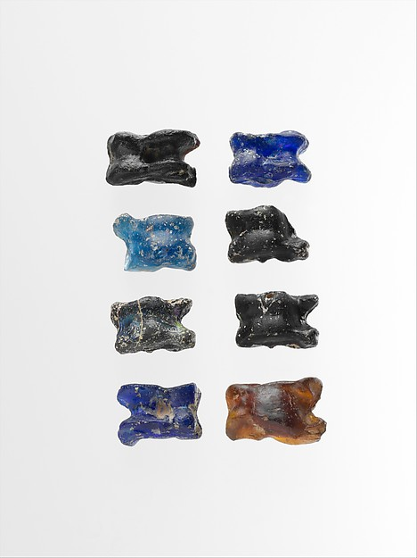

*Hellenistic glass replicas of the ankle bones that served as humanity's oldest randomizing devices — when people couldn't get the real thing, they manufactured replicas*

Source: Metropolitan Museum of Art, #256148

**Glass Astragalus (Knucklebone), 3rd–2nd century BCE**

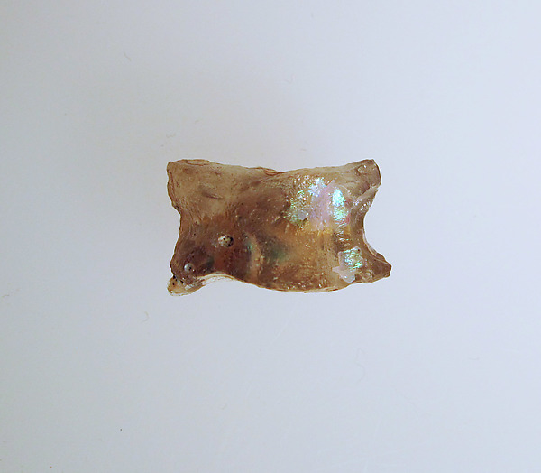

*A single glass astragalus showing the distinctive four-sided shape that produces unequal but consistent probabilities when tossed*

Source: Metropolitan Museum of Art, #249805

**Bronze Astragalus (Knucklebone), c. 3rd century BCE–2nd century CE**

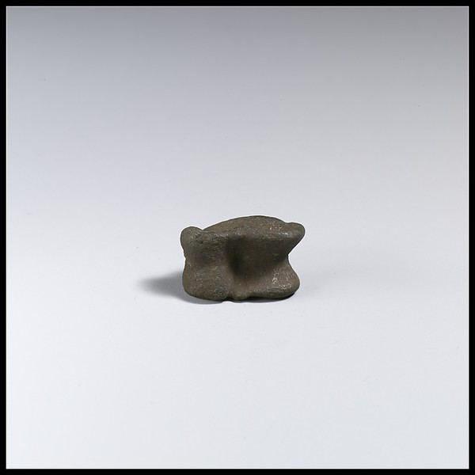

*Metal imitation astragalus — proof of how valued these objects were, crafted in durable bronze to replicate the natural bone*

Source: Metropolitan Museum of Art, #256765

**Ancient Dice, 9th–10th century**

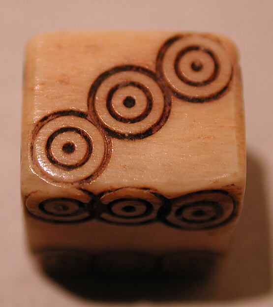

*Medieval dice showing the evolution toward the standardized, symmetrical form that Eerkens traced over two millennia of design convergence*

Source: Metropolitan Museum of Art

---

# Chapter 3
## Divination and Its Shadow

The previous chapter laid out the physical evidence: bones, dice, lots, and throwing sticks
found across seven millennia and five continents. But the objects by themselves are silent. A
knucklebone does not announce why it was thrown. The archaeological record tells us that
people across the ancient world invested enormous energy in collecting, modifying, and
preserving devices that produced unpredictable outcomes. It does not tell us what they
thought was happening when those outcomes appeared.
This chapter is about what they thought was happening.
The answer, across a staggering range of cultures and centuries, was remarkably
consistent: the gods were speaking. The random outcome was not random at all. It was a
message—a verdict, a judgment, a revelation—delivered through a channel that no human
being could manipulate. The very thing that made the outcome unpredictable to mortals
was what made it trustworthy as a communication from the divine. The lot fell where the
gods placed it, and that was that.
This idea—that randomness is the language of the gods—is the oldest and most
consequential belief in the history of gambling. Without it, the story we are telling in this
book would be entirely different. Because it means that gambling did not begin as gambling.
It began as religion.

The logic is worth unpacking, because it is not arbitrary. It rests on a genuine philosophical
insight.
Suppose you are an ancient Mesopotamian king and you need to decide whether to go to
war. You could consult your advisors, but they have their own interests and ambitions. You
could rely on your own judgment, but you know your judgment is fallible and colored by
desire. You could look for omens in the natural world—the flight of birds, the shape of a
sheep’s liver—but these require interpretation, and interpretation is a human act, subject to
error and bias.
What you need is a channel of communication that is completely, provably beyond human

influence. You need an outcome that no person—not the priest, not the general, not the king
himself—could have steered. You need something that only a god could control, precisely
because no mortal can.
A tossed object delivers this. When you throw a knucklebone or draw a lot from a jar, no one
present has the power to determine the result. If any force in the universe has that power, it
must be a force beyond the human—a god, a spirit, a cosmic principle. The unpredictability
of the outcome is not a flaw; it is the entire point. It is what makes the mechanism sacred.
This reasoning appears in almost identical form across civilizations that had no contact with
one another. It is one of the great convergent ideas of human intellectual history: the
conviction that the random event is a divine event, that chance is a door through which the
sacred enters the world.

The earliest civilization to leave detailed written records of this belief was Sumer, and its
successors in Mesopotamia.
By the third millennium BCE, the cultures of the Tigris-Euphrates valley had developed an
elaborate divinatory apparatus—a system of practices, institutions, and trained specialists
dedicated to reading the will of the gods. Divination was not marginal to Mesopotamian
civilization. It was central: a technology of statecraft, integrated into decision-making at the
highest levels of government, deployed before every major military campaign, every royal
construction project, every question of law and succession.
The Mesopotamians practiced many forms of divination. The most prestigious was extispicy
—reading the entrails, and especially the liver, of sacrificed sheep. Trained specialists called
baru priests examined the organ’s shape, color, and markings against an enormous
reference literature of omen texts compiled over centuries. Astrology was another pillar:
scribes tracked the movements of celestial bodies and correlated them with earthly events.
But alongside these elaborate techniques sat a simpler and more ancient practice: the
casting of lots.
Mesopotamian lot-casting typically used binary devices—pairs of objects, such as light and
dark stones, that could be tossed or drawn to produce a yes-or-no answer. The god
Shamash, the sun deity and patron of justice and truth, was understood as the force that
guided the result. The Akkadian vocabulary for the practice is revealing: the word for the
outcome of a lot-cast was purussû—“decision” or “verdict.” The gods were “deciders of
decisions” (pārisū purussî). The result of a divine lot was not a guess or an estimate. It was
a legal ruling, handed down by the supreme court of the cosmos.
Mesopotamia also had its Tablet of Destinies—a mythological object of immense power,
associated with cosmic authority. The tablet had to rest on the breast of the god who

mediated between the divine realm and humanity in order to function. Scholars have noted
the structural parallel with the Israelite Urim and Thummim, which likewise rested on the
breast of the mediating priest. The parallel may reflect cultural exchange, or it may reflect
independent invention driven by the same underlying logic: the mediator between gods and
humans wears the instrument of divine decision against his heart.

In the Hebrew Bible, the same theology of the sacred lot is spelled out with striking clarity.
The casting of lots—goral in Hebrew—appears forty-seven times in the biblical text. Its uses
span the entire spectrum of consequential decision-making. In the Book of Leviticus, God
commands Moses to select a scapegoat by lot: “And Aaron shall cast lots upon the two
goats; one lot for the Lord, and the other lot for the scapegoat.” In Numbers, the promised
land is allocated among the tribes of Israel by lot. In Joshua, the same method divides
specific territories. In Jonah, the terrified sailors cast lots to determine which passenger has
brought divine wrath upon their ship, and the lot falls on the prophet. In the Book of Acts—
the very last instance of lot-casting in the entire Bible—the apostles choose Matthias to
replace Judas Iscariot as the twelfth apostle by drawing lots.
The theological principle governing all of these episodes is stated with lapidary precision in
Proverbs 16:33: “The lot is cast into the lap, but its every decision is from the Lord.” The
mechanism is human. The outcome is divine. The randomness is apparent, not real: behind
the visible tumble of objects lies the invisible hand of God, directing the result to its proper
destination.
The most mysterious instruments of this theology were the Urim and Thummim—objects
associated with the breastplate of the High Priest, mentioned in Exodus, Leviticus,
Numbers, and 1 Samuel. The Bible never describes them in detail. Scholars have debated
their nature for centuries. The prevailing view is that they were a pair of objects—perhaps
polished stones, one dark and one light—kept in a pouch behind the priest’s breastplate and
used to produce binary answers: yes or no, go or stay, guilty or innocent.
In 1 Samuel 14:41, Saul uses the Urim and Thummim to determine who has broken his
army’s fast. The fuller text, preserved in the Greek Septuagint but partially lost in the
Hebrew, reads: “If the fault is in me or in Jonathan my son, O God of Israel, give Urim, and if
the fault lies within your nation Israel, give Thummim.” One object for one answer, the other
for the alternative. A sacred coin toss.
What makes the Urim and Thummim significant for the history of gambling is not the objects
themselves—those belong to Chapter 2’s archaeological territory—but the theology they
embody. The ancient Israelites accepted that God spoke through a randomizing device.
They did not see this as superstition. They saw it as the natural mode of divine

communication for questions requiring a definitive answer. Prophets delivered oracles in
words, but words are ambiguous. Dreams required interpretation, and interpretation could
be wrong. The lot was clean: yes or no, with no room for human distortion. Its very simplicity
was its authority.
The Urim and Thummim faded from use during the early monarchy, replaced by the
institution of the prophet—a human being who spoke God’s words directly. By the post-exilic
period, the objects seem to have been lost entirely. Ezra 2:63 records that certain priestly
genealogies could not be resolved “until a priest with Urim and Thummim should appear”—
an acknowledgment that the instruments were gone and no replacement had been found.
The sacred lot, for the Israelites, was a technology of an earlier age, eventually superseded
by other forms of revelation.
But the underlying principle—that randomness is governed by God—persisted. It shows up
in the New Testament soldiers casting lots for Christ’s garments at the crucifixion, an act
understood as fulfilling the prophecy of Psalm 22. It shows up in the selection of Matthias.
And it shows up, in diluted and secularized form, wherever a modern person says “let’s flip a
coin” and feels, however faintly, that the result is somehow more legitimate than an arbitrary
decision would be.

In Greece, the sacred lot took a different path—one that led, remarkably, to democracy.
The Greeks practiced cleromancy in both religious and civic contexts. At the oracular
shrines that dotted the Greek world, supplicants sought divine guidance through various
randomizing mechanisms. At Delphi, the most prestigious oracle of all, the Pythia delivered
prophecies in a trance state—not a lot-based system. But at lesser shrines, and in everyday
private divination, Greeks cast knucklebones, drew marked tablets, and interpreted the fall
of objects as messages from the gods. The word kleromanteia—from kleros (lot) and
manteia (divination)—was their name for the practice.
The Greek philosophical tradition was characteristically divided on the subject. Plato, in the
Laws, accepted the use of lots for certain civic purposes while expressing reservations
about games of chance more broadly. Aristotle, in the Rhetoric, acknowledged lot-casting
as an appropriate tool for deliberation in situations of genuine uncertainty—a pragmatic
endorsement that stopped well short of theological enthusiasm. The Stoics, who believed in
a deterministic universe governed by fate (heimarmene), had the easiest time
accommodating the sacred lot: if everything was determined, then the fall of the lot was
determined too, and its result reflected the rational order of the cosmos.
But the most consequential Greek application of the lot was political. Athenian democracy,
in its classical form, filled most public offices not by election but by sortition—random

selection from the eligible citizen body. The Council of Five Hundred, which set the
Assembly’s agenda, was chosen by lot. Jurors were chosen by lot. Magistrates were chosen
by lot. The reasoning was explicitly democratic: election favored the wealthy, the eloquent,
and the well-connected, while the lot gave every citizen an equal chance. But the reasoning
was also implicitly theological: the random selection, because it was beyond human
manipulation, was understood to be just. The Athenians did not use the language of divine
will as openly as the Mesopotamians or Israelites, but the same intuition operated beneath
the surface: a process that no person could rig was a process that could be trusted.
Sortition was not, strictly speaking, gambling. No stakes were wagered on the outcome. But
it rested on the same foundational premise: that randomness has a legitimacy that human
choice does not. This is the deep connection between the sacred lot and the casino—a
connection that persists, in attenuated form, to this day. When we say that a coin toss is
“fair,” we mean something surprisingly close to what the Athenians meant when they said
that the lot was just: the mechanism treats everyone equally precisely because it is blind.

Rome inherited Greek divination and, characteristically, institutionalized it.
The Romans had their college of augurs—official priests responsible for reading divine signs
before any major public action. No military campaign was launched, no law enacted, no
election held without the augurs first confirming that the gods approved. The augural
system encompassed many forms of divination—reading the flight of birds, interpreting
lightning, examining the feeding behavior of sacred chickens—but lot-casting was part of
the toolkit.
At Praeneste (modern Palestrina), southeast of Rome, stood the Temple of Fortuna
Primigenia, one of the most important oracular centers in the Roman world. The method of
divination there was the sortes—oak tablets inscribed with messages, stored in a chest, and
drawn at random by supplicants. The goddess Fortuna directed the selection. The Latin
word sors, from which we derive “sorcery,” “sortilege,” and “sort” itself, meant simply “lot.”
Fortuna was not originally the goddess of luck in the modern sense of happy accident. She
was the goddess of fate—of what is allotted to you, of your portion. Her wheel, the famous
Rota Fortunae that would become one of the defining images of the medieval European
imagination, was a randomizing device elevated to cosmic principle.
The Romans also gave us one of the most revealing linguistic fossils in the history of
gambling. The Latin word alea—meaning “die” or “dice game”—gave rise to aleatory,
meaning “dependent on chance.” When Caesar crossed the Rubicon and reportedly said
alea iacta est—“the die is cast”—he was not making a casual metaphor. He was invoking the
deepest available analogy for an irrevocable commitment to an uncertain outcome. The die,
once thrown, cannot be called back. The future, once set in motion, cannot be unthrown.

The metaphor works because everyone in the Roman world understood that a die-cast was
a moment of submission to forces beyond human control—whether you called those forces
Fortuna, fatum, or the gods.

The Chinese tradition of sacred randomness developed along its own axis, producing what
may be the most intellectually elaborate divination system in human history.
The earliest Chinese divination was blunt and physical: oracle bone divination, practiced
during the Shang Dynasty (c. 1600–1046 BCE). Questions were inscribed on the scapulae of
cattle or the shells of turtles. The bones were heated—with a hot bronze point applied to a
prepared cavity—until they cracked. The patterns of the cracks were read as answers from
the ancestors and spirits to whom the questions were addressed. The method was binary in
effect if not in mechanism: the cracks ran one way or another, and the diviners interpreted
the patterns as favorable or unfavorable.
Oracle bone divination was a royal monopoly, performed by specialists and recorded in
meticulous archives. Over 150,000 oracle bone fragments have been recovered, mostly
from the Shang capital at Anyang, constituting one of the richest documentary sources for
any ancient civilization. The questions inscribed on the bones range from affairs of state
(“Should we attack the Qiang people?”) to matters of health (“The king’s tooth aches—is
this the work of Father Ding?”) to agriculture (“Will it rain this week?”). They are, in effect,
the earliest surviving records of systematic decision-making under uncertainty.
By the Zhou Dynasty (1046–256 BCE), a more abstract system had evolved. The fifty
yarrow stalks of the I Ching divination ritual replaced the cracked bones as the randomizing
device. The stalks were manipulated in a series of divisions and subtractions—a process
that took considerable time and attention—to generate one of sixty-four hexagrams, each a
figure of six lines, either broken (yin) or unbroken (yang). Each hexagram was associated
with a passage of poetic, elliptical wisdom in the Book of Changes.
The philosophical leap from oracle bones to the I Ching was enormous. Oracle bone
divination asked specific questions and expected specific answers: go or don’t go, sacrifice
or don’t sacrifice. The I Ching posed its answers in the language of dynamic situations—
images of rivers and mountains, rulers and hermits, dragons and wells—that demanded
interpretive engagement. The diviner was no longer a passive receiver of a divine yes or no.
He was an active participant in a hermeneutic process, working with the random output to
construct meaning. The I Ching was, in a sense, the world’s first interactive text—a book
that generated a different reading every time you opened it, because the reading depended
on which hexagram the yarrow stalks or coins produced.
The Chinese tradition also contributed a distinctive metaphysics of chance. In the Confucian

and Taoist worldviews, the cosmos was not governed by the personal will of
anthropomorphic gods (as in the Mesopotamian and Israelite traditions) but by impersonal
principles of balance and change—yin and yang, the ceaseless alternation of
complementary forces. The random process of the I Ching was understood as a window into
the current state of this cosmic balance. The hexagram you received was not a message
from a god telling you what to do. It was a snapshot of the present moment’s dynamic
character, from which a wise person could infer the appropriate course of action.
This metaphysical difference had practical consequences. In traditions where the lot
expressed a god’s personal will, there was a tendency toward fatalism: God has spoken, and
that is the end of the matter. In the Chinese tradition, the divination result was a starting
point for reflection, not a verdict. You could receive an unfavorable hexagram and still act—
but you would do so with full awareness of the currents running against you. The I Ching
taught not obedience but situational awareness. It is arguably the most sophisticated
attempt in human history to extract practical wisdom from a random process.

In West Africa, the Yoruba tradition of Ifá divination developed a system of comparable
intellectual depth, using a framework of striking mathematical elegance.
The Ifá diviner—the babalawo, or “father of mysteries”—casts sixteen sacred palm nuts
(ikin) or a divination chain (opele) to generate a binary pattern. Each cast produces one of
256 possible Odù—figures comparable in structure to the hexagrams of the I Ching, though
generated by a different mechanism. Each Odù is associated with a corpus of oral verses—
poems, narratives, proverbs, and prescriptions—that the diviner recites and interprets in
light of the client’s situation. The corpus for all 256 Odù combined runs to tens of
thousands of verses, memorized and transmitted through years of apprenticeship.
Structurally, the Ifá system is an eight-bit binary code generating 2^8 = 256 combinations.
It was developed entirely independently of Western mathematics, and its discovery by
European scholars in the nineteenth and twentieth centuries prompted considerable
astonishment. The resemblance to formal binary systems is not coincidental—it reflects the
same mathematical logic—but it was arrived at through a completely different cultural
pathway.
The theology of Ifá rests on the same foundational premise we have encountered
everywhere else: the random process is a channel of divine communication. The Odù that
emerges from the cast is not the product of chance but the response of Orunmila—the
orisha (divine being) of wisdom, knowledge, and divination—to the question posed. The
mechanism is physical (the fall of the nuts or chain). The meaning is spiritual (the verses
associated with the resulting figure). The diviner’s skill lies not in controlling the outcome
but in interpreting the corpus: knowing which verses are relevant, which prescriptions apply,

which sacrifices or actions the figure demands.
The Ifá example is important for a reason beyond its intrinsic fascination. It demonstrates
that the theology of sacred randomness is not a peculiarity of the Near Eastern or European
traditions. It is a genuinely global phenomenon—a convergent invention of human culture,
arising independently in Africa, Asia, Europe, and the Americas. Wherever people have
tossed objects and read the results, they have tended to reach the same conclusion: the
outcome is not noise. It is signal. Something is speaking through the fall of the lot, and that
something is wiser than we are.

Tacitus, writing around 98 CE, described the lot-casting practices of the Germanic peoples
in language that could apply to almost any of the traditions we have surveyed:
They cut a branch from a fruit-bearing tree and divide it into small pieces, which they
mark with certain distinctive signs and scatter at random onto a white cloth. Then the
priest of the community, if the consultation is a public one, or the father of the family, if it
is private, after a prayer to the gods and with his eyes raised to heaven, picks up three
pieces one at a time and reads their meaning from the signs previously scored on them.
The description is precious because it captures, in a single paragraph, the essential
structure shared by every tradition in this chapter: a randomizing process (scattering
marked objects), a ritual context (prayer, a sacred cloth, eyes raised to heaven), and an
interpretive act (reading the signs). The three elements are always present, in every culture,
in every era. The mechanics vary endlessly—bones, stones, sticks, nuts, stalks, shells,
tablets, coins—but the underlying architecture is universal.

And now we reach the question that matters most for the story this book is telling.
If the earliest uses of randomizing devices were sacred—if the first people to throw bones
were talking to their gods, not betting their cattle—then how did we get from divination to
gambling?
The answer is that we probably never made a clean transition, because the two activities
were never cleanly separated. Divination and gambling share not just the same technology
(the randomizing device) but the same core experience (the suspended moment of
uncertainty between cast and result) and the same emotional intensity (the mixture of hope,
fear, and excitement that accompanies any engagement with the unknown). The
psychological experience of casting lots to ask a god for guidance is, at the neurochemical
level, virtually identical to the experience of casting dice with money on the line. The
dopamine system does not distinguish between sacred uncertainty and secular uncertainty.

It responds to both.
The transition, to the extent that there was one, was probably not a single event but a
gradual, uneven, culturally variable process of secularization. In any society that practiced
divination by lot, some individuals must have noticed that the same process could be used
for entertainment, for settling disputes, for distributing goods, for competing. The step from
“let us consult the gods about who should go first” to “let us throw to see who goes first” to
“let us throw to see who wins” is short enough that it could have been taken independently
in hundreds of cultures—and probably was.
The archaeological evidence, as we saw in the last chapter, supports this reading. The same
knucklebones appear in cultic and domestic contexts. The same dice show up in temples
and taverns. The same objects were buried with the dead as passports to the afterlife and
tossed by soldiers in their barracks for pocket money. The material record does not show a
rupture between sacred and secular uses of chance. It shows a continuum—a long, blurred
spectrum with pure divination at one end and pure gambling at the other, and an enormous
middle territory where the two shade into each other.
This middle territory is where most of the ancient world actually lived. When a Roman
soldier tossed his knucklebones in camp, he was not performing a religious ritual—but
neither was he operating in a fully secular mental universe in which the dice were mere
physical objects governed by mechanical laws. He lived in a world where Fortuna was real,
where luck was a divine attribute, where the fall of the die reflected something about the
cosmic order. His gambling was, in a sense, a secularized remnant of divination—the ritual
stripped of its priestly apparatus but retaining its metaphysical undertones.
This is why gambling has been so difficult to suppress, and why the arguments against it
have so often been theological rather than merely practical. The prohibitions we will
encounter throughout this book—from Deuteronomy to the Qur’an to the sermons of Cotton
Mather—are animated by a common anxiety: that gambling is a form of unauthorized
communication with the divine, a presumptuous attempt to peer behind the curtain of fate.
The gambler, in the eyes of the moralist, is not merely wasting his money. He is trespassing
on sacred ground.
And perhaps, in a sense that neither the gambler nor the moralist fully understands, they are
both right. The urge that draws a person to a gaming table—the electric thrill of the moment
before the outcome is revealed—is the same urge that drew the Shang king to the oracle
bones and the Israelite priest to the Urim and Thummim. It is the desire to stand at the
boundary between the known and the unknown and to receive a sign. The sign may be the
will of a god. It may be the verdict of Fortuna’s wheel. It may be nothing but the mechanics
of a bouncing cube obeying the laws of physics. But the feeling—the catch in the breath, the
quickened pulse, the sense of standing at the edge of revelation—is the same feeling that
human beings have been chasing since the first bone was thrown.

The gamblers of the ancient world will tell us more about how this played out in practice. In
the next chapter, we will meet them in their own civilizations—the specific games, the
specific cultures, the specific consequences of a species that learned to play with chance
and then could not stop.

### Images — Chapter 3

**Oracle Bone Fragment, Shang Dynasty**

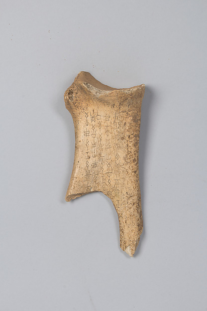

*Inscribed cattle scapula or turtle plastron used for divination — questions were carved into the bone, which was heated until it cracked, and the crack patterns read as messages from ancestors*

Source: Metropolitan Museum of Art

**Oracle Bone, Shang Dynasty (c. 1600–1046 BCE)**

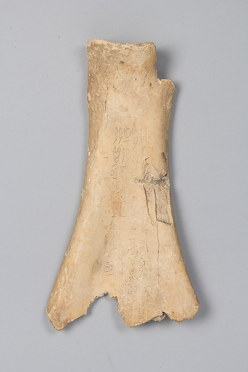

*Over 150,000 oracle bone fragments have been recovered from the Shang capital at Anyang — the earliest surviving records of systematic decision-making under uncertainty*

Source: Metropolitan Museum of Art

**Table Base with Jonah Swallowed and Cast Up by the Big Fish, early 300s CE**

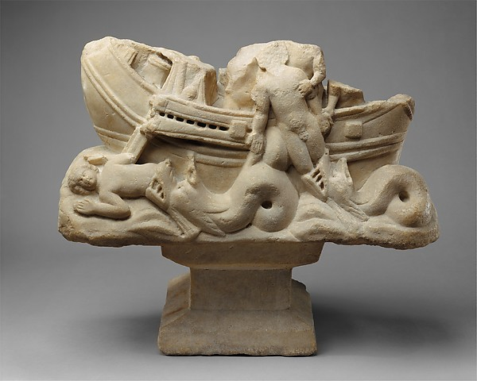

*The story of Jonah — the terrified sailors cast lots to determine which passenger brought divine wrath upon their ship, and the lot fell on the prophet*

Source: Metropolitan Museum of Art

---

# Chapter 4
## Games of the First Civilizations

The previous two chapters told the story of the objects and the beliefs—the bones people
threw and the gods they believed were listening. This chapter is about what happened when
those objects and beliefs were organized into something more structured: a game with a
board, with rules, with pieces that moved, and with outcomes that mattered.
Board games are among the oldest complex artifacts of human civilization. They appear
almost as soon as settled societies do, and the earliest ones share a striking family
resemblance: they are race games, contests in which two players move pieces along a
track, with the speed of movement determined by the throw of some randomizing device—
dice, sticks, shells, bones. The object is to get your pieces home before your opponent
does. Strategy exists, but chance governs. You can choose which piece to move, but you
cannot choose how far it goes.
This is not an accident. The race game is the most natural structure for a civilization that
has just discovered the thrill of organized uncertainty. It is simple enough to learn in
minutes, rich enough to sustain interest over thousands of plays, and—crucially—it maps the
experience of chance onto a visible, spatial metaphor. You can see your pieces advancing or
falling behind. You can watch your opponent’s luck and compare it to your own. The
randomness that was invisible when you simply threw a bone and read the result becomes
tangible when it moves a piece across a board. The board makes the abstract concrete.
Each of the great early civilizations produced its own version of this idea. And each version,
when you look closely, reveals something distinctive about the civilization that made it.

The Royal Game of Ur is the oldest board game for which we have both physical boards and
a written description of the rules—a combination that makes it uniquely valuable to the
historian.
The boards themselves were found by Leonard Woolley in the Royal Cemetery at Ur, in
southern Iraq, during his excavations of the 1920s and 1930s. They date to approximately
2600–2400 BCE and are among the most beautiful gaming artifacts ever discovered: inlaid
with shell, red limestone, and lapis lazuli, crafted with a precision and artistry that speaks to

the game’s importance in Sumerian elite culture. The design consists of twenty squares
arranged in a distinctive pattern—a block of twelve squares (three rows of four) connected
by a narrow bridge of two squares to a block of six squares (three rows of two). Five of the
squares are marked with rosettes.
The rules remained a mystery for decades after discovery. Then, in the early 1980s, Irving
Finkel, an Assyriologist at the British Museum, deciphered a cuneiform tablet that had been
sitting in the museum’s collection since 1880. The tablet, written in 177 BCE by a Babylonian
scribe named Itti-Marduk-balāṭu, described the rules of a game played on a board of this
shape. The rules Finkel reconstructed describe a race game for two players, each
commanding a set of pieces (five, in the late version described on the tablet; seven in the
original game, based on the archaeological finds). Pieces enter the board, travel a
prescribed path, and must be borne off the far end to score. Movement is determined by
the roll of tetrahedral dice—four-sided pyramids, each with two marked corners and two
unmarked, giving a result of zero to four.
The game’s strategic depth comes from its interaction rules. Two pieces cannot occupy the
same square, so an opponent’s piece on a square blocks your advance. But if you land on a
square occupied by an enemy piece on the shared middle row, you capture it—sending it
back to the start. Rosette squares confer two advantages: a piece on a rosette is safe from
capture, and landing on a rosette earns an extra roll.
What makes the Royal Game of Ur significant for the history of gambling is what Finkel’s
tablet revealed beyond the basic mechanics. The cuneiform text describes a game with a
built-in wagering system. When a player skips a rosette square, they must place a token in a
communal pot. When a player lands on a rosette, they may take a token from the pot. The
game was not merely played for the pleasure of competition. It was played for stakes, and
the stakes were integrated into the rules themselves—not an optional add-on but a
structural feature of how the game worked.
Even more remarkably, the tablet correlates gameplay with astrological significance.
Specific game outcomes are linked to zodiac signs and prognostications. The game board
was, at least in its late Babylonian form, a dual-purpose instrument: a gaming surface and a
divination device. Finkel himself titled one of his studies “Board Games and Fortune Telling:
A Case from Antiquity.” The Royal Game of Ur is the clearest surviving proof that the ancient
world did not draw the lines we draw between playing, gambling, and consulting the fates. It
did all three simultaneously, on the same board, with the same dice.
The game’s geographic spread confirms its popularity. Boards have been found across Iraq,
Iran, Syria, Egypt, Lebanon, Turkey, Cyprus, Sri Lanka, and Crete. A 2013 study of nearly
one hundred well-dated boards from across the Near East showed that the game’s design
changed significantly over 1,200 years—additional squares, modified layouts, altered
decoration—suggesting that the rules themselves evolved, probably many times. What

Finkel decoded was the game as it was played in its twilight, around 177 BCE. What was
played on the boards Woolley found, 2,400 years earlier, may have been quite different. The
game lived, changed, and adapted for longer than the Roman Empire existed.
And then, remarkably, it survived into the modern era in at least one pocket of the world.
Members of the Jewish community of Kochi, in southern India, were still playing a
recognizable form of the game—which they called Aasha—when they began emigrating to
Israel in the 1950s. Their version had twelve pieces per player rather than seven, and a
slightly different board layout, but the core mechanics were the same. A game born in
Sumerian royal tombs was still being played on kitchen tables in Kerala forty-five centuries
later.

The Egyptian game of Senet tells a different story—not of continuity but of transformation. It
began as one thing and became another, and the arc of that transformation is one of the
most revealing episodes in the early history of games.
Senet—the word means “passing” in ancient Egyptian—was played on a grid of thirty
squares arranged in three rows of ten. Each player controlled a set of pawns (typically five
or seven), and movement was determined by throwing flat, two-sided sticks that functioned
as binary randomizers. The sticks could land flat-side up or round-side up, and the number
of flat results determined the player’s move. The mechanics were those of a race game: get
your pieces from one end of the board to the other and bear them off before your opponent
does.
In its earliest documented form—the Third Dynasty, around 2650 BCE—Senet appears to
have been a straightforward secular entertainment. The tomb of the high official Hesy-Re
contains the first unequivocal depiction of the game. Over the following centuries, paintings
show Senet being played in domestic settings, at parties, in garden pavilions. It was a
popular game at every social level. Tutankhamun was buried with four Senet boards—the
most extravagant gaming equipment ever found in a pharaoh’s tomb.
Then, sometime during the Middle Kingdom (roughly 2000–1650 BCE), Senet began to
change. The blank squares on the board’s final row started acquiring markings: hieroglyphic
symbols with specific religious meanings. By the New Kingdom (1550–1077 BCE), the
transformation was complete. Square 26 bore a symbol of goodness or beauty. Square 27
carried the hieroglyph for water—the perilous waters of the underworld. Square 28, which in
earlier boards showed three simple vertical lines, now displayed three ba birds—the humanheaded birds that represented the soul in Egyptian iconography. The board had become a
map of the Duat, the Egyptian realm of the dead. The thirty squares were stations on the
soul’s journey through the afterlife. The goal was no longer merely to bear your pieces off
the board. It was to navigate death itself.

Chapter 17 of the Book of the Dead depicts the deceased playing Senet against an invisible
opponent—a solitary figure seated at the board, engaged in a contest whose outcome
determined the fate of the soul. In funerary paintings, the progression is explicit: the
deceased plays Senet, then transforms into a ba bird soaring toward the blessed Field of
Reeds. Win the game, win eternity.
The archaeologist Walter Crist, studying a transitional Senet board at the Rosicrucian
Egyptian Museum in California, identified what may be the earliest stage of this
transformation: a board with the older Middle Kingdom layout but newer, more religiously
charged square markings. The board appears to be a missing link between the secular game
and the sacred one—a snapshot of the exact cultural moment when play became ritual.
What happened to Senet is, in microcosm, the story that the last two chapters have been
telling from the opposite direction. Chapter 3 argued that divination preceded gambling—
that the sacred use of chance came first. Senet inverts this: a game that began as
entertainment gradually acquired religious meaning until it became something closer to a
sacrament. The two trajectories are not contradictory. They show that the relationship
between play and prayer ran in both directions. Games could become rituals. Rituals could
become games. The boundary was always porous.

In India, the relationship between games and cosmic stakes was not a gradual evolution. It
was there from the beginning, embedded in the civilization’s founding narratives.
The Mahabharata—one of the two great Sanskrit epics, composed in its present form
between roughly 400 BCE and 400 CE but drawing on far older oral traditions—contains
what may be the most famous gambling scene in all of world literature. In the Sabha Parva
(the Book of the Assembly Hall), the virtuous king Yudhishthira is invited to a dice game by
his cousin Duryodhana. The dice are rolled by Shakuni, Duryodhana’s uncle, a master
gambler who—in most tellings—controls loaded dice made from his own father’s bones.
Yudhishthira cannot refuse. The dharma of the Kshatriya warrior class required that a
challenge to a dice game, like a challenge to battle, be accepted. And so he plays. He loses
his jewels. He loses his gold. He loses his chariots and his horses. He loses his kingdom. He
loses his four brothers, one by one, staking each on the next throw. He loses himself. And
then, when Shakuni taunts him that there is one possession left to wager, Yudhishthira
stakes his wife, Draupadi.
He loses.
What follows is one of the most devastating scenes in ancient literature. Draupadi is
dragged into the assembly hall. Duhshasana attempts to strip her of her garments. She
poses a question that paralyzes the entire court: if Yudhishthira had already lost himself and

become a slave, did he have the legal right to stake another person? Bhishma, the greatest
authority on dharma present, can only say: “The ways of dharma are subtle.”
The dice game of the Mahabharata is not incidental to the plot. It is the engine of the entire
epic. The humiliation of Draupadi and the exile of the Pandavas are what lead, thirteen years
later, to the catastrophic Kurukshetra war—a war that destroys an entire generation.
Everything follows from the dice.
Scholars have noted that the Mahabharata‘s dice game is connected to a much older ritual
tradition. In the Vedic royal consecration ceremony—the Rajasuya—the newly crowned king
was required to play a game of dice, and he was required to win. The game was not
entertainment. It was a ritual enactment of the king’s mastery over fate, a demonstration
that the sovereign could command the forces of chance. Yudhishthira’s catastrophic loss,
read against this ritual background, is not merely a story about a man who gambled too
much. It is a story about a king who lost command of the cosmic order. His dharma failed
him at the gaming table because the gaming table was where dharma was tested.
The specific games played in ancient India—Pachisi, Chaupar, and their regional variants—
inherited this weight of meaning. Pachisi, the cross-and-circle board game played with
cowrie shells as dice, is probably the best-known Indian game worldwide (its simplified
descendants include Parcheesi, Ludo, and Sorry!). In its original form, it was substantially
more strategic and more deeply embedded in gambling culture than any of its modern
offspring. The Mughal emperor Akbar the Great was a devoted player; at his palace at
Fatehpur Sikri, he had an enormous Pachisi board laid into the flagstones of a courtyard,
and he played with living pieces—slave girls who moved at his command across the giant
cross. Games similar to Chaupar have been identified from Iron Age sites in India dating to
1100–800 BCE, suggesting that the cross-and-circle racing game has been a continuous
presence on the subcontinent for three thousand years.
The Indian tradition is distinctive in one respect: more than any other civilization, India
produced both the most elaborate philosophical defense of gambling’s cosmic significance
and the most devastating literary portrayal of its destructive power. The Rig Veda‘s
Gambler’s Lament (which we will treat in full later) and the Mahabharata’s dice scene are
two of the oldest and most powerful cautionary tales about gambling ever composed. But
Diwali—the festival of lights—is traditionally celebrated with dice games, and gambling
during the festival is considered auspicious. The Manusmriti, an ancient legal text, advises
regulation rather than prohibition. In India, the tension between gambling as sacred play and
gambling as moral catastrophe was never resolved. It was held in permanent, productive
suspension.

In China, the game of Liubo offers a different window: a game so thoroughly lost that we

must reconstruct it from fragments, like paleontologists assembling a skeleton from
scattered bones.
Liubo—the name means “six sticks,” referring to the throwing sticks used to determine
moves—was one of the most popular games in Chinese civilization during the Warring
States period (475–221 BCE) and the Han Dynasty (206 BCE–220 CE). We know this
because Liubo sets are among the most common gaming artifacts found in Han Dynasty
tombs. Beautifully crafted boards of lacquered wood, bronze, stone, and ceramic have been
recovered alongside sets of game pieces and throwing sticks. Pottery figurines of animated
Liubo players—one hand raised as if about to slam down the sticks—appear in high-status
burials. Engraved picture stones and molded picture bricks on Han tomb walls show people
playing the game in elegant pavilions, attended by servants. Some particularly striking
images depict not humans but winged immortals playing Liubo on a mountaintop, in the
presence of the Queen Mother of the West, the Taoist goddess of immortality.
The game’s equipment consisted of a square board with a distinctive symmetrical pattern—
the so-called TLV pattern, composed of T-shaped, L-shaped, and V-shaped markings that
scholars believe had cosmological significance, symbolizing the four directions, the center,
and the gates between them. Each player had six pieces (five “pawns” and one special
piece called the “owl”), and moves were determined by throwing six sticks. The mechanics
involved racing, blocking, and capturing opponent pieces, with the first player to
accumulate six points (by blocking or recovering pieces) winning the game.
But the exact rules are lost. The most complete surviving description comes from a
quotation preserved in a Jin Dynasty commentary, centuries after Liubo had already fallen
out of fashion. The description is tantalizingly incomplete. We know the game was played
for stakes—the Records of the Grand Historian mentions Liubo in contexts that clearly
involve gambling—and we know it had a divinatory function. The Shi Ji (Historical Records)
explicitly lists the Liubo board as a divination method alongside the diviner’s board, and
archaeological evidence from the Yinwan tomb (dated 32–6 BCE) includes a wooden
divination chart showing how Liubo throws were mapped to the sexagenary cycle to identify
auspicious days for actions. Like the Royal Game of Ur, Liubo was simultaneously a game, a
gambling instrument, and a tool for reading the cosmic order.
The game vanished after the Han Dynasty, displaced by the rise of Weiqi (known in the West
as Go)—a purely strategic game with no randomizing element at all. The replacement is
telling. Go is perhaps the most mathematically complex board game ever devised, with more
possible positions than there are atoms in the observable universe. It rewards pure
calculation, deep reading, and pattern recognition. It has no dice, no sticks, no lots, no
element of chance whatsoever. The displacement of Liubo by Go in Chinese culture
represents, in miniature, a civilizational shift from games that mixed chance and strategy to
games that eliminated chance entirely—a trajectory that runs counter to the Western

tradition, where chance-heavy games (dice games, card games, slot machines) have grown
more dominant over time, not less.
Confucius himself is said to have disapproved of Liubo, according to the Kongzi Jiayu
(Family Sayings of Confucius), on the grounds that it promoted bad habits. The sage’s
disapproval of a game that combined gambling with cosmological divination, and the
subsequent rise of the pure-strategy game of Go, reflect the Confucian preference for
order, discipline, and rational governance over the turbulence of chance. In the Chinese
intellectual tradition, the ideal game was one in which the better mind always won. The gods
had no vote.

In Mesoamerica, separated from all these civilizations by oceans and millennia of
independent development, the Aztec game of Patolli arrived at many of the same structural
solutions—and the same entanglement of gaming with the sacred.
Patolli was a cross-shaped race game played on a board of roughly sixty squares, with
moves determined by the toss of five marked beans that functioned as binary dice (each
bean could land marked-side up or down, producing a range of possible totals). Two players
raced their six pebble-pieces around the board, and the first to complete the circuit won.
The game required offering incense to the god Macuilxochitl, patron of games and
gambling, before play began. Spanish observers in the sixteenth century described Patolli
sessions with an intensity that suggests the stakes were no joke: players wagered gold,
precious stones, turquoise, blankets, maguey plants, and—in some accounts—their own
freedom. The Franciscan friar Bernardino de Sahagún wrote that some players were so
consumed by the game that they would wager everything they owned and leave the gaming
mat as slaves.
The parallels to Old World race games are structural, not historical. There is no evidence of
any contact between the civilizations that produced Patolli and those that produced the
Royal Game of Ur or Pachisi. The cross-shaped board, the binary dice, the race mechanic,
the integration of chance with cosmic significance, the high-stakes gambling—all were
independently invented. The convergence tells us something profound about the
universality of these patterns. Give a civilization enough time, and it will produce a race
game. Give it a race game, and it will attach stakes to the outcome. Give it stakes, and it will
attach religious meaning. The sequence is not inevitable in every detail, but its broad
outlines recur with remarkable consistency.

What do all these games have in common, and what do they collectively tell us about the
civilizations that produced them?

First, every game on this list combines chance and strategy. None of them is pure chance
(like a modern slot machine) and none is pure strategy (like chess or Go). The dice
determine how far you can move, but you choose which piece to move and when. This
combination is not a design accident. It reflects something deep about how these
civilizations understood the human condition: you operate within constraints you cannot
control, but you exercise agency within those constraints. The dice give you your situation.
What you do with it is up to you.
Second, every game on this list was played for stakes. We have direct evidence of wagering
in the Royal Game of Ur (the cuneiform rules describe a pot), in Liubo (the historical sources
mention gambling explicitly), in Pachisi and Chaupar (the Mahabharata is the most famous
gambling narrative in world literature), in Patolli (the Spanish accounts describe betting that
escalated to self-enslavement), and in Senet (the game’s association with the afterlife
suggests that the ultimate stake was the soul’s fate). Games in the ancient world were not
typically played for nothing. The introduction of stakes was not a corruption of innocent
play. It was a feature of play from the beginning.
Third, every game on this list carried meaning beyond entertainment. The Royal Game of Ur
doubled as a divination tool. Senet became a map of the afterlife. Liubo was correlated with
the cosmological calendar. Pachisi was embedded in the royal consecration ritual. Patolli
required offering incense to a god. These games were serious in a way that modern board
games—played for fun, put away when dinner is ready—generally are not. They were
technologies for engaging with uncertainty, and uncertainty, in the ancient world, was
always a domain of the gods.
And fourth, every game on this list was played across the full spectrum of society. The Royal
Game of Ur was found in royal tombs but also in humbler domestic contexts. Senet was
played by pharaohs and commoners alike. Liubo appears in the tombs of the elite but was
played, according to the historical sources, by citizens of every class. Pachisi was an
emperor’s obsession and a villager’s pastime. Games of chance were, from the very
beginning, democratic in a way that almost nothing else in the ancient world was. The dice
did not care whether you were a king or a laborer. They fell as they fell.
This last point matters because it connects the story of ancient games to the story of
gambling in later centuries. Gambling has always been both an aristocratic vice and a
popular amusement—condemned from above and practiced from below, or practiced at
every level and condemned by moralists who participate in it themselves. This ambiguity is
not a modern invention. It was present in the very first games we know about. The same
boards that were inlaid with lapis lazuli for a Sumerian king’s tomb were scratched into
stone by bored soldiers on a garrison wall. The game was the same. Only the materials
changed.
In the next chapter, we leave the world of board games and enter the world of the classical

civilizations that gave us our first detailed written accounts of gambling as a social
phenomenon: Greece, where gambling was a philosophical problem, and Rome, where it
was a national obsession.

### Images — Chapter 4

**Queen Nefertari Playing Senet, c. 1279–1213 BCE**

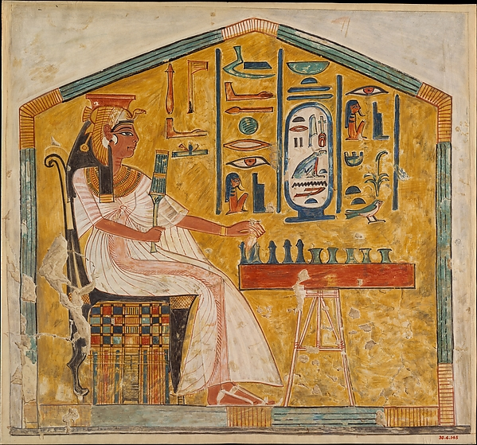

*Copy of the tomb painting showing the queen playing the game that began as secular entertainment and transformed into a map of the afterlife — the thirty squares became stations on the soul's journey through the Duat*

Source: Metropolitan Museum of Art

**Game Box for Playing Senet and Twenty Squares, c. 1635–1458 BCE**

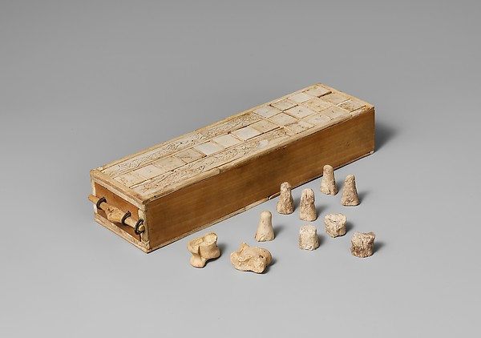

*A dual-purpose Egyptian game box — one of the most common gaming artifacts from ancient Egypt, combining two different board games*

Source: Metropolitan Museum of Art

**Mirror with TLV Game Board Design and Animals of the Four Directions, 1st–2nd century**

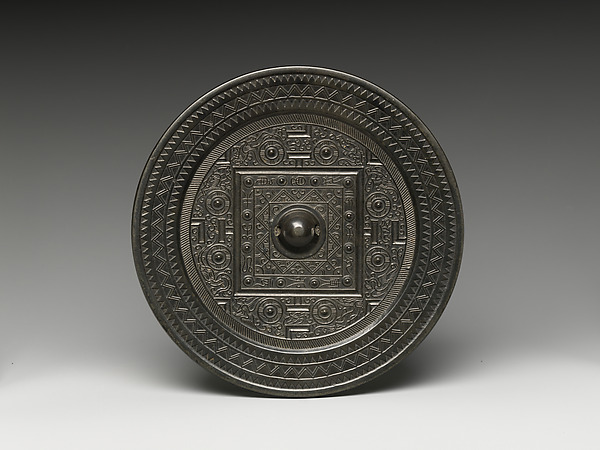

*Chinese cosmological mirror bearing the distinctive TLV pattern associated with Liubo — T-shaped, L-shaped, and V-shaped markings symbolizing the four directions and the gates between them*

Source: Metropolitan Museum of Art

**Àgéré Ifá (Ifá Divination Vessel) with Kneeling Woman, 17th–19th century**

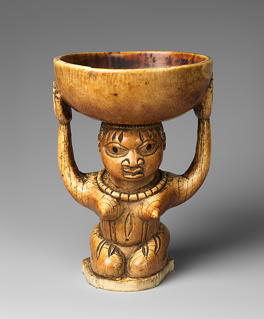

*Yoruba divination vessel used in the Ifá system — a binary code generating 256 combinations, developed independently of Western mathematics*

Source: Metropolitan Museum of Art

---

# Chapter 5
## Greece: Chance and Fate

The Greeks were the first civilization to be simultaneously obsessed with gambling and
philosophically troubled by it.
Other cultures gambled without anxiety, or prohibited gambling without ambivalence, or
folded gambling into religion so seamlessly that no tension arose. The Greeks did none of
these things. They gambled enthusiastically, in public and in private, at festivals and at
funerals, in peacetime and in war. They also produced the first sustained philosophical
arguments about why gambling was a problem—not a legal problem or a religious sin, but a
problem for the human soul. No civilization before Greece had asked the question that the
Greeks asked: if reason is our highest faculty, and if the good life consists in the exercise of
reason, then what are we to make of an activity that puts the soul at the mercy of chance?
This chapter is about that question and the civilization that produced it.

The Greeks begin, as they so often do, with a story about the gods.
When Zeus and his brothers overthrew the Titans, they needed to divide the cosmos among
themselves. They did not negotiate. They did not fight. They threw lots. Zeus drew the
heavens. Poseidon drew the sea. Hades drew the underworld. The earth and Mount
Olympus were left as common ground. The entire structure of the Greek universe—who
ruled what, which god held dominion over which domain—was determined by a single
randomized allocation.
The story is usually told quickly, almost as an aside, in the mythology textbooks. But its
implications are worth pausing over. The Greeks did not imagine that the cosmos was
organized by negotiation, conquest, or merit. They imagined it was organized by a draw. The
mightiest beings in the universe submitted to a mechanism that none of them could control.
This is an extraordinary statement about the primacy of chance. Even the gods played dice.
The mythological inventor of dice was Palamedes, a hero of the Trojan War. Palamedes was
one of the cleverest figures in the Greek mythological tradition—credited with the invention
of numbers, several letters of the alphabet, military tactics, and the game of dice. According

to Pausanias, the second-century traveler and geographer, there was a temple of Fortune
(Tyche) in the city of Argos where Palamedes had dedicated the first dice he ever made.
The story links the invention of randomizing devices to the concept of fortune from the very
beginning: the man who gave humanity dice gave them to the goddess of luck.
Palamedes’ story has a grim ending. Odysseus, who never forgave Palamedes for exposing
his attempt to feign madness and avoid the Trojan War, framed him for treason by planting
gold in his tent and forging a letter from King Priam. Palamedes was convicted and stoned
to death. In some versions of the afterlife, he is found in the underworld still playing dice—
now with Ajax and Thersites, two other figures who suffered injustice at Odysseus’ hands.
Even in death, the inventor of dice could not stop playing.
Homer’s Iliad does not mention Palamedes or dice—a conspicuous omission that scholars
like Gregory Nagy have attributed to the poem’s desire to cast Odysseus in a favorable light.
But the broader mythological tradition was rich with gambling imagery, and visual artists had
no such inhibitions. One of the most famous works of Greek art is the black-figure amphora
painted by Exekias around 540–530 BCE, now in the Vatican Museums. It depicts Achilles
and Ajax—the two greatest Greek warriors at Troy—hunched over a gaming board between
battles. Inscriptions on the vase give their scores: Achilles says “I have four,” Ajax says “I
have two.” Achilles wins. The goddess Athena stands between them, presiding.
The image was enormously popular. Over a hundred surviving vases from the late sixth and
early fifth centuries BCE depict the same scene or variations of it, making it one of the most
frequently reproduced subjects in all of Greek art. The scene’s appeal is partly
compositional—Exekias was a master of visual design, and the symmetry of the two warriors
leaning inward creates a triangle of focused attention that draws the eye. But the image also
carries deeper resonance. These are the two mightiest heroes of the Greek world, the men
on whom the fate of the war depends, and what are they doing? Playing a game of chance.
The vase compresses the central tension of Greek thinking about gambling into a single
image: the highest human excellence, taking a break to submit itself to randomness.
As Nagy has observed, the scores on the vase are not incidental. Achilles gets the higher
number—four to Ajax’s two—foreshadowing the mythological hierarchy in which Achilles is
the best of the Greeks and Ajax only second-best. The dice do not merely entertain. They
reveal the order of things. Even in play, the result reflects something true about the players’
relative standing in the cosmic scheme. Fortune speaks the truth.

The social world of Greek gambling was broad, loud, and woven into the fabric of daily life.
The primary gambling instruments were the same knucklebones and dice we encountered in
Chapter 2—astragaloi and tesserae—but the Greeks brought a distinctively social energy to

their use. Gambling happened at the symposium, the all-male drinking party that was the
central institution of Greek elite social life. The symposium was where men debated
philosophy, recited poetry, made political alliances, and competed in games of every kind.
One of the favorite symposium games was kottabos—a contest in which guests flicked the
dregs of their wine at targets, with bets riding on the outcome. It was sophisticated, rowdy,
and thoroughly competitive. Wine and wagering mixed freely.
Gambling also happened in the agora, the open public marketplace that was the beating
heart of the Greek city. Men of every social class gathered to play astragaloi on stone
surfaces, shouting their throws and settling their debts. Architectural reliefs from the fourth
century BCE depict gambling scenes with vivid specificity: men and women throwing dice,
gesturing emphatically, leaning forward in concentration. One well-known relief shows a
dice game involving Eros, Aphrodite, and a young man—a scene that links gambling with
desire and divine caprice in a single composition.
The throws had names. Rolling four different numbers on four astragaloi was called the
“Throw of Aphrodite”—the best possible result, named after the goddess of love and
beauty. The worst throw—all four bones landing on the same narrow face—was the “Throw
of the Dog.” The naming convention is revealing. A Greek throwing knucklebones was not
operating in a value-neutral mechanical universe. Every roll was mapped onto a symbolic
framework in which the gods presided. A good roll was Aphrodite’s favor. A bad roll was
canine disgrace. The language of gambling was saturated with divine presence.
Betting on athletic competitions was widespread. The Olympic Games, the Pythian Games,
the Nemean Games, the Isthmian Games—the great Panhellenic festivals that were the pride
of Greek civilization—attracted enormous crowds, and those crowds wagered. We have no
detailed records of how Olympic betting was organized (the Greeks, frustratingly, left more
literary and philosophical commentary about gambling than they did practical
documentation), but references in drama and poetry make clear that spectators placed bets
on runners, wrestlers, boxers, and chariot racers. Chariot racing, with its spectacular speed
and frequent crashes, was probably the most heavily bet event in the Greek world—a
pattern that would recur in Rome and, centuries later, in the horse-racing cultures of
England and America.
The legal status of gambling in Greek city-states was ambiguous. Athens appears to have
had laws restricting or prohibiting public gambling, but enforcement was sporadic and
private gambling was largely unregulated. Aristophanes, the comic playwright, mocked
Athenian gambling habits in his plays, portraying citizens as incorrigible risk-takers who
couldn’t resist a throw of the bones—comedy that only works if the audience recognizes the
behavior being satirized. The gap between official disapproval and actual practice was wide,
and the Greeks were self-aware enough to find it funny.

At the center of the Greek understanding of gambling stood Tyche—the goddess of fortune,
chance, and prosperity.
Tyche was not one of the original Olympians. She emerged as a significant cult figure
gradually, gaining prominence from the fifth century BCE onward and reaching her peak of
influence in the Hellenistic period (after 323 BCE), when the collapse of the classical citystates and the rise of vast, impersonal empires made the role of chance in human affairs feel
newly urgent. When your small, self-governing city is absorbed into Alexander’s worldspanning kingdom, and your fate is now determined by distant monarchs and military
campaigns you cannot influence, the goddess of fortune starts to look like the most honest
deity on the roster.
Tyche’s standard iconography tells the story of how the Greeks understood chance. She
carried a cornucopia—the horn of plenty, symbolizing abundance—and she balanced on a
ball or a wheel, symbolizing instability. The cornucopia says: fortune gives. The ball says:
fortune is precarious. The two images held together in a single figure express a truth about
randomness that the Greeks grasped intuitively and that modern probability theory would
not formalize for another two thousand years: that variance and expected value are different
things. You can live in a world of plenty and still be one roll away from catastrophe. The ball
can turn.
Hermes, the messenger god, was also associated with gambling—along with thieves,
merchants, travelers, and tricksters. The connection was logical: Hermes was the god of all
activities that involved cunning, risk, and the crossing of boundaries. Trade, theft, and
gambling all share a common structure: they involve stakes, uncertainty, and the possibility
of gain or loss through a combination of skill and circumstance. Hermes’ patronage of
gambling was not an endorsement of the activity but an acknowledgment of its place in the
order of things. The universe had a department for risky transactions, and Hermes ran it.
The concept of tyche (lowercase)—fortune, luck, the way things happen to turn out—was a
central preoccupation of Greek literature long before the goddess acquired her own
temples. Herodotus, the father of history, built his entire narrative of the Persian Wars
around the theme of fortune’s reversals: mighty kings brought low, small peoples
unexpectedly triumphant, the arrogant punished by the turning of events. Thucydides, the
more analytical historian, treated tyche with greater skepticism, preferring to explain
outcomes through human decisions and structural forces—but even he acknowledged
moments where fortune intervened in ways that no planning could have foreseen or
prevented.
The tragedians—Aeschylus, Sophocles, Euripides—returned again and again to the theme of
human beings caught in the machinery of fate. The difference between tyche (fortune,
which is random) and moira (fate, which is predetermined) was a live philosophical problem
in Greek thought. Were the outcomes of human life the result of chance events that could

have gone otherwise, or were they the working-out of a fixed destiny that was sealed from
the beginning? The question was never resolved, and the Greeks’ greatest literature draws
its power from the tension between the two possibilities. Oedipus is destroyed by fate—the
prophecy that he would kill his father and marry his mother was pronounced before his
birth. But the specific events that lead to his destruction (the chance meeting at the
crossroads, the riddle of the Sphinx, the plague that prompts the investigation) all have the
character of tyche: contingent, unpredictable, the sort of thing that might not have
happened. The tragedy lives in the collision between what was always going to happen and
what happened to happen.

The Greek philosophical tradition engaged with gambling primarily through two lenses: the
moral question (is gambling harmful to the soul?) and the epistemological question (what is
the nature of chance, and can it be understood?).
Socrates—or at least the Socrates presented in Plato’s dialogues—set the terms for the
moral debate. In the Protagoras, Socrates advanced the radical thesis that became known
as Socratic intellectualism: no one willingly does what they know to be wrong. If a person
acts badly, it is because they are ignorant of the good, not because they were overpowered
by desire. True knowledge of what is best, Socrates argued, inevitably produces the
corresponding action. Weakness of will is impossible. What looks like knowing the right
thing and doing the wrong thing is actually not knowing the right thing at all.
This thesis has obvious implications for gambling. If a person gambles to excess and ruins
himself, Socrates would say that he did not truly know that gambling was bad for him. He
may have believed it, or said it, or heard others say it, but he did not possess genuine
knowledge—the kind of knowledge that compels action. His problem was intellectual, not
moral. He needed education, not willpower.
Plato elaborated this position across several dialogues, but in the Laws—his last and longest
work, in which he designed an ideal legal code—he took a more practical stance. The Laws
includes provisions for the regulation of games and gambling, and Plato’s treatment reveals
a characteristic ambivalence. He accepted the use of lots for civic purposes (as we
discussed in Chapter 3, lot-casting was a cornerstone of Athenian democratic practice), but
he was suspicious of games played purely for pleasure and money. His concern was that
gambling habituated the soul to rely on chance rather than reason—that it trained people to
seek the thrill of random outcomes rather than the steady satisfaction of rational
deliberation. The gambler, in Plato’s view, was a person whose inner life was disordered:
desire ruling reason, the appetitive part of the soul overriding the rational part.
The Laws also contains the famous puppet metaphor, in which the human being is
compared to a puppet pulled by competing strings—some representing reason, others

representing passion and desire. The person of good character is the one who allows the
“golden cord” of reason to govern, resisting the iron cords of appetite. Gambling, in this
framework, is an activity that strengthens the wrong cords. It cultivates reliance on fortune
rather than judgment. It makes the soul weaker, not stronger.
Aristotle, as he often did, corrected Socrates while building on his foundations. In Book VII
of the Nicomachean Ethics, Aristotle took up the problem of akrasia—weakness of will, lack
of self-control—and argued that it was real in a way that Socrates denied. A person can
know that something is bad for them and do it anyway. The knowledge might be present but
inactive—like a drunk reciting poetry, who possesses the words but does not grasp their
meaning. Or the person might be overcome by the sheer force of appetite, which disrupts
the connection between knowledge and action.
Aristotle did not discuss gambling at length, but his analysis of akrasia provides the most
sophisticated ancient framework for understanding it. The gambler who knows he should
stop but cannot stop is a textbook case of akrasia: he has the knowledge, but his appetite
for the pleasurable sensation of uncertain reward overwhelms his ability to act on it.
Aristotle would not have called this a moral failing in the same sense as deliberate vice. The
akratic person is not choosing evil. He is failing to choose what he himself recognizes as
good. The distinction matters, because it means the problem is susceptible to habituation
and training—the building of better character through practice—rather than requiring a
wholesale transformation of the soul’s desires.
Aristotle made one further contribution that resonates across the entire history of gambling
philosophy. In the Nicomachean Ethics, he argued that eudaimonia—human flourishing, the
good life—should not be left to chance. “For what is greatest and most beautiful to be left to
chance would be too discordant,” he wrote. The good life requires stable conditions:
virtuous character, adequate resources, supportive relationships. A life at the mercy of
fortune’s wheel is not a good life, no matter how many lucky breaks it contains. Priam, the
king of Troy, lived in splendor for decades, only to see his city destroyed, his children killed,
and his own life ended in squalor. “No one calls a man happy who meets with misfortunes
like Priam’s.”
This is, at bottom, an argument about variance. Aristotle is saying that a high-variance life—
one subject to dramatic swings of fortune—is incompatible with genuine human flourishing,
even if the expected value is positive. The parallel to gambling is direct and deliberate. A
gambler might win enormously on occasion, but if his life is characterized by wild oscillation
between wealth and ruin, he is not living well. Stability, predictability, the ability to plan and
execute a rational life—these are what matter. And gambling, by its nature, undermines all of
them.
The Stoics, who followed Aristotle by a generation, took this insight to its logical extreme. If
the good life requires freedom from the disturbances of fortune, then the truly wise person

—the Stoic sage—must achieve apatheia: not the absence of feeling, but the absence of
passion, the state of being unperturbed by events outside one’s control. The Stoics believed
in a deterministic universe governed by logos (reason) or fate, and they taught that the path
to happiness lay in accepting what fate decreed rather than struggling against it. The sage
would be indifferent to the outcomes of any throw of the dice, because those outcomes, like
all external events, are not within his power and therefore not proper objects of desire or
fear.
The Stoic position is the philosophical negation of gambling. Gambling depends on caring
about the outcome—on the emotional investment in winning or losing that produces the
dopamine-mediated thrill described in Chapter 1. The Stoic sage, by achieving indifference
to outcomes, would be immune to gambling’s appeal. He might throw the dice, but the
result would not move him. He would be, in Skinner’s terms, resistant to the variable-ratio
reinforcement schedule—not because he lacks the neural machinery, but because he has
trained his soul to disregard its signals.
Whether anyone actually achieved this state is another question. The Stoic philosophers
were, by all accounts, human beings with appetites and emotions like everyone else. But the
ideal they articulated—that the wise person should be sovereign over fortune rather than
subject to it—established a moral framework that would influence Christian, Islamic, and
secular thinking about gambling for the next two millennia.

The Greek legacy to the history of gambling is therefore a paradox—or, more precisely, a
productive tension that has never been resolved.
On one side stands the culture: a civilization that gambled constantly, that embedded
gambling in its festivals and its mythology, that named its best and worst throws after gods,
that produced over a hundred vase-paintings of its greatest heroes playing dice. The Greeks
gambled because they were human, because they lived in a world saturated with
uncertainty, and because the thrill of the uncertain outcome was wired into their neurology
just as it is wired into ours.
On the other side stands the philosophy: a tradition that identified reason as the highest
human capacity, that regarded the well-ordered soul as the foundation of the good life, and
that diagnosed the gambler as a person whose inner architecture was disordered—someone
ruled by appetite rather than judgment, by fortune rather than virtue. The Greeks
philosophized about gambling because they were the first civilization to ask, systematically
and rigorously, what a good human life looks like, and gambling was the most vivid possible
illustration of a life at the mercy of forces beyond one’s control.
The tension was never resolved because it cannot be resolved. It is the tension between

what we are and what we aspire to be—between the dopamine system that Chapter 1
described and the rational capacity that the Greek philosophers were the first to celebrate.
Every subsequent civilization that has grappled with gambling has inherited this tension
from the Greeks, whether it knew it or not. The Roman moralist condemning dice games, the
medieval churchman preaching against fortune’s wheel, the Enlightenment mathematician
trying to tame chance with equations, the modern psychologist studying gambling addiction
—all of them are working within a framework that the Greeks built.
The Romans, who come next, would approach the same problem from a very different
angle. Where the Greeks philosophized about gambling, the Romans would regulate it,
exploit it, and indulge in it on a scale that dwarfed anything the Greek world had seen.
Where the Greeks produced Plato and Aristotle, the Romans would produce the Colosseum
and the Saturnalia. The philosophical tension would remain, but the volume would be turned
up.

### Images — Chapter 5

**Terracotta Vase in the Form of an Astragal (Knucklebone), c. 460 BCE**

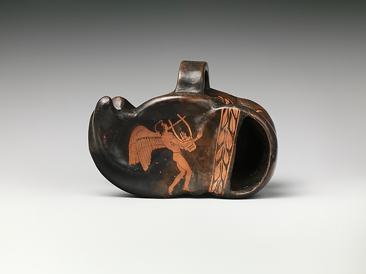

*A Greek vessel sculpted in the shape of a knucklebone — proof of how central gambling was to Greek material culture that potters made drinking vessels in the shape of dice*

Source: Metropolitan Museum of Art, #253610

**Terracotta Kylix (Drinking Cup), c. 500 BCE**

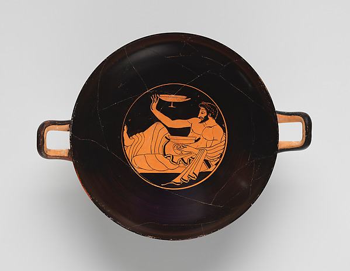

*A Greek symposium drinking cup — the symposium was where men debated philosophy, recited poetry, and competed in gambling games like kottabos*

Source: Metropolitan Museum of Art, #254921

**Bronze Statuette of the Goddess Fortuna (Tyche), c. 2nd century CE**

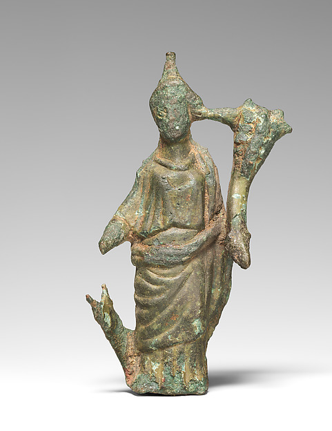

*The goddess of fortune carrying a cornucopia (abundance) and balancing on instability — 'the cornucopia says fortune gives; the ball says fortune is precarious'*

Source: Metropolitan Museum of Art, #245316

**Glass Astragalus (Knucklebone), c. 225 BCE–75 CE**

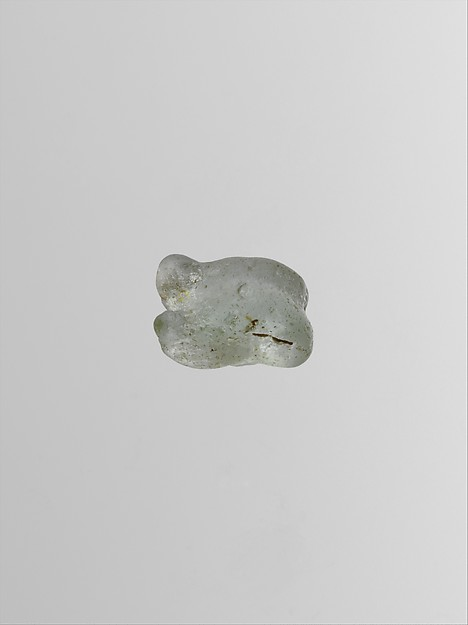

*Rolling four different numbers on four astragaloi was called the 'Throw of Aphrodite' — the best result, named after the goddess of love*

Source: Metropolitan Museum of Art

**Marble Relief Fragment with Gladiators, 1st–3rd century CE**

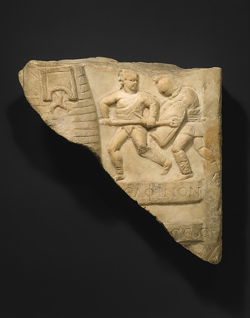

*Gladiatorial combat scenes — athletic competitions where Greeks and Romans wagered heavily on the outcomes*

Source: Metropolitan Museum of Art

---

# Chapter 6
## Rome: The Republic Bets

If Greece was the civilization that thought most deeply about gambling, Rome was the
civilization that did it most intensely. The Romans gambled with a ferocity, a scale, and a
frankly cheerful hypocrisy that has no real parallel in the ancient world. They passed law
after law forbidding dice games—and then ignored every one of them, from the lowest
tavern to the emperor’s own dinner table. They condemned gamblers as disreputable in
their legal codes and their moral literature—and then built a civilization in which 250,000
people packed into a single stadium to bet on chariot races. They spoke of gambling with
contempt in public and practiced it with enthusiasm in private. The gap between the official
Roman position on gambling and the actual Roman relationship with gambling is one of the
great comedies of ancient hypocrisy—and, as with most great hypocrisies, it reveals more
about the culture than either the laws or the behavior could reveal alone.

The legal framework came first, and it is worth setting out clearly, because it establishes a
pattern that will recur throughout this book: the pattern of prohibition that fails.
The earliest known Roman anti-gambling statute was the Lex Alearia (sometimes called the
Lex Talaria), which dates to approximately 204 BCE, during the middle Republic. The law
banned dice games—alea, the generic Roman term for gambling—with specific penalties: a
fine of four times the sum wagered, and the legal stigma of infamia, a formal loss of civic
reputation that disqualified the convicted gambler from holding office, testifying in court,
and exercising other rights of citizenship. The word aleator—gambler—became a term of
abuse, roughly equivalent to calling someone a degenerate.
Subsequent laws reinforced and extended the ban. The Lex Cornelia, Lex Titia, and Lex
Publicia, probably passed under the dictator Sulla around 81 BCE, reaffirmed the prohibition
on dice games. A senatorial decree backed the legislation. The praetor’s edict added further
provisions. Roman private law refused to recognize gambling debts—a gambler who lost
money had no legal obligation to pay, and a gambler who won had no legal right to collect.
The legal system, in other words, pretended that gambling transactions did not exist. They
were void, unenforceable, and beneath the dignity of the courts.

But the same legal tradition carved out two enormous exceptions. The first: gambling was
legal during the Saturnalia, the December festival honoring Saturn, when the normal social
order was ritually inverted. During the Saturnalia, slaves dined with their masters, servants
were served by their owners, gifts were exchanged, and dice games were played openly.
The permission was deliberate and symbolic: gambling was lawful during the Saturnalia
precisely because it was normally unlawful. The festival’s point was the temporary
suspension of rules. Allowing dice games during a celebration of cosmic inversion only
makes sense if dice games are forbidden the rest of the year. The exception proved the rule.
The second exception was larger and more revealing: betting on athletic competitions—
chariot races, gladiator fights, boxing, wrestling, running—was legal at all times. The Lex
Titia and Lex Publicia specifically permitted wagers on contests involving physical strength
and skill. Roman law distinguished sharply between gambling on dice (which was pure
chance and therefore degrading) and betting on races and fights (which involved at least
the appearance of judgment about the competitors). This distinction—between games of
pure chance and games involving some element of skill or knowledge—would echo through
gambling legislation for the next two thousand years and is still the basis of many modern
regulatory frameworks.
The legal architecture was, in its way, internally coherent. The problem was that nobody
obeyed it.

The evidence for the universality of Roman gambling is overwhelming and comes from every
conceivable source: literary, archaeological, epigraphic, and artistic.
Start with the archaeology. Gaming tables have been found scratched into stone surfaces
across the Roman world—in taverns, in military camps, in public squares, in the Forum itself.
At Pompeii, preserved under volcanic ash in its final moment of ordinary life, the evidence is
particularly vivid. Dice made from bone and ivory. Game boards carved into countertops. A
wall painting in one tavern showing two men seated at a board game; the first says “EXSI”
(“I’m out”), having rolled his dice; the second disputes the count: “NON TRIA DUAS EST”
(“Not three—it’s two!”). The next panel shows the same two men standing and fighting, fists
raised. The innkeeper, in a third panel, is throwing them out: “ITIS FORAS RIXSATIS” (“Go
outside if you want to fight!”). It is a comic strip, painted on a wall in the first century CE,
depicting a scene that would be recognizable in any gambling establishment in any century:
the disputed result, the escalation, the expulsion.
Elsewhere in Pompeii, someone scratched graffiti into a wall boasting: “I am skilled enough
to win without cheating.” The statement implies a world in which cheating was common
enough that not cheating was a point of pride. Near the Praetorian camp in Rome, a tavern
was found with a sign advertising “Good food and gambling within”—a brazen violation of

the anti-gambling laws, displayed on a public-facing sign.
The literary sources are equally rich. The satirist Juvenal, writing in the early second century
CE, described gambling as a national epidemic: “When was gambling so reckless? Men
come not now with purses to the hazard of the gaming table, but with a treasure chest
beside them. What battles will you there see waged with a steward for armor bearer!” And
he added the devastating coda: “Is it a simple form of madness to lose a hundred thousand
sesterces and not have a shirt to give a shivering slave?”
Horace, a century earlier, lamented the decay of the old martial virtues: “The young Roman
is no longer devoted to the manly habits of riding and hunting; his skill seems to develop
more in the games of chance forbidden by law.” The poet Ovid mentioned the gambling ban
almost casually in the Tristia, as one of the facts of Roman life. The fourth-century historian
Ammianus Marcellinus described a gambling mania that pervaded all social classes and
argued that Rome’s obsession with dice and chariot races was among the causes of the
empire’s decline. Cicero used aleator as a damning epithet in his speeches, and in the
Philippics he attacked Mark Antony for, among other crimes, having pardoned a man
convicted under the gambling laws.
The popinae—Roman wine bars—were recognized as centers of gambling, prostitution, and
low-class socializing. The proprietors who ran gambling operations in these establishments
were euphemistically called susceptores, meaning “entrepreneurs.” Upper-class Romans
who gambled—and nearly all of them did—preferred the more dignified term tesserarii
(“dicers”) to the loaded aleator. The social vocabulary itself encoded the hypocrisy: the
activity was the same; only the label changed depending on who was doing it.

The Roman games—the tali and the tesserae—were the primary instruments of private
gambling, and they are worth understanding in some detail because they illustrate how the
Romans adapted the Greek heritage and made it their own.
The tali were the old knucklebones—four-sided astragali that the Romans inherited from the
Greeks and continued to use throughout their history. The four faces were valued at 1, 3, 4,
and 6 (the missing 2 and 5 correspond to the narrow ends on which the bone could not
realistically land). Four tali were thrown together, and the best possible roll—all four landing
on different faces—was called the “Throw of Venus,” named after the goddess of love and
luck. The worst possible roll—all four landing on the same face—was the “Throw of the Dog.”
The naming convention was borrowed directly from the Greek system (where the best roll
was the Throw of Aphrodite), another reminder of how much Roman gaming culture owed to
its Greek predecessors.
The tesserae were true cubical dice—six-sided, numbered one through six, with opposite

faces summing to seven, essentially identical to modern dice. Romans typically played with
two or three tesserae, throwing from a cup (fritillus) onto a flat surface or a special board.
The game known as Duodecim Scripta (“Twelve Lines”)—played on a board with two rows of
twelve points—was the ancestor of modern backgammon and combined dice-throwing with
strategic movement of pieces, much like the Royal Game of Ur three thousand years earlier.
But Romans also played pure dice games with no board at all—games that were nothing but
the throw itself, with bets riding on the total or the specific combination. These were the
games that the law most clearly targeted, because they were pure chance with no strategic
component. They were also, by all accounts, the games that Romans found most irresistible.

The behavior of the emperors tells the story of Roman gambling culture more vividly than
any legal code or literary moralizer.
Augustus—the first emperor, the man who transformed the Republic into an empire and who
presided over the passage or reaffirmation of anti-gambling legislation—was himself an avid
gambler. Our primary source is Suetonius, whose Lives of the Caesars, written around 110
CE, preserves what appear to be direct quotations from Augustus’s private letters. Augustus
gambled not only during the Saturnalia but on every holiday and every ordinary day. He
would sometimes play all day long, rolling dice even while meals were being served. When
guests were reluctant to gamble with the emperor, he would include money with the
invitations—pouches of 250 denarii, handed out so that his guests could play with his coin.
In one letter to Tiberius (his eventual successor), Augustus reports his gambling losses with
a breezy nonchalance that suggests he found the whole business amusing rather than
shameful. In another, he describes a day of play in which he lost twenty thousand sesterces
—a substantial sum, though not a catastrophic one for a man who ruled the known world.
Augustus lost thirty thousand sesterces on a single occasion while betting on matches at
the Colosseum. That sum was roughly thirty times the annual salary of a Roman legionary.
The emperor who signed the laws against gambling was one of the most prolific gamblers in
Rome.
Claudius—emperor from 41 to 54 CE—took the imperial gambling habit to another level
entirely. Claudius was so devoted to dice that he wrote a book about them, a treatise on the
art of dice-playing that is unfortunately lost. (The speculated title, De Arte Aleae, would
resurface in the sixteenth century when the mathematician Gerolamo Cardano wrote his
own probabilistic analysis under the same name—a connection we will explore in a later
chapter.) Claudius had a specially modified carriage built with a gaming table installed so
that he could play dice while traveling on bumpy Roman roads. He reportedly wagered four
hundred thousand sesterces on a single throw—more than three hundred times a soldier’s
annual pay.

The philosopher Seneca, Claudius’s contemporary and no admirer of the emperor, devised a
fitting punishment in his satirical Apocolocyntosis (“The Pumpkinification of Claudius”): in
the afterlife, Claudius is condemned to roll dice forever with a cup that has no bottom. Every
time he shakes the cup and goes to throw, the dice fall out the back and he must start
again. It is an image of exquisite cruelty—and an image that only works if the audience
knows Claudius’s gambling was legendary. Seneca was satirizing a man whose vice was so
public and so well-known that the joke required no explanation.
Nero bet enormous sums—reportedly as high as four hundred thousand sesterces per
throw. Caligula was known to cheat at dice to replenish his coffers. Domitian, the micromanaging emperor of the late first century, was both a devoted gambler and a stricter
enforcer of gambling laws than most of his predecessors—a combination that Martial, the
epigrammatist writing during Domitian’s reign, found characteristically oppressive.
Commodus, the emperor whose dissolute reign is often cited as the beginning of Rome’s
long decline, once staged thirty chariot races in a single two-hour afternoon, a feat of
logistical compression that speaks to both the popularity of the races and the emperor’s
insatiable appetite for the spectacle.
The pattern is unmistakable: the men who held the power to enforce the gambling laws were
themselves the most enthusiastic violators. This was not a secret. It was common
knowledge, documented by historians and satirists, and apparently nobody found it
surprising. The laws existed as a statement of moral aspiration. The behavior existed as a
statement of human reality. The gap between the two was a space in which the entire
civilization lived.

But it was in the great public spectacles—chariot racing and gladiatorial combat—that
Roman gambling reached its full, terrifying scale.
The Circus Maximus was the largest entertainment venue in the ancient world. Situated in
the long valley between the Palatine and Aventine hills, it was rebuilt and expanded
repeatedly from the earliest days of Rome through the imperial period. Under Augustus, it
could seat approximately 150,000 spectators. Under Trajan, the estimates rise as high as
250,000—a quarter of a million people in a single stadium, in an era when the total
population of the city of Rome was perhaps one million. No modern sports venue
approaches this capacity. The Circus Maximus was the Super Bowl, the Kentucky Derby,
and the World Cup final, happening every few weeks, for centuries.
The races were organized by factiones—professional teams identified by color: Reds,
Whites, Blues, and Greens. Each faction owned stables, employed trainers, veterinarians,
grooms, and scouts, and recruited the best charioteers from across the empire. The
charioteers themselves were mostly slaves or freedmen, but the successful ones

accumulated enormous wealth and celebrity. Gaius Appuleius Diocles, a charioteer of the
second century CE, is sometimes cited as the highest-paid athlete in history when his
career earnings are adjusted for purchasing power. Scorpus, another legendary driver, won
over two thousand races before his death.
Citizens of every class—senators, merchants, artisans, freedmen, slaves—supported a
faction with the passionate, tribal loyalty that modern fans bring to their football clubs. They
wore their faction’s colors. They composed songs and chants. They placed enormous bets.
The betting at the Circus was legal (as athletic competitions were exempt from the antigambling laws) and it was massive. Spectators wagered on individual races, on the day’s
results, and—through lead curse tablets buried in the ground near the track—on the
supernatural destruction of their opponents’ horses and drivers. Archaeologists have found
hundreds of these curse tablets at circus sites across the empire: small sheets of lead
inscribed with invocations asking the gods or demons to cripple a rival charioteer, lame his
horses, or cause his chariot to crash. They are the ancient equivalent of the modern
gambler’s superstition, except that the Romans took them entirely seriously.
Pliny the Elder records that the head of one racing faction made the results of a race known
to his home town by sending trained birds whose legs were marked with the color of the
winning team. This is, in essence, the earliest documented system for rapid transmission of
sports results over long distances—the ancestor of the racing wire services that would
dominate American gambling in the nineteenth and twentieth centuries. The technology is
primitive (birds instead of telegraphs), but the underlying logic is identical: information
about the outcome of a sporting event has value, and the person who gets it first has an
advantage.
The chariot races were also, crucially, a political institution. The Circus Maximus was one of
the few places where the Roman populace could gather in enormous numbers and make its
feelings known directly to the emperor. Juvenal’s famous phrase panem et circenses—
“bread and circuses”—captures the Roman elite’s understanding of the races as a
mechanism of social control: keep the people fed and entertained, and they will not revolt.
But the formula worked both ways. The crowd at the Circus could cheer the emperor or jeer
him. It could demand policy changes through coordinated chanting. Cassius Dio describes
being present at the Circus in 196 CE when the crowd began shouting against the civil war
between Septimius Severus and his rival: “How long are we to suffer such things? How long
are we to be waging war?” The Circus was a pressure valve—and the gambling that
accompanied it was part of the energy that built the pressure.

Gladiatorial combat—the other great Roman spectacle—was also a massive arena for
betting, though less well documented than the chariot races. The Colosseum, inaugurated
in 80 CE, seated approximately fifty thousand spectators for events that included gladiator

fights, animal hunts, mock naval battles, and public executions. Betting on gladiatorial
outcomes was widespread and legal. The fights were governed by elaborate rules, staged
between carefully matched opponents, and followed by professional assessment of the
competitors’ performances. The parallel to modern combat sports—boxing, mixed martial
arts—is obvious and direct.
The gladiatorial games were more than entertainment. Like the chariot races, they were
state-sponsored spectacles that served political and social functions: demonstrating the
emperor’s generosity, placating the urban populace, displaying Rome’s military power, and
providing a ritualized outlet for the violence that permeated Roman culture. The gambling
that accompanied them was part of the experience—an additional layer of engagement that
intensified the spectator’s emotional investment in the outcome. When you have money on
a gladiator, you care more about whether he lives or dies. The bet transforms the spectator
from a passive observer into a participant, exactly as it does in every modern sports
stadium.

What are we to make of all this? Several things.
First, Rome established the pattern—still operative today—of the society that officially
condemns gambling while practically depending on it. The anti-gambling laws were a
statement of values. The actual gambling was a statement of behavior. The values and the
behavior coexisted without anyone seeing a need to reconcile them. Modern societies that
ban online poker while operating state lotteries, or that prohibit sports betting while
broadcasting odds on national television, are following a script the Romans wrote.
Second, Rome demonstrated that the legal distinction between “games of chance” and
“games of skill” is not a modern invention but an ancient one—and that it has always been
somewhat arbitrary. The Romans permitted betting on chariot races (which involved
judgment about the competitors) while forbidding betting on dice (which involved pure
chance). But the line between the two was blurred in practice. A knowledgeable chariotracing fan could make informed bets based on knowledge of the horses, the charioteers,
and the factions. A sophisticated dice player could argue that probability, experience, and
game selection constituted a form of skill. The legal distinction was a useful fiction, not a
description of reality.
Third, Rome created the first industrial-scale gambling infrastructure. The Circus Maximus,
with its professional racing teams, its hundreds of thousands of spectators, its organized
betting, its rapid information transmission, and its political functions, was not just a stadium.
It was a gambling ecosystem—a complex system in which entertainment, wagering,
information, politics, and social identity were fused into a single institution. Nothing on this
scale existed before Rome. Everything on this scale that came afterward—the horse-racing

industry of eighteenth-century England, the casinos of twentieth-century Las Vegas, the
online sports-betting platforms of the twenty-first century—can trace its ancestry, in broad
structural terms, to the Circus Maximus and the world that the Romans built around it.
And fourth, Rome showed that gambling, whatever its moral status, is extraordinarily
resistant to suppression. Three laws, a senatorial decree, a praetorian edict, the formal loss
of civic rights, a four-times-the-wager fine, the scorn of moralists and satirists from Horace
to Ammianus Marcellinus—none of it stopped the Romans from gambling. The emperors
themselves, the men with the power to enforce the laws, couldn’t stop gambling because
they couldn’t stop gambling themselves. Claudius wrote a book about dice. Augustus sent
money with his dinner invitations. The laws stayed on the books. The dice kept rolling.
The fall of Rome would eventually bring the great Roman gambling institutions to an end.
The last known chariot race in Rome was staged in 549 CE by the Ostrogothic king Totila, in
a Circus Maximus that was by then a crumbling ruin of its former grandeur. The dice games
persisted—they required no infrastructure, only bones and a flat surface—but the great
public spectacles, the professional racing factions, the organized betting markets, the curse
tablets and the bird-borne race results all vanished with the civilization that had created
them.
They would take more than a thousand years to return.

### Images — Chapter 6

**Circus Maximus from Speculum Romanae Magnificentiae (1581)**

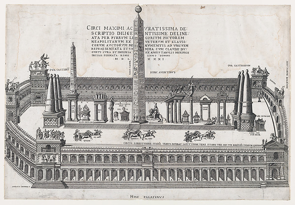

*Engraving of the Circus Maximus — the largest entertainment venue in the ancient world, seating 250,000 spectators for chariot races that were Rome's greatest gambling spectacle*

Source: Metropolitan Museum of Art

**Reconstruction of the Circus Maximus (before 1704)**

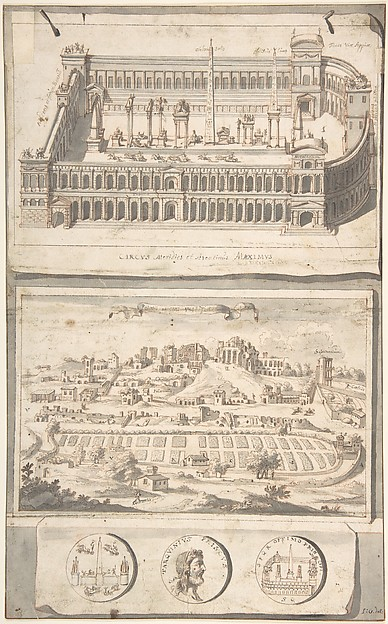

*Showing the massive scale of Rome's premier gambling venue — citizens of every class placed enormous bets on the racing factions: Reds, Whites, Blues, and Greens*

Source: Metropolitan Museum of Art

**Roman-era Dice**

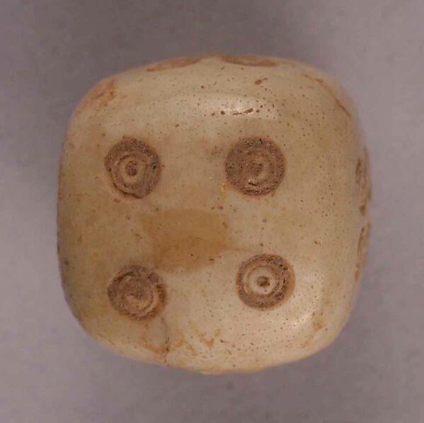

*Dice found across the Roman empire — in taverns, military camps, and the Forum itself, despite law after law forbidding dice games*

Source: Metropolitan Museum of Art

**Glass Astragal (Knucklebone), Roman**

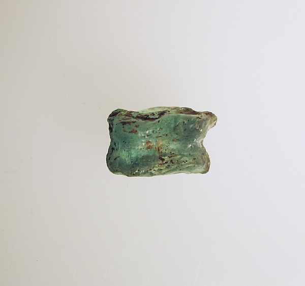

*The tali (knucklebones) that Romans inherited from the Greeks — the best roll was the 'Throw of Venus,' the worst the 'Throw of the Dog'*

Source: Metropolitan Museum of Art

**Roman Gaming Counters**

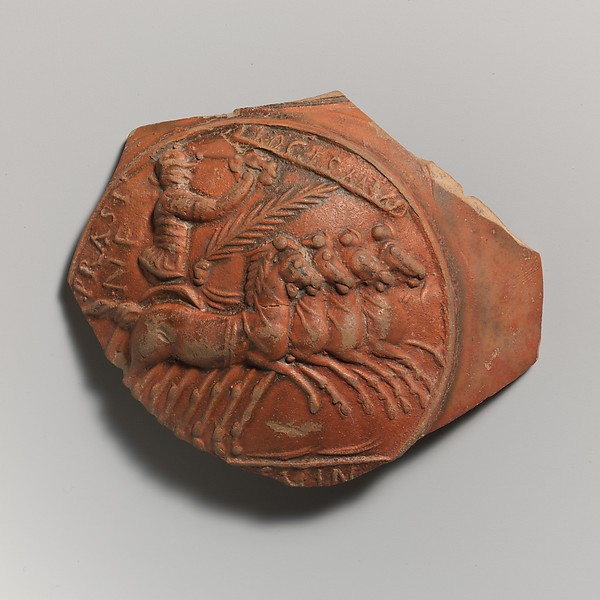

*Counters used for Duodecim Scripta ('Twelve Lines'), the ancestor of modern backgammon*

Source: Metropolitan Museum of Art

**Terracotta Hydria, c. 340–330 BCE**

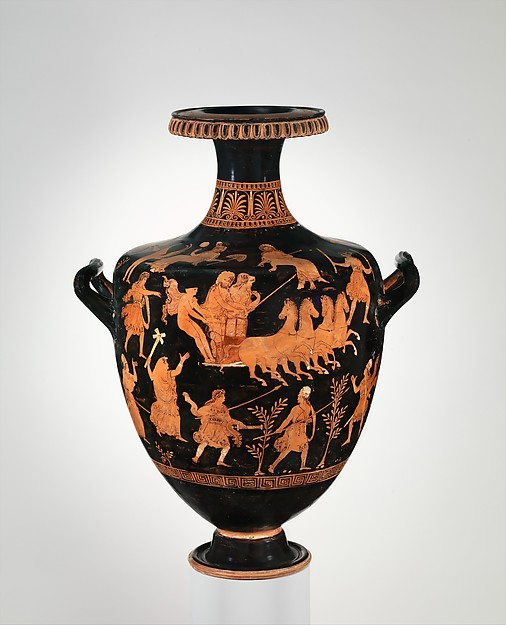

*Decorated vessel from the classical world — gambling scenes appeared on pottery across the Mediterranean*

Source: Metropolitan Museum of Art

---

# Chapter 7
## India: Dice, Dharma, and the Mahabharata

No civilization on earth has thought as deeply, as continuously, or as ambivalently about
gambling as India.
We have touched on Indian gambling in earlier chapters—the vibhidaka nuts in the
archaeological record, the Yudhishthira dice game in our survey of ancient board games.
But those were glancing references, fragments of a much larger story. India deserves its
own chapter, and a substantial one, because the Indian engagement with gambling is unique
in several respects. It is the oldest literary tradition of gambling in the world, stretching back
to the Rig Veda. It produced not one but two of the most powerful gambling narratives in all
of human literature. It generated the most sophisticated ancient regulatory framework for
gambling—a framework that anticipated modern gambling regulation by two millennia. And it
held together, in permanent, unresolved tension, a condemnation of gambling as one of the
gravest threats to human flourishing and a celebration of gambling as a sacred act
embedded in ritual, festival, and cosmology.
India did not choose between condemning gambling and embracing it. It did both,
simultaneously, for three thousand years.

The story begins, as so much in Indian civilization does, with the Rig Veda.
We encountered the Aksha Sukta—the Gambler’s Lament, Hymn 34 of the Tenth Book—
briefly in Chapter 1, where it served as evidence of the deep antiquity of gambling behavior.
Now it is time to read it properly, because the poem is not merely old. It is, by any standard,
one of the great literary achievements of the ancient world—and it establishes, in fourteen
verses, the terms of a debate about gambling that Indian civilization would conduct for the
next three millennia.
The poem is a monologue by a ruined gambler. His dice are not cubes but vibhidaka nuts—
the hard brown seeds of the Terminalia bellirica tree, drawn from a bowl in handfuls, scored
when the count was a multiple of four. The game was pure chance. And the gambler cannot
stop playing.

He begins with the sensory pull of the game itself: the rattling sound of the dice intoxicates
him like a draught of soma, the sacred drink of the Vedic gods. He had a good wife, a kind
wife, who was never angry with him or his friends. He abandoned her for the game. Now his
mother-in-law despises him, his wife rejects him, and he finds no comforter anywhere.
Then comes the passage that reads like a clinical description of addiction, composed three
thousand years before the concept existed. He resolves not to play. His friends leave
without him. But then the brown nuts rattle—and he goes to the assembly “like a woman to
her paramour.” The simile is devastating: the gambler’s relationship with the dice is erotic,
compulsive, and shameful. He knows he should not go. He goes anyway.
The gambler arrives at the hall “his body all afire,” and asks himself the question that every
gambler has asked since the beginning of time: Shall I be lucky? The dice, he says, are
“armed with goads and driving-hooks, deceiving and tormenting, causing grievous woe.”
They “give frail gifts and then destroy the man who wins.” They are “like lumps of magic
charcoal” that, “though cold themselves, burn the heart to ashes.”
The collateral damage is precise and unsparing. His wife is forlorn. His mother mourns a son
“who wanders homeless.” In debt and afraid, the gambler “goes by night unto the home of
others”—visiting other men’s houses, presumably to steal. And then the most piercing line in
the poem: “Sad is the gambler when he sees a matron, another’s wife, and his well-ordered
dwelling.” He looks at the normal lives of other men and is tormented by the comparison
with his own ruin.
The poem ends with a resolution. The gambler stretches out his hands—not to a god, but to
the dice themselves—and begs for mercy. He will farm. He will work the land. He will enjoy
modest prosperity and consider it sufficient. “Play not with dice,” he counsels. “No, cultivate
thy corn-land.” The final verse pleads with the dice to “let the brown dice snare some other
captive.”
The Sanskrit scholar Moriz Winternitz called it “the most beautiful among the non-religious
poems of the Rig Veda.” The British Journal of Psychiatry, in a 2019 analysis, found that the
poem contains precise descriptions corresponding to every major modern diagnostic
criterion for gambling disorder: preoccupation, tolerance, failed attempts to stop, using
gambling to escape distress, chasing losses, lying, jeopardized relationships, and financial
dependence on others.
But here is the complication that makes the Indian story different from any other: the Rig
Veda condemns gambling, yet the Atharva Veda—a slightly later Vedic text—contains hymns
and spells designed to ensure success in gambling. The same scriptural tradition that
produced the most devastating ancient portrait of gambling addiction also produced
magical incantations to help gamblers win. The scholar A.L. Basham argued that the Aksha
Sukta itself may have originally been a spell for success in gaming, later reworked into a

cautionary tale by an anonymous poet. If so, the poem preserves within itself the exact fault
line that runs through the entire Indian tradition: gambling as sacred power and gambling as
moral catastrophe, occupying the same textual space.

The Mahabharata contains not one but two great gambling narratives, and it is the second—
less famous but arguably more psychologically sophisticated—that reveals the deepest
Indian thinking about what dice do to the human soul.
The Yudhishthira dice game, which we surveyed in Chapter 4, is the more celebrated of the
two. We know the story: the righteous king, trapped by the Kshatriya code that forbids
refusing a challenge, loses everything—wealth, kingdom, brothers, himself, and finally his
wife Draupadi—to the crooked Shakuni, who rolls loaded dice made from his father’s bones.
The game triggers the most traumatic scene in Indian epic literature (Draupadi’s humiliation
in the assembly hall), the exile of the Pandavas, and ultimately the apocalyptic Kurukshetra
war. The entire Mahabharata—the longest epic in world literature, over 100,000 verses—
pivots on a dice game.
But the second gambling narrative, the story of Nala and Damayanti, told within the
Mahabharata as a story within the story, explores a dimension that the Yudhishthira episode
only hints at: the idea that gambling is a form of demonic possession.
Nala is the king of Nishadha—a man of extraordinary virtue, beauty, and skill. He marries
Damayanti, the most beautiful woman in the world, in a svayamvara (a ceremony in which
the princess chooses her own husband) that is attended by four gods, each of whom has
taken Nala’s form to confuse Damayanti. She sees through the disguises—the gods cast no
shadows and do not blink—and chooses the mortal Nala. The gods, impressed, bless their
union.
But the demon Kali, the personification of the darkest cosmic age, is enraged that a mortal
won Damayanti over the gods. He vows to destroy Nala. And he waits. For twelve years, he
waits—because Nala is so virtuous, so pure in his observances, that Kali cannot find an
opening. Then, one evening, Nala makes a tiny ritual error: he says his twilight prayers
without first washing his feet. It is the most minor of lapses. But it is enough. Kali enters
Nala’s body and takes possession of his mind.
Under Kali’s influence, Nala becomes a compulsive gambler. His brother Pushkara
challenges him to a dice game, and Nala, who would normally have the judgment to refuse,
cannot resist. Meanwhile, the demon Dvapara—Kali’s companion—enters the dice
themselves. The dice are literally possessed. Every throw falls against Nala. He loses his
gold, his silver, his chariots, his robes, his kingdom. His courtiers beg him to stop.
Damayanti begs him to stop. He cannot stop. His mind is “inflamed by Kali,” and he plays

“like a madman.” When Nala has lost everything, Pushkara taunts him: “Only Damayanti is
left. Will you stake her now?” This is the moment that breaks the spell—partially. Nala
refuses to stake his wife. But he has already lost everything else. He walks out of his palace
in a single garment, and Damayanti follows him into exile.
What follows is a long, harrowing journey of separation, suffering, and eventual redemption.
Nala, driven mad by Kali’s continued influence, abandons Damayanti in the forest. He is
bitten by the serpent Karkotaka, whose venom transforms his appearance but also begins to
torment the Kali inside him. In disguise as a deformed charioteer named Bahuka, Nala enters
the service of King Rituparna of Ayodhya. And here the story takes a turn that resonates
across the entire history of gambling: Rituparna possesses a secret knowledge called
Akshahridaya—“the heart of dice”—a mystical understanding of numbers and probability
that makes its possessor unbeatable at gambling. Nala trades his own skill with horses for
Rituparna’s knowledge of dice. At the moment he acquires the Akshahridaya, Kali is expelled
from his body. Knowledge defeats the demon. Understanding probability is, literally, an
exorcism.
Armed with this knowledge, Nala eventually returns to challenge Pushkara to a rematch. He
wins back everything in a single game. And in a remarkable act of mercy, he forgives his
brother.
The Nala story, told as a consolation to Yudhishthira during the Pandavas’ own exile, is a
mirror of the main epic’s dice game—but with a crucial difference. Yudhishthira’s gambling is
driven by duty (the Kshatriya code) and personal weakness (he “liked to play, even though
he did not know how to play”). Nala’s gambling is driven by literal demonic possession. The
narrative framework is supernatural—demons enter both the player and the dice—but the
psychological portrait is entirely realistic: a good man, under an influence he cannot control,
destroying his life through compulsive gambling despite the desperate pleas of everyone
who loves him. The demon Kali is, in a sense, the Mahabharata’s way of describing what
modern neuroscience would call the hijacking of the reward system. And the cure—
Akshahridaya, the knowledge of numbers and probability—is the Mahabharata’s way of
saying that understanding the mathematics of chance is the only true defense against its
power.

The Vedic royal consecration ceremony—the Rajasuya—adds another dimension. In this
elaborate rite, which installed a king in his sovereignty, the newly crowned monarch was
required to play a game of dice. And he was required to win.
The game was not entertainment. It was ritual enactment. The king’s victory at dice
demonstrated his mastery over the forces of chance—his capacity to command fortune
itself. The game was played with five vibhidaka nuts (later replaced by gold cowrie shells),

and the king’s winning throw was the highest possible score. The ceremony dramatized the
central claim of Indian kingship: that the sovereign was not merely a political leader but a
cosmic figure, positioned at the junction of order and chaos, capable of bending chance to
his will.
Read against this ritual background, Yudhishthira’s catastrophic loss in the Sabha Parva
takes on a meaning that goes far beyond a personal failing. Yudhishthira is called
Dharmaraja—the king of righteousness. His identity is defined by his relationship to dharma,
the cosmic moral order. When he loses at dice, he is not merely losing his kingdom. He is
demonstrating that dharma itself has been defeated. The cosmic order has broken down.
The king who should command fortune is instead destroyed by it. This is what makes the
Mahabharata‘s dice game the most devastating gambling scene in literature: it is not just a
story about a man who couldn’t stop. It is a story about the collapse of the moral universe.

If the Mahabharata and the Rig Veda represent the literary and philosophical dimensions of
Indian gambling, the Arthashastra represents the administrative dimension—and it is, in its
way, equally remarkable.
The Arthashastra is an ancient treatise on statecraft attributed to Kautilya (also known as
Chanakya), the legendary advisor to the Maurya emperor Chandragupta. The text, as it
survives, is likely a compilation by multiple authors over several centuries, with its core
material dating to approximately the third century BCE. It is one of the most comprehensive
manuals of governance ever written, covering everything from taxation to espionage to
animal husbandry. And it includes a chapter on the regulation of gambling that anticipates
modern gambling law with startling precision.
The Arthashastra’s approach is not prohibitionist. Kautilya recognized that gambling could
not be eliminated, and he saw no reason to try. Instead, he proposed that the state should
centralize and regulate it. Gambling was to take place in state-supervised gambling houses,
operated by an appointed Superintendent of Gambling. The superintendent was required to
be honest and to supply standardized dice, rented to players at a fixed rate. Substituting
unauthorized dice—through sleight of hand or any other trick—was punishable by a fine of
twelve panas. Cheaters were to be fined, made to forfeit their winnings, and punished
additionally for theft and deceit.
The state took a five-percent cut of every winning stake, plus fees for the hire of dice and
equipment, charges for water and accommodation, and a licensing fee. The superintendent
could also conduct sales and mortgage transactions on the premises. If the superintendent
failed to prevent cheating, he himself was fined double the amount levied on the cheaters.
There was also a secondary purpose. Kautilya argued that centralized gambling houses

served a law-enforcement function: thieves and spies, flush with ill-gotten money, were
likely to frequent gambling halls, making the houses useful surveillance points. Gambling
was to be permitted “with a view to find out spies or thieves.”
The Arthashastra‘s regulatory model—state monopoly, licensed premises, standardized
equipment, taxation of winnings, penalties for cheating, and government oversight—is
recognizably the same model used by modern gambling commissions in Nevada, Macau,
and the United Kingdom. Kautilya arrived at this framework twenty-three centuries before
the Nevada Gaming Control Board was established. And he arrived at it through the same
reasoning: the pragmatic recognition that prohibition doesn’t work, that gambling will
happen regardless of the law, and that the state is better served by taxing and controlling
the activity than by driving it underground.
Other Indian legal texts took comparable positions. The Yajnavalkya Smriti directed the
keeper of a gambling house to take five percent of stakes up to a hundred panas and ten
percent above that—a sliding scale of taxation. Gambling was to take place “under one
supervision” as a means of detecting thieves. The Narada Smriti prescribed that the master
of the gaming house should “arrange the game and pay the stakes which have been won,”
with a profit of ten percent. Disputes among gamblers were to be settled by other gamblers,
acting as both judges and witnesses—a remarkable anticipation of the self-regulatory
principles used in modern gambling arbitration.
The Brihaspati Smriti captured the Indian legal tradition’s ambivalence in a single sentence:
“Gambling has been prohibited by Manu, because it destroys truth, honesty, and wealth. It
has been permitted by other legislators when conducted so as to allow the king a share of
every stake.” Prohibition and permission, occupying the same breath. Manu says no. Other
sages say yes, provided the state gets its cut. The compromise is regulation.
Even the Apastamba Dharma Sutra, one of the oldest surviving legal texts, prescribed that a
play-table should be raised in the midst of the assembly-house, sprinkled with water, and
supplied with dice made of vibhidaka wood “as many as are wanted.” Men of the first three
castes—Brahmins, Kshatriyas, and Vaishyas—were permitted to play, provided they were
“pure and truthful.” The commentator Haradatta added that gambling should take place in
licensed houses only, with the keeper giving his profits to the king. Those who gambled
elsewhere were to be punished.
The consistency of these provisions across centuries and across different legal schools is
striking. Indian jurisprudence never seriously attempted total prohibition of gambling. The
dominant legal tradition, from the Arthashastra through the medieval Smritis, was
regulation, taxation, and state supervision—a position that was simultaneously pragmatic
(gambling generates revenue), administrative (gambling houses are useful for surveillance),
and moral (regulated gambling is less destructive than unregulated gambling).

The religious traditions that emerged from the Indian subcontinent took divergent positions
that further enriched the picture.
The Buddha, in the Sigalovada Sutta, explicitly prohibited gambling among his followers. The
text lists six dangers of gambling: the winner creates enemies; the loser grieves over his
losses; wealth is destroyed; one’s word carries no weight in public assemblies; friends and
associates show contempt; and one is not sought after for marriage, “for people will say a
gambler cannot maintain a wife.” The Buddhist prohibition is practical rather than
theological—it rests on an assessment of consequences, not on a claim about the
metaphysical status of chance. Gambling is bad because it produces bad outcomes, not
because it offends the gods. The fact that dice and gaming equipment have been found at
Buddhist monastery sites across India suggests that the prohibition, like the Roman antigambling laws, was not perfectly observed.
Jain tradition similarly discouraged gambling as incompatible with the principles of nonattachment and non-violence. But the Jain prohibition, like the Buddhist one, was part of a
broader ascetic ethic rather than a specific theological condemnation of chance.
Hinduism, by contrast, never reached consensus. The Rig Veda condemns. The Atharva
Veda offers spells for winning. The Manusmriti prohibits. The Arthashastra regulates. The
Mahabharata uses gambling as the engine of the greatest catastrophe in Indian literature—
and also depicts the gods themselves playing dice. Shiva and Parvati are traditionally shown
playing Chaupar together, a scene depicted in sculpture and painting across centuries. And
Diwali—the festival of lights, the most important holiday in the Hindu calendar—is
traditionally celebrated with dice games and card games, a practice that continues to this
day. Gambling during Diwali is considered auspicious: it invokes Lakshmi, the goddess of
wealth and prosperity, and the belief is that winning at cards or dice during the festival
brings good fortune for the coming year.
The Diwali gambling tradition is the living descendant of the Vedic dice ceremony. The logic
is the same: to gamble during a sacred season is to engage with the forces of fortune under
divine protection. The festival sanctifies the activity. What would be a vice in ordinary time
becomes a blessing during the sacred interval—precisely the same logic that governed the
Roman Saturnalia, though the Indian tradition is both older and more continuous.

What emerges from this long survey is a portrait of a civilization that understood gambling
more completely than any other.
The Greeks philosophized about gambling. The Romans legislated against it while doing it.
The Chinese displaced it with Go. But India encompassed the full range of human responses
to chance within a single, continuous tradition. India produced the world’s oldest literary

portrait of gambling addiction—and spells to help gamblers win. India produced the most
devastating narrative of gambling’s destructive power—and a royal consecration ceremony
in which the king must gamble and must win. India produced a legal tradition that banned
gambling on moral grounds—and a parallel legal tradition, equally old and equally
authoritative, that regulated gambling with a sophistication unmatched until the modern era.
India invented the concept of Akshahridaya—the idea that the mathematics of probability
could be a form of secret knowledge, a mystical power that defeats the demons of chance.
This comprehensiveness is not confusion. It is wisdom. India recognized that gambling
occupies a space in human life that cannot be resolved by a single policy or a single moral
judgment. It is simultaneously dangerous and sacred, destructive and creative, a source of
ruin and a test of sovereignty. The Indian tradition holds all of these truths together without
pretending that any one of them cancels the others.
The next chapter moves to another great civilization of the ancient East—China—where the
relationship with gambling followed a different trajectory entirely, shaped by Confucian
disdain for disorder and a gaming culture that eventually chose pure strategy over chance.

### Images — Chapter 7

**Shiva and Parvati Playing Chaupar, from a Rasamanjari Series, 1694–95**

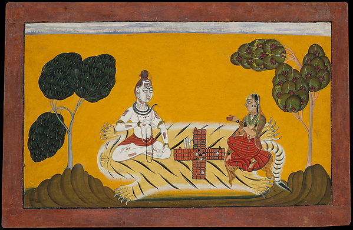

*The gods themselves at the gaming board — Shiva and Parvati are traditionally shown playing Chaupar, depicted in sculpture and painting across centuries*

Source: Metropolitan Museum of Art, #37942

**Indian Miniature Painting, Mughal Era**

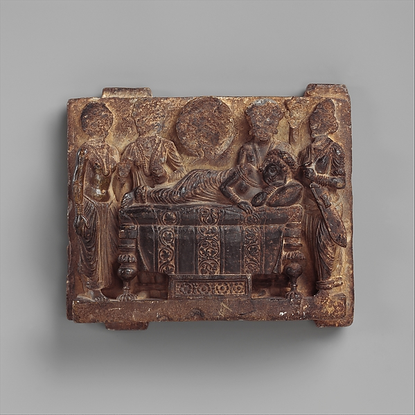

*The rich tradition of Indian miniature painting documented courtly life, including the gambling scenes central to Indian epic literature*

Source: Metropolitan Museum of Art

**Laur and Chanda in the Forest, from a Chandayana, c. 1525–50**

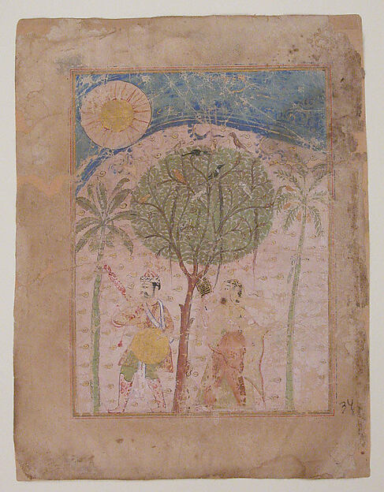

*Indian manuscript painting from the tradition that produced the world's greatest gambling narratives*

Source: Metropolitan Museum of Art

---

# Chapter 8
## China: From Liubo to Mah-Jongg

Here is one of the great paradoxes of gambling history: the civilization that disapproved of
gambling most consistently also invented more of its essential tools than any other
civilization on earth.
China gave the world playing cards, dominoes, paper money, the lottery, and Mah-Jongg.
Five technologies, each of which transformed the way human beings gamble, each of which
spread from China to the rest of the world and reshaped it. If you stripped Chinese
inventions from the global gambling industry, there would be almost nothing left. No cards,
no tiles, no keno, no Pai Gow. The casino floor would be a room full of dice and roulette
wheels—a thin fraction of the gambling universe we actually inhabit.
And yet China is also the civilization of Confucius, who reportedly condemned the gambling
game of Liubo for promoting bad habits; of imperial edicts banning dice games under pain
of severe punishment; of a Communist revolution that outlawed Mah-Jongg itself, on the
grounds that it was a capitalist vice. Chinese culture has been both the engine room of
gambling innovation and its most vocal philosophical critic. Understanding how those two
things can be true at the same time is the work of this chapter.

We surveyed Liubo in Chapter 4—the six-stick game with its TLV board and cosmological
symbolism, popular during the Han Dynasty and then displaced by the pure-strategy game
of Go. That displacement, we noted, reflected a Confucian preference for order over chaos,
for rational mastery over the turbulence of chance. Go rewarded the better mind. Liubo
rewarded the luckier throw.
But the story didn’t end there. What actually happened after Liubo faded was not that
Chinese culture abandoned gambling. It abandoned that particular game and invented a
dozen others. The Confucian ideal of the rational, disciplined life was powerful as
philosophy but impotent as prohibition. The Chinese people went right on gambling—they
just did it with new equipment.
The first and most consequential innovation was playing cards.

The invention of playing cards is one of those world-historical developments that is both
well-attested and frustratingly murky in its details. What is clear is that cards originated in
China, that they appeared sometime during or after the Tang Dynasty (618–907 CE), and
that their invention was made possible by an earlier Chinese innovation: woodblock printing.
The earliest literary reference that may describe card games comes from a Tang Dynasty
text attributed to the writer Su E, who describes Princess Tongchang, daughter of Emperor
Yizong, playing a “leaf game” (yezi xi) with members of the Wei clan in 868 CE. The Song
Dynasty scholar Ouyang Xiu, writing around 1067, confirmed that the leaf game had been
popular among scholar-officials since the mid-Tang period and associated its invention with
the development of printed sheets. In 969, according to a fourteenth-century history of the
Liao Dynasty, Emperor Muzong went on a twenty-five-day drinking spree and played the
“game of leaves” with his ministers on New Year’s Eve.
What exactly the “leaf game” was remains a matter of scholarly debate. The scholar Andrew
Lo, in a meticulous 2000 study published in the Bulletin of the School of Oriental and
African Studies, argued that the Tang-era yezi referred not to playing cards as we
understand them but to the pages of a reference book consulted during a board game
played with dice—a sort of lookup table. If Lo is right, the word yezi was only transferred to
playing cards proper sometime around the fifteenth century. The first unambiguous
evidence of playing cards in China comes from a legal case: in 1294, during the Yuan
Dynasty, two gamblers named Yan Sengzhu and Zheng Zhugou were arrested in Shandong
province, and the authorities confiscated nine paper cards and the woodblocks used to print
them.
The dispute over dating does not change the essential point: China invented the playing
card. Whether it happened in the ninth century or the thirteenth, the technology originated
there and nowhere else. Chinese cards came in several varieties. The most important for the
global history of gambling were the money cards—cards organized into suits based on
denominations of currency: cash (single coins), strings of cash, hundreds of strings, and
myriads (thousands) of strings. There were nine ranks in each suit. The connection between
playing cards and actual paper money was not coincidental. The historian William Henry
Wilkinson suggested that the first cards may have been paper currency used simultaneously
as gaming tokens and as stakes—the tools of play and the objects wagered were the same
thing.
This insight is worth pausing over, because it connects two Chinese inventions that jointly
transformed the world. China invented paper money (during the Tang Dynasty, formalized
during the Song) and playing cards (during roughly the same period). The two technologies
share a common substrate—printed paper—and a common logic: the assignment of agreedupon value to a portable, reproducible symbol. A banknote says “this piece of paper is worth
ten strings of cash.” A playing card says “this piece of paper represents the nine of strings.”

The conceptual leap from one to the other is short. And both innovations, when they
eventually reached Europe, would revolutionize their respective domains: paper money
would transform finance, and playing cards would transform gambling.
Chinese dominoes—tiles bearing all twenty-one combinations of a pair of dice—appeared
around the Song Dynasty (960–1279) and were initially made of bone, ivory, or wood. They
did not take paper form until around 1600, during the late Ming. The Chinese word pái
means both “card” and “tile,” reflecting the fluid boundary between the two formats. Domino
cards and money cards coexisted in Chinese gambling culture for centuries, each spawning
its own family of games.

While scholars debated the leaf game and artisans carved dominoes, a simpler form of
Chinese gambling was thriving in the streets and taverns of the empire: Fan-Tan.
Fan-Tan is one of the oldest continuously played gambling games in the world. Its origins
may reach back to the third or fourth century CE—the period of the Northern and Southern
Dynasties—though the name itself dates only to the mid-nineteenth century. Before that, it
was known by various names: yanqian (“covering coins”), tanxi, tanqian, or yiqian. The
mechanics are elemental: a dealer scoops a double handful of small objects—beans,
buttons, coins, beads—onto a table and covers them with a bowl. Players bet on a number
from one to four. The bowl is lifted, and the dealer removes objects four at a time with a
bamboo stick until one, two, three, or four remain. That number wins.
It is, at its core, a modular arithmetic game: what is the remainder when an unknown
quantity is divided by four? The mathematics are trivially simple. The odds are exactly one in
four for each outcome. The house takes a commission (traditionally five to ten percent of
the winning stake), and the house edge—depending on the specific bet type—ranges from
about 1.25 to 3.75 percent. Fan-Tan requires no skill, no strategy, no knowledge of
probabilities, no cards, no dice, no board. It requires only a pile of small objects, a bowl, a
stick, and a willingness to bet.
This simplicity was Fan-Tan’s genius and its endurance. A game that requires nothing but
beans and a bowl can be played anywhere, by anyone, at any level of stakes. During the
Qing Dynasty, Fan-Tan became the dominant gambling game of southern China, particularly
in Guangdong Province. By the mid-nineteenth century, Macau had over two hundred FanTan stalls. The game was the backbone of the gambling economy that would eventually
make Macau the richest gaming territory on earth.
When the great Cantonese emigration began—driven by the Taiping Rebellion, the Gold
Rush, and the construction of the Transcontinental Railroad—Fan-Tan traveled with the
emigrants. By the 1880s, San Francisco’s Chinatown had fifty Fan-Tan houses, some with as

many as twenty-four tables. New York’s Chinatown ran its own operations. Jacob Riis, in his
1890 exposé How the Other Half Lives, described entering a Chinatown Fan-Tan parlor: “At
the first foot-fall of leather soles on the steps the hum of talk ceases, and the group of
celestials, crouching over their game of fan tan, stop playing and watch the comer with ugly
looks.” California amended its penal code in 1885 to specifically ban Fan-Tan—a legislative
action that coincided with the broader anti-Chinese sentiment that produced the Chinese
Exclusion Act of 1882. The ban on the game was, in part, a ban on the people who played it.
Fan-Tan’s story is emblematic of a pattern that recurs throughout the global history of
gambling: a game that is unremarkable in its home culture becomes a marker of ethnic
identity, and then a target of nativist hostility, when it travels abroad. The game itself—beans
under a bowl, remainder after division by four—could not be more innocent. But in the eyes
of white Americans in the 1880s, it was sinister, foreign, and inseparable from the Chinese
community they wanted to exclude.
Today, a handful of tables in Macau’s casinos still offer Fan-Tan, mostly patronized by
elderly regulars. It is the last remnant of a game that once dominated the gambling culture
of southern China and its global diaspora. Two millennia old and barely changed, it sits in
the corner of a casino floor surrounded by baccarat tables, a living fossil.

The Chinese lottery is another innovation whose influence far exceeds its fame.
The earliest evidence of a lottery-like game in China dates to the Han Dynasty (206 BCE–
220 CE). The game known as baige piao—“white pigeon ticket”—was named for the carrier
pigeons used to transmit results between cities. The mechanics evolved over the centuries,
but the principle was consistent: players selected characters or numbers from a set, and
winning was determined by a random draw. During the Qing Dynasty, the lottery became
enormously popular, particularly in Guangdong.
When Chinese immigrants brought the lottery to the American West, it underwent a
transformation. The original game used Chinese characters—eighty characters selected
from the Thousand Character Classic, a traditional Chinese poem in which no character
repeats. Players chose a subset of characters, and the house drew a winning set. The game
was Americanized as “Chinese lottery” and eventually, as the Chinese characters gave way
to numbers, became the game known today as Keno—a fixture in casinos worldwide. The
link between Keno and the Chinese baige piao is direct and well-documented, though most
Keno players are entirely unaware of it.

Pai Gow—played with Chinese dominoes, not cards—deserves a brief mention as another
Chinese game that traveled far from its origins. The name means “make nine,” referring to

the goal of creating two domino hands that each beat the dealer’s corresponding hands. It
is a banking game, played against the house, with a low house edge and a slow pace that
makes it popular among experienced gamblers who want their bankroll to last. When Pai
Gow was adapted for Western casinos in the 1980s, the dominoes were replaced with
playing cards (creating “Pai Gow Poker”), which made the game accessible to a broader
audience while preserving its essential structure.

And then there is Mah-Jongg—the game that conquered the world.
Mah-Jongg is not ancient. Despite the romantic legends that attribute it to Confucius or to
the Shang Dynasty, scholarly consensus places its invention firmly in the mid-nineteenth
century, in the coastal provinces around Ningbo, Shanghai, and Nanjing. The earliest
surviving tile sets date to around 1870. The game evolved from earlier Chinese card games
—particularly the draw-and-discard money-card games like Madiao and Penghú—with the
crucial innovation being the transfer of card designs onto tiles. The tiles are beautiful
objects: rectangles of bamboo backed with bone or ivory, inscribed with Chinese characters
and symbols, tactile and resonant in a way that paper cards are not. The clatter of MahJongg tiles being shuffled—what the Chinese call “the twittering of sparrows,” which is
probably the origin of the game’s name—is one of the most distinctive sounds in the world
of games.
Mah-Jongg is played by four players, each drawing and discarding tiles to assemble a
winning hand of specific combinations (melds and a pair), in a mechanic structurally
identical to Western rummy games. It blends strategy, memory, probability assessment, and
the ability to read other players’ discards—a game of genuine skill with a substantial
element of chance. It is, in other words, the card-game equivalent of the mixed strategyand-chance games we surveyed in Chapter 4. But where the Royal Game of Ur and Senet
embedded chance in a race mechanic, Mah-Jongg embeds it in a draw-and-discard
mechanic—a structure that feels more cerebral, more interactive, and more amenable to
long-term skill development.
The game spread across China with remarkable speed. By 1905, it was largely unknown
outside its region of origin. By 1920, it had supplanted chess as the most popular game in
China—a stunning reversal of the trajectory we traced in Chapter 4, where Go had displaced
Liubo. The Chinese people, it turned out, had not permanently chosen pure strategy over
chance. They had simply been waiting for a chance-and-strategy game sophisticated
enough to hold their interest.
From China, Mah-Jongg reached the Western world through the foreign residents of
Shanghai’s international settlement. An American businessman named Joseph Park
Babcock, a representative of Standard Oil stationed in China, became fascinated with the

game and saw its commercial potential. He simplified the rules, added Arabic numerals to
the tiles so that Westerners could read them, trademarked the spelling “Mah-Jongg,” and
began importing sets to the United States. The first sets went on sale at Abercrombie &
Fitch in New York in 1920.
What followed was one of the most intense game crazes in American history. By 1922–1924,
Mah-Jongg mania had swept the country. Department stores sold out of sets. Mah-Jongg
clubs and societies proliferated. The game was particularly popular among wealthy white
women—a demographic that would later, through the National Mah Jongg League (founded
in 1937), develop the distinctive American variant with its annual card of standardized hands
and its use of jokers. The Jewish-American community became a particularly devoted
custodian of the American game, passing it from generation to generation through the
twentieth century and into the twenty-first.
In China itself, Mah-Jongg’s fate followed the trajectory of the nation’s politics. The game
flourished through the Republic era. Then, after the Communist Revolution, Mao Zedong
banned it—not because of any specific ideological objection to tile games, but because
Mah-Jongg was associated with gambling, idleness, and the bourgeois culture the
revolution was determined to destroy. The ban lasted until 1985. When it was lifted, the
game returned immediately and explosively, as if thirty-seven years of prohibition had only
increased the pressure. Today, Mah-Jongg is played by an estimated hundreds of millions of
people in China and across the global Chinese diaspora. The rhythmic clatter of tiles is the
soundtrack of family gatherings, festival celebrations, and neighborhood teahouse
afternoons from Beijing to San Francisco.

The imperial and philosophical tradition of disapproval that forms the counterpoint to all this
invention is worth examining in its own right, because it illuminates something important
about why Chinese gambling culture took the shape it did.
Confucius (or the tradition attributed to him) set the tone. The Kongzi Jiayu records
Confucius condemning Liubo for leading people away from righteousness. The Confucian
ethical framework valued self-cultivation, filial duty, social harmony, and productive labor.
Gambling violated every one of these values: it was self-indulgent rather than selfimproving, it risked the family’s resources, it generated social conflict, and it produced
nothing. The Confucian ideal was the scholar-official who spent his leisure hours studying
the classics, composing poetry, playing Go, or practicing calligraphy—the “four arts of the
Chinese scholar.” Gambling was the negation of this ideal.
Imperial law followed Confucian philosophy, sporadically but persistently. The Han Dynasty
had statutes against gambling. The Tang Dynasty prohibited dice games. The Song, Yuan,
Ming, and Qing Dynasties all issued edicts against various forms of gambling, with

punishments ranging from fines to flogging to exile. The pattern was identical to what we
saw in Rome: laws were passed, laws were ignored, laws were passed again. The
persistence of the legislation is itself evidence of the legislation’s failure. You do not keep
banning something that is already successfully banned.
The Chinese pattern differed from the Roman pattern in one important respect: the Chinese
state, unlike Rome, did not generally carve out exceptions for sports betting or athletic
competitions. Chinese anti-gambling law was more comprehensive in theory—and equally
ineffective in practice. The Qing Dynasty, in particular, waged a prolonged and futile war
against gambling. Opium dens and Fan-Tan houses proliferated side by side in Guangdong
and Fujian provinces, and the government’s inability to suppress either became one of the
markers of Qing decline.
The Confucian condemnation was also complicated by a countervailing tradition within
Chinese culture: the deep association between gambling and luck, and between luck and
cosmic favor. The Chinese concept of yun (运)—fortune, luck, the way things are turning out
for you—is a pervasive element of Chinese folk culture, distinct from the more austere
Confucian worldview. To be lucky is to be in harmony with the current of events. To gamble
successfully is to demonstrate that you are in yun—that the universe is flowing in your
direction. This folk belief, which coexists with official Confucian disapproval in much the
same way that Roman gambling coexisted with Roman anti-gambling law, provides the
cultural oxygen that keeps Chinese gambling alive despite centuries of philosophical and
legal opposition.

What China’s gambling history reveals, when you step back and look at the full sweep, is a
civilization in which the impulse to innovate and the impulse to prohibit were not opposing
forces but linked forces—two sides of the same coin, each generating the other.
Every prohibition produced workarounds. Every crackdown produced new games. Ban dice
and people switch to cards. Ban cards and people switch to tiles. Ban tiles and people bet
on beans under a bowl. The Chinese genius for gambling technology was, in part, a
response to the Chinese tradition of gambling prohibition: if you can’t play the old game,
you invent a new one. The result was that China, over three thousand years, produced more
gambling technologies than any civilization in history—not despite its anti-gambling culture,
but in a strange way because of it.
And those technologies, carried by trade and emigration to every corner of the world,
became the infrastructure of global gambling. Playing cards reached the Islamic world by
the thirteenth or fourteenth century, arrived in Europe by the late 1300s, and were adapted
into the French-suited fifty-two-card deck that dominates the world today. The Chinese
lottery became Keno. Chinese dominoes became Pai Gow. Mah-Jongg became a global

phenomenon. The Confucian scholars condemned gambling. The Chinese people invented
the tools with which the rest of the world gambles. Both statements are true. Both are
essential to the story.
In the next chapter, we will follow some of those tools—particularly the playing card—as they
traveled westward along the trade routes, through the Islamic world and into medieval
Europe, where they would ignite a revolution in gambling that is still unfolding today.

### Images — Chapter 8

**Pair of Seated Figures Playing Liubo, 1st century BCE–1st century CE**

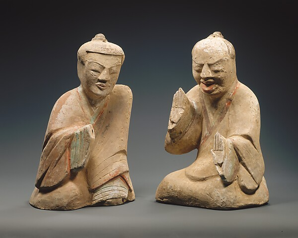

*Han Dynasty tomb figurines showing animated Liubo players — one hand raised as if about to slam down the throwing sticks. These are among the most common gaming artifacts in Han Dynasty tombs*

Source: Metropolitan Museum of Art, #44732

**Liubo Board and Pieces, 1st century BCE–1st century CE**

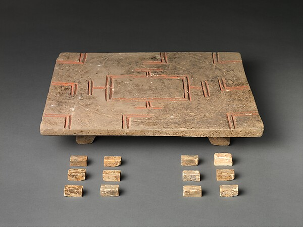

*A complete Han Dynasty Liubo gaming set with its distinctive square board — the game was simultaneously entertainment, gambling instrument, and divination tool*

Source: Metropolitan Museum of Art, #50484

**Mirror with Game Board Design (TLV Pattern), 1st–2nd century**

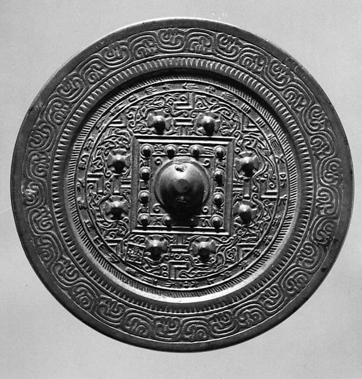

*The cosmological TLV pattern that adorned both Liubo boards and bronze mirrors — believed to symbolize the gates between the four directions and the center of the cosmos*

Source: Metropolitan Museum of Art

---

# Chapter 9
## Japan: Gambling in the Floating World

In the autumn of 1543, three Portuguese merchants were blown off course by a typhoon and
crashed onto the shores of Tanegashima, a small island off the southern tip of Japan. They
brought two things that would reshape the country: the matchlock musket and a deck of
forty-eight playing cards.
The musket gets all the attention in the history books, and understandably so—it helped
unify Japan under the Tokugawa Shogunate within sixty years. But the playing cards, in their
way, had consequences just as far-reaching. They were the seed from which would grow an
extraordinary three-century struggle between the Japanese state and the Japanese people
over the right to gamble—a struggle that produced one of the most beautiful card decks
ever designed, gave birth to the most powerful organized crime syndicate in Asia, and
launched a company that would eventually become the largest video game corporation on
earth.
This is a chapter about prohibition, ingenuity, and unintended consequences.

The Portuguese cards that arrived in Japan were a standard Iberian deck: forty-eight cards
in four suits—Cups, Coins, Clubs, and Swords—divided into twelve ranks. The Japanese
were immediately obsessed. They reverse-engineered the decks with meticulous precision,
producing copies called Tenshō Karuta (from the Portuguese carta, meaning “card”) that
were virtually indistinguishable from the European originals. The Ace of Coins often featured
a dragon, faithfully mimicking the Portuguese style. Card games spread rapidly across
Japanese society, and with them came gambling—a development that did not escape the
attention of the authorities.
When the Tokugawa Shogunate consolidated power in 1603 and imposed the sakoku
(“closed country”) isolation policy starting in 1633, foreign playing cards were banned.
Anything associated with the dangerous influence of the West—Christianity, firearms trade,
and now card games—was to be eliminated.
What followed was the most remarkable game of regulatory cat-and-mouse in the history of
gambling.

The government banned Tenshō Karuta. Japanese gamblers responded by creating a new
card design called Unsun Karuta, with different imagery that did not resemble the
Portuguese originals. The government identified the new cards as a gambling instrument
and banned those too. The gamblers created Mekuri Karuta—a forty-eight-card deck
divided into four suits of twelve, used for a fishing-style game that became wildly popular
through the mid-to-late eighteenth century. It was banned in 1791, during the Kansei
Reforms. New designs appeared. Those were banned. Newer designs appeared. Those
were banned too.
Each ban triggered the creation of a new deck, and each new deck was designed to be
more abstract, more Japanese, and less recognizably derived from the forbidden foreign
originals. The progression was a kind of forced evolution: governmental pressure selected
for card designs that looked nothing like European cards. Suits disappeared. Numbers
disappeared. The forty-eight-card structure—the mathematical backbone inherited from the
Portuguese—was retained, because the games required it, but everything visible was
transformed.
The endpoint of this evolutionary process was Hanafuda—“flower cards”—and they are a
work of art.

Hanafuda consists of forty-eight cards divided into twelve suits of four, each representing a
month of the year and associated with a specific plant: pine for January, plum blossom for
February, cherry blossom for March, wisteria for April, iris for May, peony for June, bush
clover for July, silver grass for August, chrysanthemum for September, maple for October,
willow for November, and paulownia for December. Each suit contains four cards of different
values, distinguished not by numbers but by the imagery depicted: some feature only the
plant, others include poetry ribbons (tanzaku), animals, or birds, and one card in each suit is
designated as the high-value “bright” card.
There are no numbers anywhere on the cards. There are no suits in the European sense.
There are no kings, queens, or jacks. There is nothing that would identify them, to an
uninformed observer, as gambling instruments. They look like seasonal greeting cards—like
something you might hang on a wall or give as a gift. The aesthetic is pure Japanese: bold,
flat, graphic, with the high-contrast visual vocabulary of ukiyo-e woodblock prints. Pine and
crane. Cherry blossoms and a poetry curtain. A deer turning to gaze at maple leaves. A boar
rushing through bush clover. Moon over silver grass.
The beauty was the disguise. Hanafuda were designed to pass as cultural artifacts—
educational tools for teaching the seasonal calendar, or parlor games for matching flowers.
The fact that they could be (and were) used for gambling was, technically, incidental. The
government, exhausted by decades of banning one card design after another, largely

stopped trying. When cards had no pips and no suits and no numbers—when they were, on
their face, nothing but pictures of flowers—what exactly was there to ban?
The earliest known reference to hana awase (the precursor game played with flower cards)
as a banned gambling instrument dates to 1816. By then, the cards had already been
circulating for decades. The design had stabilized at twelve suits of four cards—forty-eight
cards total, the same number as the Portuguese deck that had arrived on Tanegashima
nearly three centuries earlier. The mathematical DNA of the original European cards
survived every ban, every redesign, every cycle of prohibition and reinvention. Only the
surface changed. Underneath, the probabilities were the same.

But the cards needed players, and the players needed organizers, and the organizers
became something else entirely.
During the Edo period (1603–1868), gambling was officially illegal throughout Japan. The
Tokugawa Shogunate’s Confucian-influenced social order was rigid and hierarchical:
samurai at the top, then farmers, then artisans, then merchants at the bottom. Gambling
disrupted this order. It redistributed money unpredictably. It mixed social classes. It created
alternative economies outside the government’s control. The authorities suppressed it—
intermittently, unevenly, and ultimately without success.
Into this gap stepped the bakuto.
The bakuto were itinerant gamblers who traveled the highways and post roads of Tokugawa
Japan, running illicit card and dice games in towns, inns, and makeshift gambling dens.
Their signature game was Chō-Han—a dice game of absolute simplicity. A dealer shakes
two standard six-sided dice in a bamboo cup, overturns the cup, and players bet on whether
the sum of the two dice is chō (even) or han (odd). The cup is lifted, the dice are revealed,
winners collect, losers pay. There is no strategy, no skill, no decision beyond the initial bet. It
is the Japanese equivalent of a coin flip with a house cut. The dealer—traditionally a woman,
chosen for the aesthetic and theatrical dimension she brought to the game—performed the
ritual with practiced grace: the shake, the overturn, the dramatic pause before the reveal.
The bakuto were recruited from the margins of Japanese society: the landless poor,
masterless samurai (ronin), delinquent merchants, dismissed sumo wrestlers. Their origins
were sometimes directly governmental. Local officials and construction bosses during the
Tokugawa era hired professional gamblers to recover the wages they had paid to irrigation
and construction workers—setting up gambling operations along the roads so that laborers
would gamble their earnings away on payday and the money would flow back to the bosses.
The bakuto were, in this respect, a tool of labor exploitation before they were a criminal
enterprise.

Over time, the hired gamblers organized. They developed hierarchical structures modeled
on the Japanese family: the oyabun (boss, literally “parent role”) presided over the kobun
(subordinates, literally “child role”), bound together by rituals of loyalty including the
exchange of sake cups. They enforced discipline through severe punishments, most
notoriously yubitsume—the ritual severing of the top joint of the little finger, performed with
a short blade as atonement for serious transgressions. The practice had a practical origin: a
man missing a finger joint could not grip a sword properly, making him more dependent on
his boss’s protection. The bakuto also adopted full-body irezumi tattoos—elaborate,
gorgeous, painful works of art that covered the torso, back, and limbs. Originally a mark of
criminal punishment, the tattoos were reclaimed as a badge of identity and defiance.
The bakuto, together with the tekiya (itinerant peddlers who ran protection rackets at
markets and festivals), became the two ancestral streams that merged to form the modern
yakuza—Japan’s organized crime syndicates. The connection between Japanese organized
crime and gambling is not incidental or metaphorical. It is genetic. The yakuza literally grew
out of gambling operations. The word yakuza itself comes from a losing hand in the card
game Oicho-Kabu, a game played with Kabufuda or Hanafuda cards: the combination 8-9-3
(ya-ku-za) totals twenty, which in the game counts as zero—the worst possible score.
“Yakuza” means, roughly, “worthless” or “good for nothing”—a self-deprecating label that
the gamblers-turned-gangsters wore with perverse pride, as if to say: we are the losers, the
rejects, the people society has discarded. And we run things now.

Gambling was not merely tolerated in the demimonde of Edo-period Japan. It was
embedded in the culture of the ukiyo—the “floating world,” the nocturnal realm of pleasure
quarters, theaters, teahouses, and brothels that flourished in the great cities of Edo (Tokyo),
Osaka, and Kyoto.
The floating world was, in theory, a space of licensed transgression—a zone where the rigid
hierarchies of Tokugawa society were temporarily relaxed, where samurai and merchants
mingled, where money rather than birth determined status, and where the pleasures of the
body and the senses were cultivated as art. The great cultural achievements of the Edo
period—ukiyo-e woodblock prints, kabuki theater, the novels of Ihara Saikaku, the poetry of
Matsuo Bashō—were all produced in or adjacent to this floating world. Gambling was part of
its texture. Dice games in the back rooms of teahouses. Card games in the pleasure
quarters. Wagers on sumo matches. Bets on the outcome of kabuki performances.
Bashō, Japan’s most celebrated poet, lived in a cultural world where gambling was
ubiquitous. The haiku poet Kobayashi Issa, writing in the early nineteenth century,
documented the spread of gambling with a characteristically wry eye: he described New
Year’s Day scenes where travelers gambled openly in mountain inns, the authorities absent,
the old prohibitions dissolving. He observed that the line between the underworld of the

gamblers and the “real” world of politics and economics was becoming increasingly
indistinct—a perception that would prove prophetic.
The cultural status of gambling in Edo Japan was paradoxical in a way that echoes every
other civilization we have examined in this book. Officially, gambling was illegal, immoral,
and socially destructive. Unofficially, it was everywhere—in the pleasure quarters of the
floating world, on the highways controlled by the bakuto, in the homes of samurai who
played for stakes behind closed doors. The Tokugawa government alternated between
crackdowns and tacit tolerance, sometimes deputizing cooperative bakuto bosses as
informal enforcers who maintained order in their territories in exchange for being left alone.
The relationship between the state and the gambling underworld was not simply adversarial.
It was symbiotic—each needing the other, neither willing to acknowledge the dependence.

The Meiji Restoration of 1868, which ended the Tokugawa Shogunate and opened Japan to
the modern world, transformed the gambling landscape.
The new government relaxed the old prohibitions on playing cards. For the first time in
centuries, it was legal to manufacture and sell card decks openly. In 1889, a Kyoto
craftsman named Fusajiro Yamauchi seized the opportunity and founded a small company
to produce hand-painted Hanafuda cards. He called the company Nintendo.
The name is variously translated as “leave luck to heaven” or “the temple of free hanafuda”
—both interpretations carry a gambling resonance. Yamauchi’s cards were exquisitely made:
painted on mulberry bark with traditional techniques, thick and rigid, designed to survive the
rough handling of serious play. They were popular with families. They were also popular with
the yakuza, who adopted Hanafuda for their gambling parlors.
For the better part of a century, Nintendo was a playing card company. It survived wars,
economic crises, and the gradual decline of traditional card games by diversifying—first into
Western-style playing cards (including a licensing deal with Disney in the 1950s), then into
toys, then into arcade games, and finally, in the 1980s, into video game consoles. The
Nintendo Entertainment System, the Game Boy, the Wii, the Switch—the entire edifice of
one of the world’s most beloved entertainment companies rests on a foundation of
Hanafuda cards made for gamblers. Nintendo still manufactures Hanafuda in Japan,
including a premium line called Daitōryō (“President”) that features Napoleon’s face on the
box. The company’s most famous brand, which features a certain Italian plumber, is a direct
descendant of the flower cards that Japanese artisans designed to evade Tokugawa
gambling bans three centuries ago.

The twentieth century brought a new form of gambling to Japan that would dwarf

everything that came before: pachinko.
Pachinko is a vertical pinball machine—a player launches small steel balls into a forest of
pins, channels, and pockets, and winning balls are exchanged for prizes. It is, mechanically,
a game of very marginal skill: the player controls the force of the initial launch and nothing
else. The machines are designed to return prizes at a rate determined by the operator,
making them, in functional terms, slot machines with a thin veneer of player agency.
Pachinko arrived in Japan in the 1920s, adapted from an American children’s game called
the Corinthian bagatelle. After World War II, it exploded into a national obsession. By the
twenty-first century, the pachinko industry generates revenues that dwarf those of Las
Vegas—estimated at over $200 billion annually at its peak, though the figure has declined in
recent decades. There are thousands of pachinko parlors across Japan, their neon facades
and deafening interiors as characteristic of the Japanese urban landscape as convenience
stores and vending machines.
The legal fiction that sustains pachinko is one of the most elaborate in the global history of
gambling regulation. Japanese law prohibits gambling for cash. Pachinko parlors therefore
do not pay out in cash. They pay out in prizes—typically small items like pens, lighters, or
specialty tokens. The player then walks to a separate establishment, usually located
conveniently nearby (sometimes in an adjacent window of the same building), and
exchanges the prizes for cash. The two businesses are, by legal definition, independent
operations. Everyone involved—the players, the parlor operators, the exchange shops, the
police, the government—knows exactly what is happening. Nobody says so out loud. The
fiction is maintained because dismantling it would mean either legalizing gambling outright
or shutting down an industry that employs hundreds of thousands of people and generates
enormous tax revenue.
The pachinko industry has deep historical connections to Japan’s Korean minority—many
parlor operators are ethnic Koreans, a legacy of the industry’s origins in the postwar period
when discrimination excluded Koreans from mainstream employment. The industry also has
well-documented ties to the yakuza, who have historically controlled or extorted pachinko
operations in various territories.
Pachinko is, in a sense, the final chapter of the story that began when the Portuguese
washed ashore with their playing cards. The Tokugawa Shogunate tried to ban gambling and
produced hanafuda. The Meiji government tried to regulate it and produced Nintendo. The
postwar government tried to prohibit cash gambling and produced pachinko—a multihundred-billion-dollar industry sustained by a legal fiction so transparent that it would be
comical if the stakes were not so enormous. At every stage, prohibition generated
innovation. At every stage, the Japanese people found a way to gamble that was technically
not gambling, played with instruments that were technically not gambling instruments, in
establishments that were technically not gambling establishments.

The pattern is the same pattern we have seen in Rome, in China, in India—but in Japan it is
drawn with a sharper line and a more exquisite aesthetic. The hanafuda cards are beautiful.
The pachinko parlors are garish. The yakuza tattoos are magnificent. The legal fictions are
absurd. And the gambling never stops.

Japan’s gambling history matters for the broader story this book is telling because it
demonstrates, with unusual clarity, a principle that operates everywhere but is rarely so
visible: prohibition is a creative force.
Every ban on gambling in Japanese history produced not just workarounds but inventions—
new card designs, new games, new organizational structures, new industries, new forms of
art. The pressure of prohibition did not eliminate the desire to gamble. It channeled that
desire into innovation. The hanafuda deck exists because the Tokugawa government kept
banning playing cards. The yakuza exist because the Tokugawa government kept banning
gambling. Pachinko exists because the postwar government prohibited cash gambling.
Nintendo exists because Fusajiro Yamauchi saw a business opportunity in the wreckage of
three centuries of failed prohibition.
This is not an argument that prohibition is good. It is an observation that prohibition, when
applied to an activity rooted in the deepest structures of human neurology—the dopaminemediated attraction to uncertain reward that Chapter 1 described—does not produce the
intended effect. It produces something else entirely: a landscape of ingenuity, evasion,
beauty, and crime that is, in its way, more interesting than the landscape that would have
existed without the prohibition.
The next chapter moves to the Pre-Columbian Americas, where indigenous peoples on a
continent with no contact with Asia or Europe independently developed their own rich
gambling cultures—further proof, if any were needed, that the gambling impulse is not a
product of any single civilization but a feature of the species.

### Images — Chapter 9

**Box with Cards for the Poem Card Game, Japan**

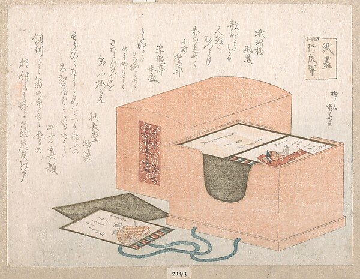

*Japanese karuta cards — part of the card game tradition that evolved from banned Portuguese playing cards through successive reinventions*

Source: Metropolitan Museum of Art

**Four of Clubs, Japanese Courtship, from Harlequin Cards (1889)**

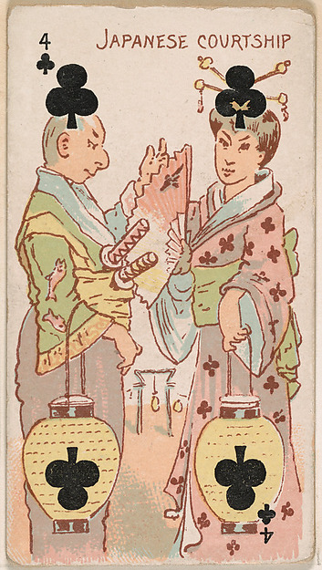

*Cards connecting Japanese and Western card cultures — produced the same year Fusajiro Yamauchi founded Nintendo to manufacture Hanafuda cards*

Source: Metropolitan Museum of Art

**Japanese Woodblock Print, Edo Period**

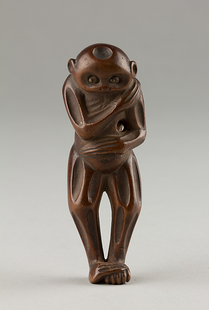

*Ukiyo-e print from the 'floating world' — the nocturnal realm of pleasure quarters, theaters, teahouses, and gambling dens that flourished in Edo-period Japan*

Source: Metropolitan Museum of Art

**Ukiyo-e Print, Japan**

*The floating world was where the rigid hierarchies of Tokugawa society were temporarily relaxed — and where gambling was woven into the texture of daily life*

Source: Metropolitan Museum of Art

---

# Chapter 10
## The Pre-Columbian Americas and the Pacific

Sometime around the year 1100, in a city larger than London, a chief climbed to the summit
of a black earthen pyramid and raised his arms. A thousand people in the grand plaza below
erupted in a deafening shout. The crowd split into two halves. Someone rolled a polished
stone disc across the packed earth. Hundreds of spears arced through the air. And then, as
the disc wobbled and slowed and the spears clattered down around it, the real action began
—not on the playing field but on the sidelines, where spectators wagered everything they
had on the outcome.
The city was Cahokia. The pyramid was Monks Mound, a four-tiered platform rising a
hundred feet from its fourteen-acre base—larger at its footprint than the Great Pyramid of
Giza. The city sprawled across the bottomlands of the Mississippi River, near present-day
St. Louis, and at its peak it held between ten and fifteen thousand residents, with a regional
population of perhaps forty thousand. It was the largest urban center in North America
before the arrival of Europeans—the capital of the Mississippian civilization, with trade
networks stretching from the Great Lakes to the Gulf of Mexico. And one of the things that
held it together, archaeologists now believe, was a gambling game.
The game was called chunkey.

Chunkey was deceptively simple. Two players faced each other on a cleared field. One
rolled a carefully crafted stone disc—a chunkey stone, polished to a smooth finish, typically
two to six inches in diameter, concave on both faces, made from sandstone or granite or
occasionally exotic materials like Commerce quartzite. The disc rolled across the ground,
wobbling, decelerating, its path unpredictable. Before it stopped, both players threw long
spears—eight to ten feet of hickory or poplar, hurled with force and precision—attempting to
land as close as possible to the stone’s resting point. The player whose spear landed
nearest scored. Games were played to eleven or twelve points and could last hours.
The skill involved was real: reading the wobble of the disc, calculating where it would stop,
timing the throw. But the uncertainty was also real. The disc could catch a rut, hit a pebble,
veer in ways no one anticipated. And it was this uncertainty—the gap between skill and

outcome—that made chunkey a gambling game rather than merely an athletic contest.
The gambling around chunkey was extreme. When European explorers first encountered
versions of the game among Southeastern tribes in the eighteenth century, they recorded
scenes of extraordinary intensity. The trader James Adair, writing in the 1770s, translated
the name as “running hard labor.” The naturalist William Bartram described plazas devoted
entirely to the game. French explorers reported that players wagered everything they owned
—possessions, homes, families. Losers who had gambled away their entire material
existence were known to commit suicide. The eighteenth-century accounts are consistent:
chunkey was not a pastime. It was an obsession, a social institution, and a mechanism of
economic redistribution so powerful that it could ruin a person in an afternoon.
But the archaeological story goes deeper than the ethnographic accounts, because the
archaeologist Timothy Pauketat has argued that chunkey was not merely a game played at
Cahokia. It was an instrument of Cahokian power.
Chunkey stones appear in the archaeological record of the American Bottom—the
Mississippi River floodplain around Cahokia—starting around 600 CE, during the Late
Woodland period. In this early phase, they show up in residential middens, the refuse heaps
of ordinary households. People were playing casually, probably gambling casually. But when
Cahokia exploded into a major urban center around 1050 CE, something changed. Chunkey
stones disappeared from domestic contexts and began appearing in elite burials and
ceremonial deposits. The archaeologist Warren DeBoer has argued that the Cahokian elite
appropriated the game—seized control of an activity that had been a popular gambling
pastime and transformed it into a regulated, state-controlled spectacle. The stone discs,
now crafted to exacting standards from specific materials, became prestige objects. Some
were engraved with crosses representing the four cardinal directions. Others bore eye
motifs associated with the thunderbird deity. The rolling chunkey stone may have
symbolized a severed head—a rolling human head is a central figure in several indigenous
creation stories—or the eye of the creator god watching the contest unfold.
Pauketat goes further. He proposes that when Cahokia sent envoys to distant communities
—an activity for which there is substantial archaeological evidence—those envoys carried
two things: war clubs and chunkey stones. The message was elegant and brutal. Play with
us, or fight us. The chunkey stone and the war club were the choice between diplomacy and
violence, and the game itself became the medium of alliance, tribute, and political
integration. This is what Pauketat calls the Pax Cahokiana—a peace maintained, in part,
through competitive gambling.
After Cahokia’s mysterious decline around 1300 CE—the city was virtually abandoned within
a few generations, for reasons still debated—chunkey stones reappeared in domestic
contexts across the Southeastern and Midwestern regions. The game had returned to the
people. Freed from elite control, it spread along trade routes and migration paths, carried by

communities who remembered Cahokia’s cultural forms even after the city itself was gone.
By the time Europeans arrived, chunkey was being played from Montana to the Carolinas—a
game that had been born as folk entertainment, had been captured by a political elite to
serve the needs of empire, and had escaped back into popular culture when that empire
collapsed.
The trajectory is unique in the history of gambling, and it inverts the pattern we have seen
elsewhere. In Rome, in China, in Japan, the state tried to suppress gambling and failed. At
Cahokia, the state tried to monopolize it—and succeeded, for a while.

A thousand miles to the south, in the Valley of Mexico, the stakes were even higher.
Chapter 4 introduced patolli—the cross-shaped Aztec race game played for stakes under
the watchful eye of Macuilxochitl, the god of games. We covered its mechanics there: the
fifty-two-square board, the five marked beans functioning as binary dice, the six racing
pieces, the escalating wagers that could end in enslavement. What we did not cover was the
broader Aztec gambling ecosystem in which patolli existed—an ecosystem dominated by an
even more spectacular venue for wagering.
The Mesoamerican ball game—known as ōllamaliztli in Nahuatl—was three thousand years
old by the time the Aztecs inherited it. Invented by the Olmecs around 1600 BCE, it was the
longest continuously played sport in the Americas. Two teams on an I-shaped stone court, a
solid rubber ball weighing six to eight pounds, players striking it with their hips, knees, and
forearms but never their hands or feet. Stone rings mounted high on the court’s walls
served as goals—driving the ball through one was so difficult that doing so ended the game
instantly. The ball itself was a marvel: pre-Columbian Mesoamerica had discovered
vulcanization, and the rubber balls that bounced off the court’s stone walls were a
technology that Europeans would not match for centuries.
But the ball game was also a gambling platform on a scale that dwarfs anything we have
encountered so far in this book.
Bernardino de Sahagún, the Franciscan friar who compiled the most comprehensive
Spanish account of Aztec life, recorded that ball games were staged regularly in the wards
and markets of Tenochtitlan, the Aztec capital, and that they were accompanied by betting
so intense that it routinely led to violence. Diego Durán, another Spanish chronicler,
described the scene around the courts: crowds of onlookers pressing close, alcohol flowing
freely, the wagering escalating as the game progressed—jewels, slaves, precious stones,
feathered cloaks, the trappings of war. Durán wrote that some gamblers sold their own
children to fund their bets, and that others staked themselves, losing the game and their
freedom in the same stroke. Sahagún noted matter-of-factly that at the ball courts, “heads

were constantly split open”—not from the game itself but from the fights that erupted over
disputed bets.
The most famous ball game wagers involved the Aztec emperors themselves. The chronicler
Fray Juan de Torquemada recorded that Emperor Axayacatl wagered a year’s tribute income
plus several tributary towns against the city of Xochimilco in a match against its ruler,
Xihuitlemoc. Axayacatl lost. Rather than honor the bet, he had Xihuitlemoc assassinated. In
another celebrated match, Montezuma himself played Nezahualpilli, the king of the
neighboring city of Texcoco. Nezahualpilli staked his entire kingdom. Montezuma offered
three turkeys. Nezahualpilli won. Montezuma took his loss as an omen of divine disfavor—a
reading that proved prophetic when Hernán Cortés arrived a few years later and the empire
fell.
These were not metaphorical stakes. Aztec nobles genuinely wagered their political
authority on the outcome of athletic contests. The ball game was simultaneously sport,
religious ritual (the court symbolized the boundary between the human world and the
underworld, and the game reenacted cosmic battles), diplomatic tool, and gambling market.
The same god—Macuilxochitl, Five Flower, patron of games and excess—presided over both
patolli and the ball game. His presence at the sidelines was not symbolic. An empty space
was reserved near the gaming area for the god to sit, and players offered incense and
treasure to him before play began. When your dice rolled zero in patolli, you paid a forfeit
not to your opponent but to Macuilxochitl. When the ball caromed off the court wall in
ōllamaliztli, the god was watching.
The Spanish, when they arrived, were horrified. Not by the gambling itself—Spain was hardly
innocent of that vice—but by its entanglement with what they considered pagan religion.
The priests who accompanied the conquistadors banned patolli. They burned the boards
and the bean-dice. According to some accounts, they burned the hands of people caught
playing. The ball game was suppressed as part of the systematic destruction of indigenous
religious practice. Anything that connected the Aztec people to their gods was targeted,
and since gambling and worship were inseparable—since the game was the ritual—
destroying the game was destroying the religion.
It nearly worked. Patolli survived only in remote mountain communities, where Alfonso Caso
found people still playing it in the 1920s. The ball game survived as ulama, a stripped-down
version played in the Mexican state of Sinaloa, shorn of its religious context, kept alive by
communities that remembered the rules even after the courts crumbled and the gods fell
silent.

North of Mexico, a different gambling civilization flourished—one with no cities, no empires,
no written records, and an intensity of wagering that astonished every European who

encountered it.
We noted in an earlier chapter that the anthropologist Stewart Culin, in his monumental
1907 study Games of the North American Indians, documented games of chance among
130 tribes belonging to 30 linguistic groups. The sheer variety is staggering: dice games
played with marked plum stones, beaver teeth, carved walnut shells, painted sticks, and
burned peach pits. Guessing games in which one team concealed marked bones in their
hands while the other team tried to locate them. Hoop-and-pole games in which players
threw spears at a rolling target. Arrow games in which contestants flipped arrows at a mark.
Moccasin games in which a small object was hidden under one of several overturned shoes.
Racing games, spinning-top games, football games, lacrosse games—virtually all of them
played for stakes.
But the game that best captures the spirit of North American indigenous gambling is the
hand game, also called the stick game, because it distills the gambling impulse to its purest
form: deception, observation, and the wager.
Two teams face each other, usually four to eight players per side. On the hiding team, two
players each hold a pair of bones—one plain, one marked with a stripe or wrapping. They
pass the bones back and forth between their hands, swaying, feinting, misdirecting, while
their teammates beat drums, sing power songs, chant, and shout—creating a wall of sound
designed to energize the hiders and rattle the guessers. The guessing team’s captain
watches the hiders’ hands, reading body language, looking for the involuntary twitch or
hesitation that reveals which hand holds the marked bone. When the captain is ready, he
points—not with words but with specific hand gestures, each carrying a precise meaning. If
the guess is right, the hiding team surrenders counting sticks. If wrong, the guessing team
pays. The game continues until one team holds all ten sticks.
There is no randomizing device. No dice, no cards, no spinning wheel. The uncertainty
comes entirely from human deception and human perception. It is, in the purest sense, a
game of reading people—and if that sounds familiar to you, it should. The hand game is the
closest thing in the pre-Columbian world to poker. The hider is bluffing. The guesser is
calling. The noise and theater are the ancient equivalent of table talk and psychological
pressure. The stakes are real. The skill is real. And the margin between winning and losing is
the same margin that separates the good poker player from the bad one: the ability to see
what someone is trying to hide.
The spiritual dimension was as real as the material one. In many traditions, the hand game
was not merely accompanied by songs—the songs were the game’s spiritual engine.
Specific melodies belonged to specific players or clans and were believed to carry power
that could confuse opponents, strengthen hiders, or reveal hidden truths to guessers.
Shamans sometimes participated, using sleight of hand during healing rituals that blurred
the line between medicine and entertainment. The Coyote stories of the Plateau peoples—

sacred narratives told only during winter months—feature the trickster figure playing the
hand game, winning and losing with the same reckless abandon that characterizes his other
adventures. In the tale “Coyote Loses His Eyes,” a pivotal moment unfolds during a hand
game match: blind Coyote wins every round, and by the story’s end, his sight is restored.
The game is the mechanism of transformation.
The gambling around these games was not casual. Among the Cherokee, pre-stickball
gambling ceremonies lasted all night. The game itself—played entirely by males, sometimes
lasting most of the day, finishing before sunset—was preceded by fasting, purification
rituals, prayers, and magical practices that were believed to determine the outcome as
much as any physical skill. Bets were tied together on a frame of poles in an elaborate
display. Players wore specific body paint made from charcoal struck by lightning. The ball
was red yarn wound around a living tiger beetle, cased in groundhog rawhide. Every detail
was fixed with symbolic meaning. This was not recreation. This was ceremony, warfare by
other means, and an economic redistribution mechanism operating under ritual rules.
The same pattern held across the continent. Among the peoples of the Great Plains,
gambling on horse races and hand games was a primary mechanism of wealth transfer
between bands. Among the peoples of the Northwest Coast, high-stakes gambling
accompanied potlatch ceremonies. Among the Zuni of the American Southwest, an
elaborate stick-dice and board game was a ritual sacred to their gods—the circle of
compulsive gamblers who devoted their lives to the game were understood not as addicts
but as a special kind of dedicated priesthood, men possessed by supernatural forces. The
anthropologist Frank Hamilton Cushing, who lived among the Zuni in the 1880s, recognized
this immediately: the men who could not stop gambling were not failing at self-control. They
were fulfilling a spiritual role.

In the middle of the Pacific Ocean, fifteen hundred miles from the nearest continent, the
Polynesian peoples who settled the Hawaiian archipelago created their own gambling
culture from scratch—no contact with the Americas, no contact with Asia, no inherited
traditions from anywhere but the voyaging canoes that had carried their ancestors across
open ocean.
Hawaiian gambling centered on the Makahiki festival—a four-month season beginning with
the rising of the Pleiades, dedicated to the god Lono, during which warfare was forbidden
and athletic competition took its place. During the Makahiki, game tournaments drew
hundreds, sometimes thousands, of spectators. The games included ʻulu maika (stone
bowling), mokomoko (boxing), hākōkō (wrestling), and various forms of spear throwing, dart
throwing, and racing. Betting on these competitions was not incidental—it was the point.
The stakes could be food, fishing nets, canoes, feathered capes, land. Some participants
bet their freedom. The Makahiki was, in effect, a weeks-long gambling festival wrapped in

the structure of a religious observance.
The most intellectually demanding Hawaiian game was kōnane—a two-player strategy game
played on a rectangular board of black lava stones and white coral pieces, arranged in an
alternating pattern. Players captured by jumping over opponent’s pieces, as in checkers, but
only orthogonally, never diagonally, and the game ended when one player could make no
more captures. The loser was not the player with fewer pieces but the player who had been
rendered powerless—a distinction that reflects a Hawaiian worldview fundamentally
different from the Western conquest-oriented model. Kōnane boards were carved into lava
rock along the coastline; some survive today. The game was played by everyone, from
commoners to the aliʻi (chiefs), and was used as a tool for teaching strategic thinking,
resolving disputes, and—inevitably—gambling. When missionaries arrived in the nineteenth
century, they suppressed kōnane precisely because of its association with wagering.
But the Hawaiian game that would have most delighted a poker player was Pūhenehene—
the hiding game. A long piece of tapa cloth was laid between two teams. One player took a
small stone or piece of wood—the noʻa—and slid their hands beneath the cloth, moving it
back and forth, taunting the other side, deploying body language and verbal misdirection,
before leaving the stone concealed under one of the cloth’s folds. The opposing team then
had to guess where the stone was hidden. It was the Hawaiian equivalent of the North
American hand game—a contest of deception and observation, theater and psychology,
played for real stakes. The hider used trash talk, false signals, and feigned tells. The
guesser studied the hider’s face for microexpressions. The crowd roared.
Six thousand miles of open ocean separate Hawaiʻi from the Great Plains, yet both
civilizations independently arrived at the same game: hide something, read the hider, bet on
whether you can see through the deception. The convergence is too specific to be
coincidence and too distant to be diffusion. It is, instead, evidence that certain forms of
gambling are not cultural inventions at all. They are expressions of something inherent in the
species—the drive to test one’s ability to read other minds, to deceive and detect deception,
to stake something real on the outcome of that test.

The anthropologist Stewart Culin spent his career arguing that the world’s games shared
common origins—that similarities between games played in distant civilizations proved
ancient contact and diffusion. He was largely wrong about that. The similarities prove
something more interesting: convergent evolution. Isolated human societies, facing the
same psychological needs—for entertainment, for status competition, for economic
redistribution, for contact with the divine, for the raw thrill of uncertainty—independently
invented the same kinds of games over and over again.
Roll a disc and throw spears at it. Hide an object and dare someone to find it. Race pieces

around a board while the gods watch. Throw marked sticks and let the pattern decide your
fortune. Bet everything. Lose everything. Come back tomorrow and do it again.
These are not the customs of any particular civilization. They are the customs of the
species. And the Pre-Columbian Americas and the Pacific Islands, precisely because they
were isolated from the Old World, provide the clearest proof that this is so. Every argument
this book has made about the universality of gambling—the neuroscience of Chapter 1, the
archaeological record of Chapter 2, the divine entanglement of Chapter 3—finds its most
powerful confirmation in the simple fact that people in the Americas and the Pacific, with no
knowledge of Roman dice or Chinese cards or Indian vibhidaka nuts, built gambling cultures
every bit as elaborate, as dangerous, as sacred, and as irrepressible as anything on the
other side of the world.
The next chapter turns to the one major civilization that mounted the most theologically
rigorous argument against gambling: Islam. It is a story of prohibition more absolute than
anything the Tokugawa or the Romans or the Aztec elders ever attempted—and of the
human ingenuity that found ways around it nonetheless.

### Images — Chapter 10

**Seated Ballplayer, 200 BCE–300 CE**

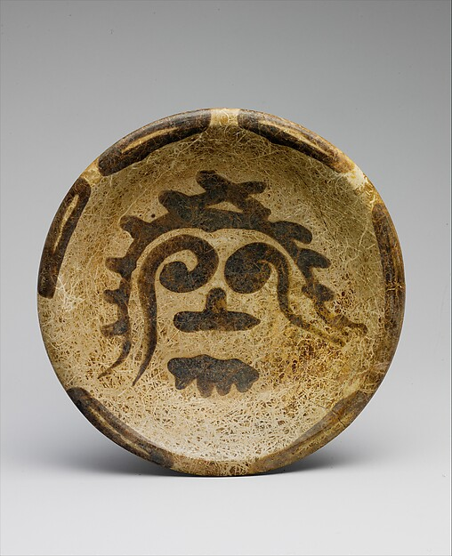

*Pre-Columbian figure of a Mesoamerican ball game player — the ball game was three thousand years old by the time the Aztecs inherited it, the longest continuously played sport in the Americas*

Source: Metropolitan Museum of Art

**Stone Yoke (Ball Game Equipment), 600–900 CE, Classic Veracruz**

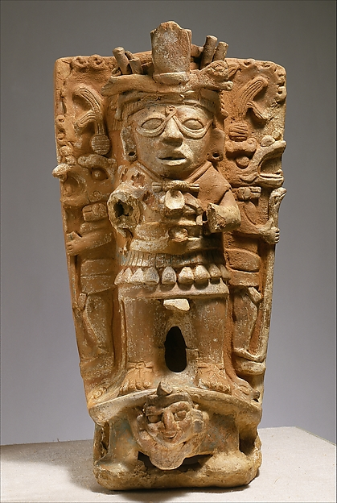

*Stone yoke worn by Mesoamerican ballplayers — the ball game was simultaneously sport, religious ritual, diplomatic tool, and gambling market*

Source: Metropolitan Museum of Art

**Closed Yoke, 600–900 CE, Classic Veracruz**

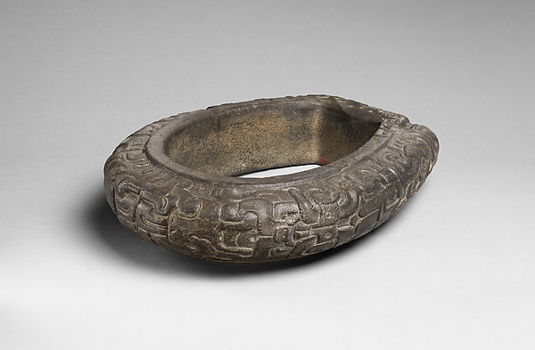

*Ball game equipment from the civilization that discovered vulcanization and produced rubber balls Europeans would not match for centuries*

Source: Metropolitan Museum of Art

**Pendant with Serpent Design, 13th–14th century, Mississippian Culture**

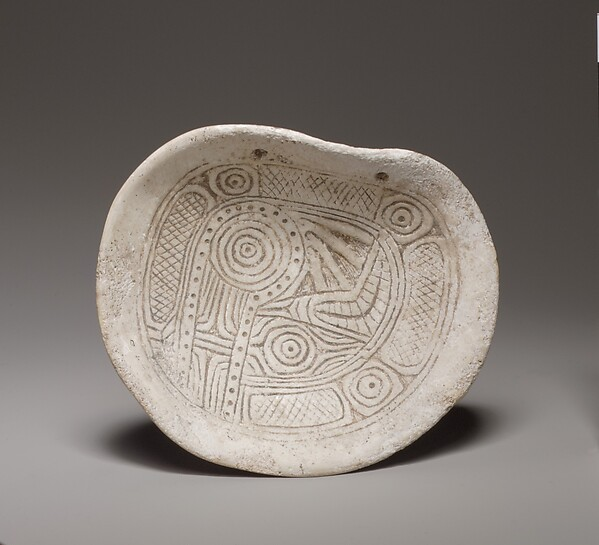

*Artifact from the Mississippian civilization that built Cahokia — where chunkey was played as both folk entertainment and instrument of political power*

Source: Metropolitan Museum of Art

**Polychrome Bottle, 14th–15th century, Mississippian (Ancestral Quapaw)**

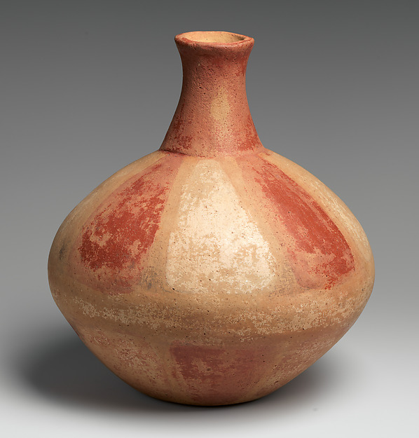

*Decorated pottery from the Cahokian cultural sphere — the civilization that used gambling as a tool of diplomacy and empire*

Source: Metropolitan Museum of Art

---

# References

## Chapter 1: The Gambling Animal

Evolutionary Psychology and Risk-Seeking
Mallpress, D.E.W., Fawcett, T.W., Houston, A.I., & McNamara, J.M. “Risk attitudes in a
changing environment: An evolutionary model of the fourfold pattern of risk
preferences.” Psychological Review (2015). University of Bristol.
Gray, P.M. “Evolutionary and cross-cultural perspectives on gambling.” Journal of
Gambling Studies 20(4): 347–371 (2004). Harvard University.
Mishra, S., et al. Life history theory and gambling behavior, in association with fast life
history strategy frameworks (2017).
“Risk sensitivity as an evolutionary adaptation.” Scientific Reports 5, 8242 (2015).
Research demonstrating risk aversion evolves in small populations under 1,000
individuals.
Neuroscience of Dopamine, Reward Prediction, and Uncertainty
Schultz, W., Dayan, P., & Montague, P.R. “A neural substrate of prediction and reward.”
Science 275: 1593–1599 (1997). The foundational reward prediction error paper.
Fiorillo, C.D., Tobler, P.N., & Schultz, W. “Discrete coding of reward probability and
uncertainty by dopamine neurons.” Science 299: 1898–1902 (2003). The landmark
study demonstrating sustained dopamine response to uncertainty.
Clark, L., Lawrence, A.J., Astley-Jones, F., & Gray, N. “Gambling near-misses enhance
motivation to gamble and recruit win-related brain circuitry.” Neuron 61: 481–490
(2009). The Cambridge near-miss neuroimaging study.
Habib, R. & Dixon, M.R. “Neurobehavioral evidence for the ‘near-miss’ effect in
pathological gamblers.” Journal of the Experimental Analysis of Behavior 93: 313–328
(2010).

Reuter, J., et al. “Pathological gambling is linked to reduced activation of the mesolimbic
reward system.” Nature Neuroscience 8(2): 147–148 (2005).
Volkow, N.D., et al. “Addiction: Beyond dopamine reward circuitry.” Proceedings of the
National Academy of Sciences 108(37): 15037–15042 (2011).
Zald, D.H., et al. “Dopamine transmission in the human striatum during monetary reward
tasks.” Journal of Neuroscience 24(17): 4105–4112 (2004).
Variable-Ratio Reinforcement and Behavioral Psychology
Skinner, B.F. About Behaviorism (1974). The key passage on variable-ratio schedules
and gambling.
Skinner, B.F. Science and Human Behavior (1953). Earlier formulation of reinforcement
schedules.
Zack, M., Featherstone, R.E., Mathewson, S., & Fletcher, P.J. “Chronic exposure to a
gambling-like schedule of reward predictive stimuli can promote sensitization to
amphetamine in rats.” Frontiers in Behavioral Neuroscience (2014).
Singer, B.F., et al. Variable-ratio saccharin reinforcement and amphetamine sensitization
studies (2012).
Animal Gambling Behavior
Zentall, T.R. & Stagner, J.P. “Maladaptive choice behaviour by pigeons: An animal
analogue and possible mechanism for gambling.” Proceedings of the Royal Society B
278: 1203–1208 (2011).
Anselme, P. “Dopamine, motivation, and the evolutionary significance of gambling-like
behaviour.” Behavioural Brain Research 256: 1–4 (2013).
Ludvig, E.A., et al. “Reward context determines risky choice in pigeons and humans.”
Biology Letters 10(8) (2014).
Proctor, D., et al. “Gambling primates: Reactions to a modified Iowa Gambling Task in
humans, chimpanzees and capuchin monkeys.” (2014). Emory University / Living Links
Center.
Paglieri, F., et al. “Nonhuman gamblers: Lessons from rodents, primates, and robots.”
Frontiers in Behavioral Neuroscience 8: 33 (2014).
Winstanley, C.A., et al. “Dopamine modulates reward expectancy during performance of
a slot machine task in rats: Evidence for a ‘near-miss’ effect.”
Neuropsychopharmacology 36: 913–925 (2011).

Anthropology: The Hadza and Cross-Cultural Gambling
Woodburn, J. “Egalitarian societies.” Man 17: 431–451 (1982). The foundational paper on
Hadza egalitarianism and gambling as redistribution.
Woodburn, J. Hunters and Gatherers: The Material Culture of the Nomadic Hadza
(1970). British Museum.
Binde, P. “Gambling across cultures: Mapping worldwide occurrence and learning from
ethnographic comparison.” International Gambling Studies 5(1): 1–27 (2005). The
definitive cross-cultural survey.
Pryor, F. The Origins of the Economy (1976). Cross-cultural quantitative analysis of
gambling prevalence and economic variables.
Textor, R. A Cross-Cultural Summary (1967). Cross-cultural tabulations including games
of chance.
Pickles, A.J. “Gambling” entry in Open Encyclopedia of Anthropology (2025). Cambridge
University.
Geertz, C. “Deep Play: Notes on the Balinese Cockfight.” In The Interpretation of
Cultures (1973).
Marlowe, F. The Hadza: Hunter-Gatherers of Tanzania (2010). University of California
Press.
Evolutionary Mismatch and Gambling Addiction
Komoto, Y. “Evolutionary mismatch, neural reward circuits, and pathological gambling.”
Medical Hypotheses (2003). The application of mismatch theory to gambling pathology.
Clark, L., et al. Various publications on cognitive distortions in gambling, University of
Cambridge Behavioural and Clinical Neuroscience Institute.
Schüll, N.D. Addiction by Design: Machine Gambling in Las Vegas (2012). Princeton
University Press. The definitive account of how slot machines exploit evolved reward
circuitry.
General Background
Schwartz, D.G. Roll the Bones: The History of Gambling (2006). The most
comprehensive single-volume gambling history, essential context throughout.
Bernstein, P.L. Against the Gods: The Remarkable Story of Risk (1996). The history of
risk and probability with significant gambling content.
Kahneman, D. & Tversky, A. “Prospect Theory: An Analysis of Decision Under Risk.”

Econometrica 47(2): 263–292 (1979). The foundational behavioral economics
framework for understanding gambling decisions.

---

## Chapter 2: Bones and Lots: The Archaeological Record

Astragali: Archaeological Studies
Gilmour, G.H. “The Nature and Function of Astragalus Bones from Archaeological
Contexts in the Levant and Eastern Mediterranean.” Oxford Journal of Archaeology
16(2): 167–175 (1997). The foundational survey of astragali finds, cataloguing species,
modifications, and contexts.
Perry-Gal, L., Erlich, A., Ecker, A., & Stern, I. “The Assemblage of Astragali from
Maresha.” Levant (2022). doi: 10.1080/00758914.2022.2048433. Study of 530+
knucklebones from Hellenistic Maresha, Israel.
Holmgren, R.J. Various studies on astragali as proto-currency and gaming pieces
(2004).
Poplin, F. Studies on bone processing and astragali modification in Mediterranean
antiquity (1984).
Koerper, H.C. Studies on astragali use among Native American peoples (2004).
Freeman, G. “The Tactics of Liar Dice.” Journal of the Royal Statistical Society, Series C
38(3): 507–516 (1989). Includes discussion of astragali probability distributions.

The Maresha Excavations
Stern, I. Various publications on the Maresha cave complex excavations. Hebrew Union
College / Nelson Glueck School of Archaeology.
Perry-Gal, L. Zooarchaeological analysis of the Maresha astragali. Israel Antiquities
Authority.
Coverage in Archaeology Magazine (November/December 2022), Smithsonian Magazine
(August 2022), Haaretz (August 2022), The Jerusalem Post (August 2022).
Cubic Dice: Archaeological and Evolutionary Studies
Eerkens, J.W. & de Voogt, A. “The Evolution of Cubic Dice: From Inaccurate to Fair
Geometry.” Acta Archaeologica 88(1): 163–173 (2017). The landmark study of 110 dice
from the Netherlands and 62 from the UK, tracing 2,000 years of design evolution.
Coverage in Atlas Obscura (“How the Design of Dice Evolved Over Time”) and Ancient
Origins.
Encyclopedia Britannica, entries on dice and gaming. Source for dating of earliest
cubical dice in Egypt (c. 2000 BCE) and China (c. 600 BCE).
Indus Valley Dice
Various archaeological reports from Mohenjo-daro and Harappan sites documenting
terracotta dice with opposite-sides-summing-to-seven convention, c. 2500 BCE.
Marshall, J. Mohenjo-daro and the Indus Civilization (1931). Early documentation of dice
finds.
The Royal Game of Ur and Mesopotamian Gaming
Woolley, C.L. Ur Excavations, Volume II: The Royal Cemetery (1934). British Museum /
University of Pennsylvania.
Finkel, I.L. “On the Rules for the Royal Game of Ur.” In Ancient Board Games in
Perspective (2007). British Museum Press.
de Voogt, A., Dunn-Vaturi, A., & Eerkens, J. Study of nearly 100 game boards showing
transmission patterns across the Near East over 1,200 years (2013).
Egyptian Gaming Artifacts
Various Egyptological sources on Senet boards, throwing sticks, and knucklebones from
tomb contexts, including the tomb of Tutankhamun (KV62). Egyptian Museum, Cairo.
Piccione, P.A. “The Historical Development of the Game of Senet and its Significance for

Egyptian Religion.” Doctoral dissertation, University of Chicago (1990).
Chinese Oracle Bones
Keightley, D.N. Sources of Shang History: The Oracle-Bone Inscriptions of Bronze Age
China (1978). University of California Press. The standard reference on Shang oracle
bones.
Various archaeological reports from Anyang / Yinxu excavations.
Mesoamerican and North American Gaming Artifacts
Culin, S. Games of the North American Indians (1907). Bureau of American Ethnology,
Smithsonian Institution. Monumental ethnographic catalogue.
Voorhies, B. Theoretical analysis of possible 5,000-year-old game scoreboards at the
Tlacuachero archaeological site, Chiapas, Mexico.
Various archaeological sources on patolli boards at Teotihuacan and other
Mesoamerican sites.
Central Asian Knucklebone Traditions
UNESCO. “Mongolian knuckle-bone shooting (shagai).” Inscribed on the Representative
List of the Intangible Cultural Heritage of Humanity (2014).
Various ethnographic sources on asyk (Kazakh), chükö (Kyrgyz), kajik (Tuvan), ashyk
(Turkish) knucklebone traditions.
Indian Dice and Vedic Gambling
Basham, A.L. The Wonder That Was India (1967). On vibhidaka nuts and early Indian
dice practices.
Various archaeological reports on dice found at Buddhist monastery sites.
Reports on Harappan-period dice from Indus Valley excavations.
Cross-Cultural Surveys
Binde, P. “Gambling Across Cultures: Mapping Worldwide Occurrence and Learning from
Ethnographic Comparison.” International Gambling Studies 5(1): 1–27 (2005). On the
“cultural silence” problem and geographic distribution.
Pryor, F. The Origins of the Economy (1976). Cross-cultural quantitative analysis.
General Background
Schwartz, D.G. Roll the Bones: The History of Gambling (2006). Gotham Books.

David, F.N. Games, Gods and Gambling: A History of Probability and Statistical Ideas
(1962). Dover.
Bell, R.C. Board and Table Games from Many Civilizations (1960, revised 1969). Dover.
Murray, H.J.R. A History of Board-Games Other Than Chess (1952). Oxford University
Press.
Parlett, D. The Oxford History of Board Games (1999). Oxford University Press.

---

## Chapter 3: Divination and Its Shadow

Mesopotamian Divination
Oppenheim, A.L. Ancient Mesopotamia: Portrait of a Dead Civilization (1964, revised
1977). University of Chicago Press. Standard reference on Mesopotamian divinatory
practices.
Bottéro, J. Mesopotamia: Writing, Reasoning, and the Gods (1992). University of
Chicago Press. On the intellectual framework of Mesopotamian divination.
Various sources on the baru priests, the Tablet of Destinies, and the role of Shamash in
lot-casting.
Akkadian omen literature and the vocabulary of purussû (decision/verdict) in divinatory
contexts.
Israelite Divination and the Urim and Thummim
Van Dam, C. The Urim and Thummim: A Means of Revelation in Ancient Israel (1997).
Eisenbrauns. The first exhaustive modern study.
“Ancient Israelite Divination: Urim ve-Tummim, Ephod, and Prophecy.” TheTorah.com.
Scholarly analysis of biblical passages.
1 Samuel 14:41 (Septuagint text). The clearest biblical description of the Urim and
Thummim’s binary function.
Proverbs 16:33, 18:18. The theological principles governing lot-casting.
Exodus 28:30, Leviticus 8:8, Numbers 27:21, Ezra 2:63, Acts 1:26. Key biblical passages
on lots and the Urim and Thummim.
Greek Divination and Sortition
Halliday, W.R. Greek Divination (1913). Chapter 10 on cleromancy.
Hansen, M.H. The Athenian Democracy in the Age of Demosthenes (1991). On sortition
as the basis of Athenian democratic practice.
Plato, Laws; Aristotle, Rhetoric 1.2.6–7. Philosophical positions on lot-casting.

Various sources on the Oracle of Delphi and lesser Greek oracular sites.
Roman Divination and Fortuna
Champeaux, J. Fortuna: Recherches sur le culte de la Fortune à Rome et dans le monde
romain (1982–1987). On the theology and worship of Fortuna.
Cicero, De Divinatione. The most extensive surviving Roman philosophical treatment of
divination.
Various sources on the sortes at Praeneste (Temple of Fortuna Primigenia) and the
Roman augural system.
On alea iacta est: Suetonius, The Twelve Caesars, “Julius Caesar,” 32.
Chinese Divination: Oracle Bones and the I Ching
Keightley, D.N. Sources of Shang History: The Oracle-Bone Inscriptions of Bronze Age
China (1978). University of California Press.
Wilhelm, R. (trans.), & Baynes, C.F. (trans.). The I Ching, or Book of Changes (1950).
Princeton University Press. The standard English translation with introduction by C.G.
Jung.
Smith, R.J. Fathoming the Cosmos and Ordering the World: The Yijing (I Ching, or
Classic of Changes) and Its Evolution in China (2008). University of Virginia Press.
Various archaeological reports from Anyang/Yinxu on the oracle bone archive of
approximately 150,000 fragments.
West African Ifá Divination
Bascom, W.R. Ifa Divination: Communication Between Gods and Men in West Africa
(1969). Indiana University Press. The foundational Western scholarly study.
Abimbola, W. Ifá: An Exposition of Ifá Literary Corpus (1976). On the literary and oral
dimensions of the 256 Odù.
Various sources on the mathematical structure of the Ifá binary system.
Germanic Divination
Tacitus, Germania, Chapter 10 (c. 98 CE). The primary source for Germanic lot-casting
practices.
Cross-Cultural Studies of Divination
Peek, P.M. (ed.). African Divination Systems: Ways of Knowing (1991). Indiana University
Press.

Binde, P. “Gambling Across Cultures.” International Gambling Studies 5(1): 1–27 (2005).
On the global distribution of gambling and its relationship to divination.
David, F.N. Games, Gods and Gambling: A History of Probability and Statistical Ideas
(1962). Dover. On the historical relationship between divination, gambling, and the
emergence of probability theory.
General Background
Schwartz, D.G. Roll the Bones: The History of Gambling (2006). Gotham Books.
Bernstein, P.L. Against the Gods: The Remarkable Story of Risk (1996). Wiley.
Pickles, A.J. “Gambling.” Open Encyclopedia of Anthropology (2025). Cambridge.

---

## Chapter 4: Games of the First Civilizations

The Royal Game of Ur
Woolley, C.L. Ur Excavations, Volume II: The Royal Cemetery (1934). British Museum /
University of Pennsylvania.
Finkel, I.L. “On the Rules for the Royal Game of Ur.” In Ancient Board Games in
Perspective (2007). British Museum Press. The definitive study of the cuneiform rules
tablet (BM 33333B).
Finkel, I.L. “Board Games and Fortune Telling: A Case from Antiquity.” In New
Approaches to Board Games Research (1995). IIAS Working Papers.
de Voogt, A., Dunn-Vaturi, A., & Eerkens, J. Study of nearly 100 game boards showing
1,200 years of design evolution across the Near East (2013).
Finkel, I.L. Games: Discover and Play 5 Ancient Games (British Museum publication).
Adapted rules for public play.
On the Kochi Jewish community playing Aasha: various ethnographic sources and
Finkel’s own documentation.
Senet
Piccione, P.A. “The Historical Development of the Game of Senet and its Significance for
Egyptian Religion.” Doctoral dissertation, University of Chicago (1990). The foundational
comprehensive study.
Crist, W. “A Senet Board from the Rosicrucian Egyptian Museum.” The Journal of
Egyptian Archaeology (2022). The transitional board study.
Kendall, T. “Passing Through the Netherworld: The Meaning and Play of Senet.” Kirk
Game Company (1978). Influential rule reconstruction.
Bell, R.C. Board and Table Games from Many Civilizations (1960, revised 1969). Dover.
Rule reconstructions.
Book of the Dead, Chapter 17. Depictions of the deceased playing Senet.
Indian Games: Pachisi, Chaupar, and the Mahabharata

Mahabharata, Sabha Parva (Book of the Assembly Hall). The dice game episode.
Multiple translations including van Buitenen (University of Chicago Press) and Ganguli.
Topsfield, A. “The Indian Games of Pachisi, Chaupar, and Chausar.” Expedition
Magazine, Penn Museum (1985).
Finkel, I.L. “The Sedentary Games of India: An Introduction.” In Sedentary Games of India
(1999).
Various archaeological reports on Painted Grey Ware period game pieces from Mathura
and Noh (1100–800 BCE).
Basham, A.L. The Wonder That Was India (1967). On Vedic-era dice games and royal
consecration rituals.
On Akbar’s courtyard Pachisi: Abu’l-Fazl, Ain-i-Akbari (16th century).
Liubo
Loewe, M. Various publications on Liubo’s archaeological context and cosmological
significance.
Records of the Grand Historian (Shi Ji), Sima Qian. References to Liubo gambling in
ancient Chinese society.
Zhang Zhan, commentary on the Book of Liezi (Jin Dynasty). Most complete surviving
description of Liubo rules.
Metropolitan Museum of Art, Liubo Board and Pieces (accession records). Han Dynasty
gaming set.
Cazaux, J.-L. Reconstructed Liubo rules based on archaeological and textual evidence.
Various archaeological reports on Liubo boards, pieces, and tomb figurines from Han
Dynasty sites.
Patolli
Sahagún, B. de. Historia General de las Cosas de la Nueva España (Florentine Codex),
Book 8. Sixteenth-century Spanish descriptions of Patolli gameplay and gambling.
Voorhies, B. Theoretical analysis of possible 5,000-year-old game scoreboards at
Tlacuachero, Chiapas, Mexico.
Various archaeological sources on Patolli boards from Teotihuacan and other
Mesoamerican sites.
Cross-Cultural Game Studies

Parlett, D. The Oxford History of Board Games (1999). Oxford University Press. The best
single-volume survey.
Murray, H.J.R. A History of Board-Games Other Than Chess (1952). Oxford University
Press. Still the most comprehensive catalogue.
Bell, R.C. Board and Table Games from Many Civilizations (1960, revised 1969). Dover.
Finkel, I.L. (ed.). Ancient Board Games in Perspective (2007). British Museum Press.
Collected scholarly papers.
General Background
Schwartz, D.G. Roll the Bones: The History of Gambling (2006). Gotham Books.
David, F.N. Games, Gods and Gambling (1962). Dover.

---

## Chapter 5: Greece: Chance and Fate

Greek Mythology and Gambling
Homer, Iliad. On Ajax as second-best of the Achaeans (2.768, 13.321, 17.279).
Pausanias, Description of Greece 2.20.3. The temple of Tyche at Argos where
Palamedes dedicated the first dice.
Plato, Phaedrus 274d. Socrates attributing the invention of games and dice to the
Egyptian god Thoth.
Sophocles, Ajax. On Ajax’s suicide after losing the contest for Achilles’ armor.
Various sources on the myth of Zeus, Poseidon, and Hades dividing the cosmos by lot.
The Exekias Amphora and Greek Gaming Art
Exekias, Black-figure amphora (c. 540–530 BCE). Vatican Museums, inv. 344. Achilles
and Ajax playing a board game.
Nagy, G. “A Roll of the Dice for Ajax.” Classical Inquiries, Center for Hellenic Studies,
Harvard (2015/2019). On the mythological significance of the Achilles-Ajax gaming
scene.
Nagy, G. “How a Classical Homer Occasionally Downgrades the Heroic Glory of Ajax in
Order to Save It.” Classical Inquiries (2021). On the omission of dice-playing from the
Iliad.
Woodford, S. & Moore, M. Various studies on the chronology of Achilles-Ajax gaming

scenes in Attic vase-painting.
Schneider, L. On the compositional design of the Exekias amphora.
Greek Social Life and Gambling Practice
Aristophanes, various plays (references to Athenian gambling habits).
Various archaeological reliefs depicting Greek gambling scenes (4th century BCE).
Sources on the symposium, kottabos, and agora gambling culture.
On the “Throw of Aphrodite” and “Throw of the Dog”: various ancient sources on
astragali nomenclature.
Tyche and Greek Concepts of Fortune
Herodotus, Histories. On fortune’s reversals as a governing theme.
Thucydides, History of the Peloponnesian War. On the role of tyche in historical events.
Various sources on the cult of Tyche, her iconography (cornucopia, ball/wheel), and her
rise in the Hellenistic period.
Aeschylus, Sophocles, Euripides. The tragedians on tyche vs. moira.
Greek Philosophy on Chance, Gambling, and Akrasia
Plato, Protagoras. Socrates’ denial of akrasia (weakness of will).
Plato, Republic. The tripartite soul; appetite, spirit, and reason.
Plato, Laws. The puppet metaphor (644d–645b); provisions for regulating games; the
two types of equality (756e–758); lot-casting as democratic process.
Aristotle, Nicomachean Ethics, Book VII. The analysis of akrasia; the distinction between
weakness (astheneia) and impetuosity (propeteia).
Aristotle, Nicomachean Ethics, Book I. On eudaimonia not being left to chance (1099a–
1099b); the example of Priam.
Aristotle, Politics 4.9.1294b. On lot-casting as democratic vs. voting as oligarchic.
Aristotle, Rhetoric 1.2.6–7. On lot-casting as appropriate for deliberation under
uncertainty.
Various sources on Stoic apatheia and the Stoic treatment of fortune and fate.
Stanford Encyclopedia of Philosophy, “Aristotle’s Ethics” (2001, revised). On akrasia in
the Nicomachean Ethics.

Palamedes
Pausanias, Description of Greece 2.20.3. On the Temple of Fortune at Argos.
Hyginus, Fabulae. On Palamedes’ death by Odysseus’ treachery.
Plato, Republic, Book VII. Socrates’ remark that Palamedes claimed to have invented
numbers.
Various sources on Palamedes in the underworld playing dice with Ajax and Thersites.
General Background
Schwartz, D.G. Roll the Bones: The History of Gambling (2006). Gotham Books.
David, F.N. Games, Gods and Gambling (1962). Dover.
Kurke, L. Coins, Bodies, Games, and Gold: The Politics of Meaning in Archaic Greece
(1999). Princeton University Press.

---

## Chapter 6: Rome: The Republic Bets

Roman Gambling Law
Faris, S. “Changing Public Policy and the Evolution of Roman Civil and Criminal Law on
Gambling.” UNLV Gaming Law Journal (2012). The most comprehensive modern legal
analysis.
Digest of Justinian, 11.5. Roman private law on gambling: non-recognition of gambling
debts, remedies for losers, bars to recovery.
Cicero, Philippics 2.23. On Mark Antony pardoning a convicted gambler.
Justinian, Codex 3.43. The final imperial prohibition on all gambling, public and private.
Smith’s Dictionary of Greek and Roman Antiquities (1875), entry on “Alea.” Summary of
the Lex Alearia, Lex Titia, Lex Publicia, and Lex Cornelia.
Literary Sources on Roman Gambling
Suetonius, Lives of the Caesars (c. 110 CE). On Augustus’s gambling (letters to
Tiberius), Claudius’s dice-playing treatise and modified carriage, Nero’s high-stakes

play, Caligula’s cheating.
Seneca, Apocolocyntosis (c. 54 CE). The satirical afterlife punishment of Claudius with a
bottomless dice cup.
Horace, Odes 3.24.58. On young Romans devoting themselves to games forbidden by
law.
Juvenal, Satires 10.77–81 (panem et circenses); Satires 1 (on reckless gambling with
treasure chests).
Ovid, Tristia 2.470. Mention of the gambling ban.
Ammianus Marcellinus, Res Gestae 6.25; 26.3; 29.3. On gambling mania as a cause of
Rome’s decline; on prosecution of charioteers for witchcraft.
Martial, various epigrams on gambling during and outside the Saturnalia.
Cassius Dio, Roman History. On crowd behavior at the Circus Maximus.
Archaeological Evidence
Pompeii excavations: wall paintings depicting gambling disputes in taverns; graffiti (“I
am skilled enough to win without cheating”); dice and gaming equipment finds.
Gaming tables scratched into stone at the Forum, military camps, and taverns across the
empire.
Tavern sign near the Praetorian camp advertising “Good food and gambling within.”
Various sources on the discovery of dice, game boards, and gaming equipment at
Roman military sites from Hadrian’s Wall to North Africa.
The Saturnalia
Macrobius, Saturnalia. On the customs and reversals of the December festival.
Various sources on the Saturnalia as ritual inversion: slaves dining with masters, dice
games permitted as lawful exception.
Chariot Racing and the Circus Maximus
Humphrey, J.H. Roman Circuses: Arenas for Chariot Racing (1986). The definitive
archaeological study.
Cameron, A. Circus Factions: Blues and Greens at Rome and Byzantium (1993). On the
political and social role of the racing factions.
Bell, S. Various publications on chariot racing culture and its social functions.

Pliny the Elder, Natural History 7.186 (on the supporter of the Reds who threw himself on
a charioteer’s funeral pyre); 10.71 (on birds used to transmit race results).
On Gaius Appuleius Diocles as the highest-earning athlete in antiquity: various modern
analyses.
Gladiatorial Combat
Hopkins, K. & Beard, M. The Colosseum (2005). Harvard University Press.
Kyle, D.G. Spectacles of Death in Ancient Rome (1998). Routledge.
Various sources on betting at gladiatorial games and the Colosseum.
The Emperors and Gambling
Suetonius on Augustus (Divus Augustus 70–71), Claudius (Divus Claudius 33), Nero
(Nero 30), Caligula (Gaius 41), Domitian (Domitian 21).
Carcopino, J. Daily Life in Ancient Rome: The People and the City at the Height of the
Empire (1940). On gambling habits and social mores.
Curse Tablets
Various archaeological publications on lead defixiones found at circus sites across the
Roman empire—invocations against rival charioteers and horses.
General Background
Schwartz, D.G. Roll the Bones: The History of Gambling (2006). Gotham Books.
Potter, D. & Mattingly, D. (eds). Life, Death, and Entertainment in the Roman Empire
(1999).

---

## Chapter 7: India: Dice, Dharma, and the Mahabharata

The Aksha Sukta (Gambler’s Lament)
Rig Veda, Book 10, Hymn 34. Translations: Griffith (1896); Jamison & Brereton (2014).
Winternitz, M. A History of Indian Literature, Volume 1 (1981). On the Aksha Sukta as the
finest non-religious poem of the Rig Veda.
Macdonell, A.A. A History of Sanskrit Literature (1900).
Basham, A.L. The Wonder That Was India (1967). On vibhidaka nuts and the hymn’s
possible magical origin.
Siddiqui, S. & Siddiqui, H. “The Dyuta Sukta (Ode to the Dice): An Account of Gambling
in the Rig Veda.” British Journal of Psychiatry 215(1): 395 (2019).
Bhide, A.V. “Compulsive Gambling in Ancient Indian Texts.” Indian Journal of Psychiatry
52(suppl 1): S396–S399 (2010).
On the Atharva Veda’s gambling spells: AV 2.3, 4.38, 6.118, 7.52, 7.109.
The Mahabharata Dice Games
Mahabharata, Sabha Parva (Book of the Assembly Hall). The Yudhishthira dice game.
Translations: van Buitenen (University of Chicago Press); Ganguli.

Mahabharata, Vana Parva (Book of the Forest), Nalopakhyana. The Nala and Damayanti
episode.
On the concept of Akshahridaya (the “heart of dice”): Nalopakhyana, various scholarly
commentaries.
On the Vedic royal consecration (Rajasuya) dice ritual: various Indological sources on
Vedic ritual.
Indian Legal Texts on Gambling
Kautilya (attr.), Arthashastra, Book 3, Chapter 20. On the Superintendent of Gambling.
Translations: Shamasastry (1915); Kangle (1965); Rangarajan (1992); Olivelle (2013).
Manusmriti (Laws of Manu), 9.220–228. On banishing the gambler.
Yajnavalkya Smriti, 2.199–203. On the keeper of the gambling house, taxation, and
cheating penalties.
Narada Smriti, 17.2–8. On the master of the gaming house and dispute resolution among
gamblers.
Brihaspati Smriti, 26.1–8. The key statement: “Gambling has been prohibited by Manu…
permitted by other legislators when conducted so as to allow the king a share.”
Apastamba Dharma Sutra, 2.10.25.12–13. On the preparation of the play-table and the
supply of dice.
Haradatta, commentary on the Apastamba Dharma Sutra. On licensed gambling houses
and the king’s revenue.
Buddhist and Jain Perspectives
Sigalovada Sutta (Digha Nikaya 31). The Buddha’s six dangers of gambling.
Various archaeological reports on gaming equipment found at Buddhist monastery sites.
General Jain sources on gambling as incompatible with non-attachment.
Diwali Gambling and Hindu Festival Traditions
Various ethnographic and cultural sources on Diwali gambling with cards and dice.
On Shiva and Parvati depicted playing Chaupar: various art-historical sources.
On gambling as invoking Lakshmi during Diwali.
Pachisi, Chaupar, and Indian Board Games
Topsfield, A. “The Indian Games of Pachisi, Chaupar, and Chausar.” Expedition

Magazine, Penn Museum (1985).
On Akbar’s courtyard Pachisi: Abu’l-Fazl, Ain-i-Akbari (16th century).
Various archaeological reports on Painted Grey Ware period game pieces (1100–800
BCE).
General Background
Schwartz, D.G. Roll the Bones: The History of Gambling (2006). Gotham Books.
Faris, S. “Changing Public Policy and the Evolution of Roman Civil and Criminal Law on
Gambling.” UNLV Gaming Law Journal (2012). For comparative legal framework.
Law Commission of India, Report No. 276 (2018). “Legal Framework: Gambling and
Sports Betting Including in Cricket in India.” Historical background section.

---

## Chapter 8: China: From Liubo to Mah-Jongg

Playing Cards: Chinese Origins
Lo, A. “The Game of Leaves: An Inquiry into the Origin of Chinese Playing Cards.”
Bulletin of the School of Oriental and African Studies 63(3): 389–406 (2000). The key
scholarly study arguing that yezi referred to book pages, not cards, before the 15th
century.
Parlett, D. “The Chinese ‘Leaf’ Game.” parlettgames.uk. Survey of the evidence and the
scholarly debate.
Wilkinson, W.H. Various publications on Chinese money-suited cards and the theory that
cards originated as paper money used for gaming.
Carter, T.F. The Invention of Printing in China and Its Spread Westwards (1925; 2nd ed.
1955). On “sheet-dice” and the connection between printing, cards, and dominoes.
Dummett, M. The Game of Tarot (1980). Argues that the concept of suits and tricktaking games was invented in China.
The 1294 Yuan Dynasty legal case (Yan Sengzhu and Zheng Zhugou arrested with paper
cards and woodblocks): Da Yuan shengzheng guochao dianzhang (1320).
Fan-Tan
Paulès, X. “Gambling in China Reconsidered: Fantan in South China During the Early
Twentieth Century.” International Journal of Asian Studies (2010). On Fan-Tan’s role in
Cantonese diaspora communities.
Paulès, X. “The Worst of All Gambling Games: Fantan in Southern China During the Qing
Era.” SOAS seminar (2022).
Riis, J. How the Other Half Lives (1890). Description of a New York Chinatown Fan-Tan
parlor.
Jesse B. Cook, former San Francisco police commissioner, on the fifty Fan-Tan houses

in 1889 Chinatown.
Britannica, “Fan-Tan.” On the game’s mechanics and house edge.
The Chinese Lottery and Keno
Various sources on baige piao (“white pigeon ticket”) and its transformation into
American Keno.
On the use of the Thousand Character Classic as the character set for the original
Chinese lottery.
Chinese Dominoes and Pai Gow
Various sources on the Song Dynasty origins of Chinese dominoes and their civil/military
suit system.
On Pai Gow’s adaptation into Pai Gow Poker for Western casinos in the 1980s.
Mah-Jongg
Shen, Y. Illustrated Mahjong Guide (1914). The first Mah-Jongg guidebook, placing the
game’s origin roughly thirty years earlier in Ningbo.
Du, Y. Endless History (1933). On Mah-Jongg’s origins among fishermen in Guangdong
and Fujian.
Stanwick, M. Various publications on proto-Mah-Jongg tiles and the game’s
development (in The Playing Card journal).
Babcock, J.P. Rules of Mah-Jongg (1920s). The simplified rules that introduced the
game to America.
On the National Mah Jongg League (founded 1937) and the American variant.
On Mao Zedong’s ban of Mah-Jongg and its lifting in 1985.
On Mah-Jongg’s evolution from money-card games (Madiao, Penghú).
Confucian Attitudes and Imperial Prohibition
Kongzi Jiayu (Family Sayings of Confucius). On Confucius condemning Liubo.
Various sources on Han, Tang, Song, Yuan, Ming, and Qing Dynasty anti-gambling
legislation.
On the Confucian “four arts of the scholar” (Go, calligraphy, painting, music) as the ideal
use of leisure.
On the Chinese folk concept of yun (fortune/luck) and its tension with Confucian

rationalism.
Liubo and Go (Cross-Reference)
See Chapter 4 sources for detailed Liubo treatment.
On the displacement of Liubo by Go: various sources in Chapter 4.
General Background
Schwartz, D.G. Roll the Bones: The History of Gambling (2006). Gotham Books.
Parlett, D. The Oxford History of Board Games (1999). Oxford University Press.
Parlett, D. A History of Card Games (1991). Oxford University Press.
Needham, J. Science and Civilisation in China, Vol. IV and V. On printing, paper money,
and related technologies.

---

## Chapter 9: Japan: Gambling in the Floating World

Portuguese Cards and the Tenshō Karuta
Yamaguchi, K. Unsun Karuta and the History of Japanese Playing Cards (1961).
On Francis Xavier’s arrival in Japan in 1549 and the introduction of playing cards.
Various sources on the Portuguese 48-card Ombre deck and its Japanese copies.
The Ban-and-Reinvent Cycle

Ebashi, T. Hanafuda: The Flower Cards of Japan (2005). Dai-Nippon Playing Card
Museum.
Ebashi, T. “Visual Camouflage: The Evolution of Gambling in the Edo Period.” Journal of
Japanese Ludology (2012).
On the successive bans of Tenshō Karuta (1648), Unsun Karuta, Mekuri Karuta (1791),
and the eventual emergence of Hanafuda.
99% Invisible, “Flower Cards: Japanese Hanafuda Designed to Circumvent Ban on
Western Decks” (2018).
Unseen Japan, “Hanafuda: How a Banned Game Defined the Pre-Pokémon Era” (2026).
Hanafuda
Wikipedia, “Hanafuda.” Comprehensive account of the deck’s structure, history, and
games.
Various sources on the twelve-suit, forty-eight-card structure and its games (Koi-Koi,
Hachi-Hachi, Hana-Awase).
Entoten, “Hanafuda: Japanese Culture Dealt in a Deck of Cards.” On seasonal symbolism
and cultural significance.
The Bakuto and the Yakuza
Wikipedia, “Bakuto.” On itinerant gamblers as forerunners of yakuza.
Wikipedia, “Yakuza.” On the bakuto and tekiya origins, yubitsume, irezumi, and the
oyabun-kobun relationship.
On the word “yakuza” deriving from the 8-9-3 losing hand in Oicho-Kabu.
On the recruitment of bakuto by Tokugawa officials to recover workers’ wages through
gambling.
Kaplan, D.E. & Dubro, A. Yakuza: Japan’s Criminal Underworld (2003). University of
California Press.
Chō-Han
Various sources on the even-odd dice game as the bakuto’s signature gambling activity.
The Floating World
On the ukiyo and its cultural productions: ukiyo-e, kabuki, the literature of Ihara Saikaku.
Kobayashi Issa, haiku on gambling in mountain inns. Commentary by Chris Drake.

On gambling’s place in Edo-period pleasure quarters and teahouses.
Nintendo
On Fusajiro Yamauchi founding Nintendo in 1889 to produce Hanafuda.
On the company’s evolution from card manufacturer to video game corporation.
Oehring, O. “The ‘Bakuto’ and Nintendo.” Undervalued Japan (2022).
On the Daitōryō (“President”) Hanafuda brand featuring Napoleon.
Pachinko
On the origins of pachinko from American Corinthian bagatelle in the 1920s.
On the legal fiction of prize exchange and the “TUC shop” system.
On the industry’s estimated annual revenues (over $200 billion at peak).
On ethnic Korean involvement in the pachinko industry.
Lee, M.J. Pachinko (novel, 2017). While fiction, provides cultural context for the KoreanJapanese pachinko world.
General Background
Schwartz, D.G. Roll the Bones: The History of Gambling (2006). Gotham Books.
Parlett, D. A History of Card Games (1991). Oxford University Press.

## Chapter 10: The Pre-Columbian Americas and the Pacific

Cahokia and Chunkey
Pauketat, T.R. Cahokia: Ancient America’s Great City on the Mississippi (2009). Viking
Penguin. On Cahokia’s rise, the chunkey game, and the Pax Cahokiana thesis.
Pauketat, T.R. Ancient Cahokia and the Mississippians (2004). Cambridge University
Press.
DeBoer, W. “Of Dice and Women: Gambling and Exchange in Native North America.”
Journal of Archaeological Method and Theory (1993). On the elite appropriation of
chunkey at Cahokia.
Perino, G. “The Cahokia Discoidal.” In An Archaeological Salvage Report (1971). The
typology of chunkey stones.
World History Encyclopedia, “Chunkey” (2024). Overview of the game’s origins and
mechanics.
Cherokee Phoenix, “Chunkey: A Game of Stones” (2020). On the revival of chunkey in
Cherokee communities.
Patolli and the Spanish Encounter
Sahagún, B. de. Historia General de las Cosas de la Nueva España (Florentine Codex),

Book 8. Sixteenth-century description of patolli and ball game gambling.
Durán, D. Historia de las Indias de Nueva España, vol. I. On ball game wagering, crowds,
and violence.
Codex Magliabechiano. Aztec codex depicting patolli under the supervision of
Macuilxochitl.
Caso, A. “Un antiguo juego mexicano: el patolli.” El México antiguo 2 (1927): 203–211.
The foundational study of patolli.
Clendinnen, I. Aztecs: An Interpretation (1991). Cambridge University Press. On patolli
as a response to existential uncertainty.
Tylor, E.B. “On the Game of Patolli in Ancient Mexico, and its Probably Asiatic Origin.”
Journal of the Anthropological Institute of Great Britain and Ireland 8 (1879): 116–131.
The Mesoamerican Ball Game
Scarborough, V.L. & Wilcox, D.R., eds. The Mesoamerican Ballgame (1991). University of
Arizona Press. Comprehensive archaeological treatment.
Torquemada, F.J. de. Monarquía Indiana. On the Axayacatl/Xochimilco wager.
Ixtlilxochitl, F. de Alva. On the Toltec king Topiltzin wagering sovereignty through the ball
game.
The Metropolitan Museum of Art, “The Mesoamerican Ballgame” (2017). Survey of
archaeological and artistic evidence.
ReVista (Harvard), “Religion, Politics and Plenty of Betting.” On the ball game as a
gambling venue and Vernon Scarborough’s comparison to Balinese cockfighting.
Popol Vuh. The Maya Hero Twins narrative and the ball game’s mythological
significance.
North American Indigenous Gambling
Culin, S. Games of the North American Indians (1907). Bureau of American Ethnology.
The foundational reference on 130+ tribes’ games.
Culin, S. “Hawaiian Games.” American Anthropologist 1(2) (1899): 201–247.
University of Pennsylvania Museum, “American Indian Gaming Arrows and Stick-Dice.”
On Culin and Cushing’s collaboration.
University of Pennsylvania Museum, “Formal Games in the Cherokee Ritual Cycle.” On
Cherokee stickball ceremonies.

Yanicki, G. “Gambling Societies of North America.” Critical Gambling Studies 2 (2021):
123–140.
Vennum, T. American Indian Lacrosse: Little Brother of War (1994). Smithsonian
Institution Press.
The Hand Game
Wikipedia, “Handgame.” Overview of rules and regional variations.
Various sources on the hand game’s spiritual significance, power songs, and the Coyote
narratives.
Mathkind.org, “Native American Stick Game: Global Math Story” (2024).
Hawaiian and Polynesian Gambling
Culin, S. “Hawaiian Games.” American Anthropologist 1(2) (1899): 201–247. First
academic description of Lu-Lu, kōnane, and Pūhenehene.
Kaʻiwakīloumoku (Hawaiian Cultural Center), “Makahiki: Let the Games Begin.” On
Makahiki festival gambling.
Wikipedia, “Kōnane.” On the game’s rules, cultural significance, and PSPACEcompleteness.
Wikipedia, “Traditional Hawaiian Games.” Overview of Makahiki games and Pūhenehene.
Malo, D. Hawaiian Antiquities (Moʻōlelo Hawaiʻi). Primary source on Pūhenehene.
Convergent Evolution and General Background
Binde, P. “Gambling Across Cultures.” International Gambling Studies 5(1) (2005): 1–27.
Cross-cultural survey identifying North America as a “continent of gamblers.”
Pryor, F. The Origins of the Economy (1976). Quantitative analysis finding North
American location as a predictor of gambling intensity.
Schwartz, D.G. Roll the Bones: The History of Gambling (2006). Gotham Books.
Parlett, D. The Oxford History of Board Games (1999). Oxford University Press.

---

